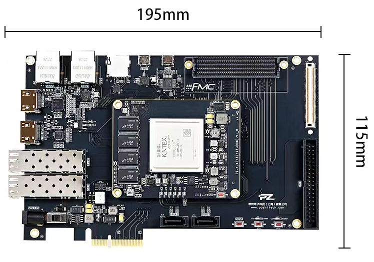
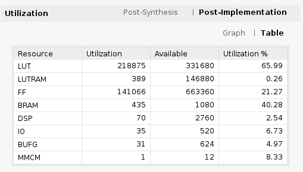
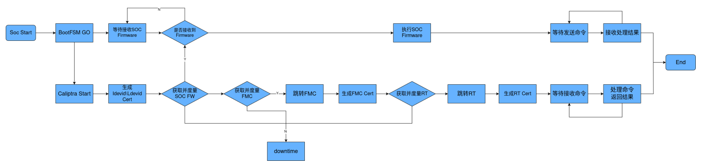
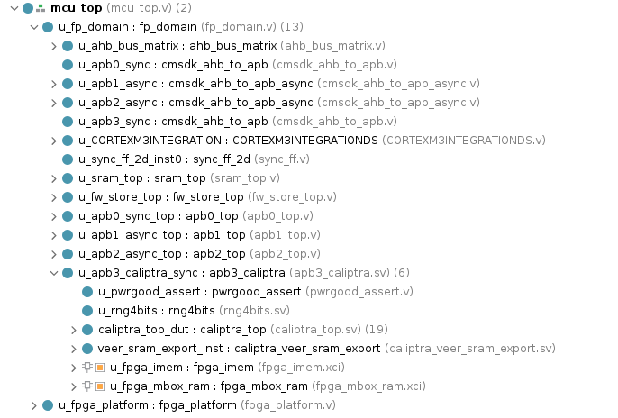
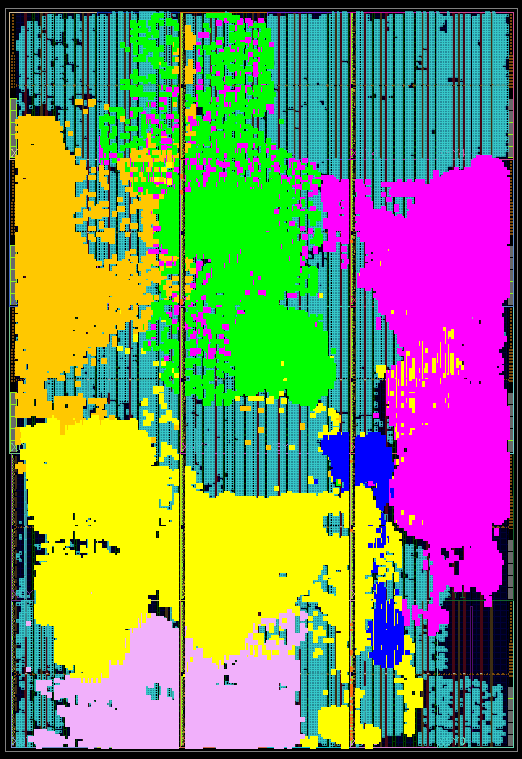

# FPGA流程
## 使用推荐的硬件平台

**软件：**
`vivado 2021.1`

**板子：**
我们采用xilinx KU060 开发板

- 购买地址：淘宝璞致旗舰店

**准备rom程序：**

SOC中的ARM核的bootrom、caliptra的imem存放启动程序。在FPGA实现中，均由xilinx IP核构成，并在synth时初始化数据。vivado 配置IP时采用的`.coe`文件在[rom软件编译阶段](../user/firmware/boot_to_ca/makefile.boot_to_ca)产生。

**FPGA实现：**

1. 进入工程根文件夹
2. `source setenv.sh `
3. `run fpga_ku6_soc_ca_full_vivado`即可在[FPGA工程文件夹](../project/fpga_syn)中生成vivado工程。
4. vivado打开工程，替换`ram128k`和`fpga_imem`存储初始化文件为[mem_init文件夹](../project/fpga_syn/mem_init/)中的`bootloader.coe`和`caliptraROMC.coe`
5. 生成bitstream和mcs文件，连接FPGA固化bitstream。
6. 逻辑资源占用情况

**准备SD卡：**
按照[SD卡和Debug说明](SD卡和Debug说明.md)烧录[SOC image](../project/fpga_syn/mem_init/)到SD卡，并插入板卡。

**测试：**

1. 设置顶层TAP信号`security_state`=3`b111`，`scan_mode`=1`b0 。

2. 连接SOC串口和caliptra串口至主机并准备接收串口信息，Speed: 115200、Data bits: 8、Stop bits: 1、Parity: None、Flow control: None
3. FPGA上电，观察串口信息和ila波形。
4. 测试程序实现了SOC的安全启动和身份认证，详细内容参阅[安全策略和标准定义](../design_doc/安全策略和标准定义.md)和[软件仓库](https://gitcode.com/Trust_Shield/Trust_arm_soc_rot_sw)。

## 移植到用户的FPGA平台

**测试准备：**
移植SOC全部代码并在FPGA开发软件上完成逻辑综合、布局布线，并生成FPGA配置文件。

**测试过程：**

根据测试目标编写测试软件，连接JTAG调试器并将二进制文件加载到SOC程序存储器中，复位SOC运行测试软件。

## 更多

用户按照代码中SOC与可信根的集成方法将可信根集成到自己的云平台的各级处理器中。并进行仿真验证、逻辑综合、布局布线、时序分析等IC设计后续步骤。
