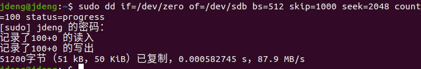
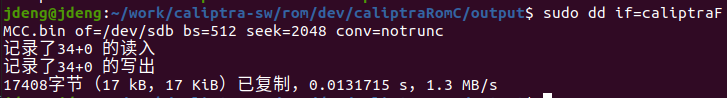
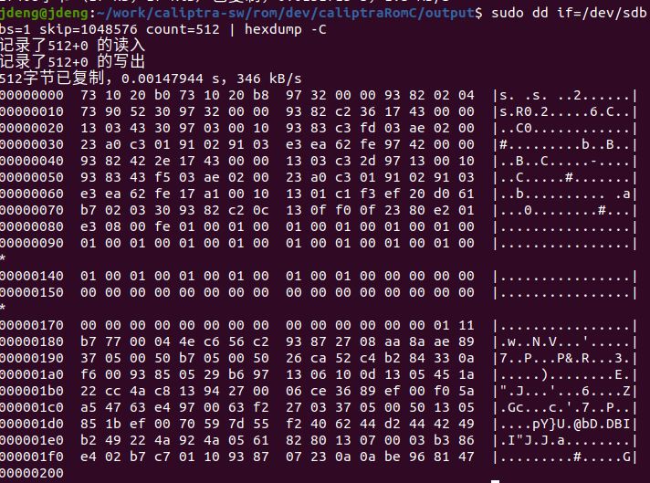

# SD卡和Debug说明
## SD卡
**准备：**

我们使用支持SD2.0协议的SD卡存储SOC运行时的Image，并使用读卡器连接linux主机和SD卡。

### 擦除

使用dd命令对SD卡设备进行读写，写入之前先对SD卡进行擦除。

`sudo dd if=dev/zero of=/dev/sdb bs=512 skip=1000 seek=2048 count=100 status=propress`

### 写入
FMC固定写入SD卡的2048块位置（1MB的偏移），RT固定写入到4096块位置，
SOC_FW固定写入到6144块位置

`sudo dd if=caliptraFMCC.bin of=/dev/sdb bs=512 seek=2048 conv=notrunc`

### 检查
使用字节为单位进行读取，2048*512=1048576，是FMC的存储位置

`sudo dd if=/dev/sdb bs=1 skip=1048576 count=512 | hexdump -C`

## Debug流程

**说明**：

ARM核的调试流程参照一般J_Link使用方法，连接好调试器后上电即可使用调试命令，这里不再赘述。主要详细拆解 Caliptra 进入 DEBUG（调试）模式的每一步，便于理解和实际操作：

### 1. 让 SoC 驱动 Caliptra 进入 Debug 状态

- **目的**：必须让 Caliptra 所在芯片处于 DebugUnlocked 状态，否则 JTAG/TAP 调试口不会开放。
- **操作**：
  - SoC 需要将 Caliptra 的 security state 信号线配置为 DebugUnlocked。例如，security state 的编码为 `000b`（DebugUnlocked + unprovisioned）或 `011b`（DebugUnlocked + production）。
  - 这由主 SoC trap 管脚配置来实现。
  - **注意**：security state 是在 cptra_rst_b（Caliptra 复位信号）去使能时锁存的，必须在释放 Caliptra 复位之前设置好。

---

### 2. 驱动 BootFSMBrk 信号

- **目的**：BootFSMBrk 信号用于打断 Caliptra 内部 BootFSM 状态机，常用于制造或调试流程。
- **操作**：
  - 通过 SoC 上的 GPIO 或 ROM 控制 BootFSMBrk 信号，在 cptra_rst_b 释放之前拉高。
  - 这样 Caliptra 在启动流程上会进入特殊的调试/制造分支。

---

### 3. 上电并初始化 Caliptra

- **顺序**：
  1. SoC 先拉高 cptra_pwrgood（Caliptra 上电良好信号）。
  2. 再释放 cptra_rst_b（Caliptra 复位信号）。
  3. Caliptra 评估当前的 security state（此时如果是 DebugUnlocked，则后续 JTAG 会开放）。
  4. Caliptra 进入 Ready_for_Fuse 状态，SoC 可以写入必要的 fuse、TRNG 等初始化寄存器。
  5. SoC 设置 CPTRA_FUSE_WR_DONE 标志，Caliptra 完成 fuse 锁定。

---

### 4. 利用 JTAG 或 SoC 接口申请调试服务

- **操作**：
  1. 通过 JTAG 或 SoC APB 接口，向寄存器 CPTRA_DBG_MANUF_SERVICE_REG 写入，表明需要“调试服务”。
  2. 向寄存器 CPTRA_BOOTFSM_GO 写入，允许 Caliptra BootFSM 状态机继续，让 MCU 出复位。
  3. 此时 MCU 会根据上面写入的服务类型，进入对应的调试服务流程。
  4. 现在，可以通过 JTAG（参考 [VeeR Specification](https://github.com/chipsalliance/Cores-VeeR-EL2)）访问微控制器的 TAP 命令，实现断点、寄存器查看等硬件调试功能。

---

### 5. 调试寄存器的访问说明

- **调试时可访问的寄存器例举**（通过 JTAG DMI 或 SoC APB 实现，部分寄存器为只读）：
  - DMI_REG_MBOX_DLEN = 0x50
  - DMI_REG_MBOX_DOUT = 0x51
  - DMI_REG_MBOX_STATUS = 0x52
  - DMI_REG_BOOT_STATUS = 0x53
  - DMI_REG_CPTRA_HW_ERROR_ENC = 0x54
  - DMI_REG_CPTRA_FW_ERROR_ENC = 0x55
  - DMI_REG_CPTRA_DBG_MANUF_SERVICE_REG = 0x60
  - DMI_REG_BOOTFSM_GO = 0x61

---

### 6. 注意事项

- **安全状态锁存时机**：cptra_rst_b 释放时的 security state 决定是否能进入 Debug 模式。错过时机需要重新复位并设置。
- **调试开放性**：处于 DebugUnlocked 状态时，Caliptra 内部密钥等安全资产会被清零或切换为调试密钥，确保安全策略。
- **不要在生产状态下随意开放调试**，否则会影响安全性。

---

### 总结流程示意

1. 配置 security state 为 DebugUnlocked。
2. 驱动 BootFSMBrk。
3. 上电并释放 Caliptra 复位。
4. 通过 JTAG/SoC 接口申请调试服务。
5. 访问调试寄存器，使用 JTAG 进行 MCU 调试。

