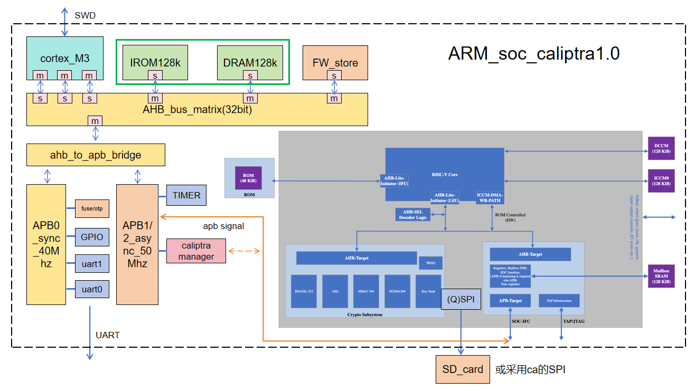
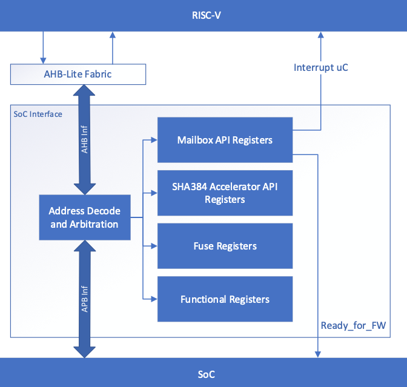

# 硬件RTL代码使用说明书 #

**说明：**

本SOC设计采用了[ARM](https://www.arm.com)开源的cortex-M3内核，安全协处理器部分采用了[caliptra](../user/verilog/Caliptra/caliptra-rtl/docs/CaliptraHardwareSpecification.md)。

## 1 系统架构 ##

### 1.1 整体架构图 ###

1.  可信根须集成在处理器总线下，作为APB设备与主CPU进行通信。

2.  SOC采用ARM架构CPU core
    并采用AHB、APB总线互联，并集成自主编写的GPIO、UART、TIME、fuse
    OTP、SPI等外设。

3.  SOC采用128k
    IROM、128kDRAM、256kFW_store作为存储设备，并为可信根提供imem、iccm、dccm、作为运行时存储，通过Mbox进行数据交互。

4.  可信根采用RISC_V
    架构CPU，AHB_lite总线，密码学IP集成sha256、sha512、ECDSA、HMAC、CSRNG、AES等。

### 1.2 可信根接口图 ###

SOC interface是可信根与SOC沟通的桥梁，具有两种总线接口。AHB接口供可信根core访问，APB接口供SOC访问。SOC和可行根core都可以访问接口中的邮箱寄存器、SHA384加速器寄存器、fuse寄存器、以及功能寄存器。同时将功能模块中的中断信号传给可信根core，并且给SOC发出wire信号。

## 2 关键模块介绍

### 2.1 mcu_top

这个Verilog文件(mcu_top.v)是一个名为\'cm3_ahbmtx\'的微控制器单元(MCU)的顶层模块。它集成了微控制器系统的多个功能域和接口。

#### 主要组件:

1.接口端口，模块定义了以下主要接口组：

- 调试端口：包括CLK(时钟)、RSTN(复位)等基本信号。

- GPIO/外设复用接口：通过\`ifdef GPIO宏选择GPIO或特定外设。

- JTAG调试接口：TDI、TCK、TMS、TDO、TRST等标准JTAG信号。

- Caliptra专用接口：

- JTAG接口(ca_jtag\_\*)

- QSPI接口(ca_qspi\_\*)

- UART接口(ca_uart\_\*)

2.时钟和复位系统

- 生成多种时钟信号：hsi、hsi2、hsi3、lsi等。

- 分配系统时钟(sys_root_clk)和各总线时钟(apb0/1/2/3_root_clk)。

- 复位信号与PLL锁定状态(pll_locked)相关联。

3.功能域

- FP域(全功能域)：通过fp_domain实例实现主要功能。

- AO域(常开域)：虽然代码中没有直接实例化，但注释提到包含。

- FPGA平台支持：通过\`ifdef FPGA条件编译。

4.外设接口

- UART接口：支持UART0和UART1。

- 以太网接口：包括MDC、MDIO、TXD等信号。

- GPIO接口：条件编译支持16位GPIOA。

#### 功能特点:

灵活的配置选项：使用条件编译(`ifdef)支持不同配置(如GPIO或特定外设)。

多时钟域设计：支持不同总线和工作模式下的多种时钟频率。

完整的调试支持：提供标准JTAG和专用调试接口。

安全特性：集成Caliptra安全模块接口。

FPGA兼容性：支持在FPGA平台上实现。

### 2.2 Fp_domain

#### 模块概述:

fp_domain是一个 SoC（System-on-Chip）设计的顶层模块，主要功能包括：

- Cortex-M3 CPU 核心：作为主控制器，执行代码并管理外设。

- AHB 总线矩阵：连接 CPU 与多个存储和外设模块。

- APB 桥接器：将高速 AHB 总线转换为低速 APB 总线，连接
UART、GPIO、以太网、定时器等外设。

- 存储子系统：包括 ITCM（指令紧耦合存储器）、DTCM（数据紧耦合存储器）和
FW_STORE（固件存储区）。

- 外设子系统：UART、GPIO、以太网 MAC、定时器、Caliptra 安全模块等。

- 中断控制器：管理 CPU 的中断请求（IRQ）。

#### 时钟与复位架构：

1.时钟输入

- sys_root_clk：系统主时钟，驱动 CPU 和 AHB 总线。

- apb0_root_clk \~ apb3_root_clk：4 个 APB
总线时钟，分别用于不同外设域。

- eth_pe_tx_clk/eth_pe_rx_clk：以太网 PHY 的 TX/RX 时钟。

- advtim_pe_clk：高级定时器的专用时钟。

2.复位信号

- sys_root_rstn：系统主复位（低有效）。

- apb0_root_rstn \~ apb3_root_rstn：4 个 APB 域的复位信号。

- eth_pe_tx_rstn / eth_pe_rx_rstn：以太网 PHY 的 TX/RX 复位。

- power_on_rstn：上电复位（POR），用于 CPU 初始化。

#### CPU 子系统（Cortex-M3）：

1.主要功能

- 采用ARM Cortex-M3处理器，支持Thumb-2指令集。

- 包含3 个 AHB 总线接口：
I-Code 总线（取指）：用于指令读取（只读）。D-Code 总线（数据）：用于数据加载/存储（可读写）。System 总线（系统）：用于访问外设和存储器。

2.调试接口

- SWD（Serial Wire Debug）：

- SWCLKTCK（时钟）、SWDITMS（数据）、TDO（调试输出）。

- JTAG（可选）：

- TDI（数据输入）、TCK（时钟）、TMS（模式选择）、TRST（复位）。

- ETM（Embedded Trace Macrocell）：支持指令跟踪（未在此设计中启用）。

3.中断处理

- NVIC（Nested Vectored Interrupt Controller）管理 240
个中断源（irq\[239:0\]）。

- 部分中断源：

- uart0_int / uart1_int（UART 中断）。

- gpioa_int（GPIO 中断）。

- eth_mac_dma_int（以太网 DMA 中断）。

- bastim_int（基础定时器中断）。

- advtim_gen_int / advtim_cap_int（高级定时器中断）。

#### AHB 总线矩阵：

1.主要功能

- 连接CPU（主设备）与存储器/外设（从设备）。

- 支持多主设备（Multi-Master）和多从设备（Multi-Slave）架构。

2.主设备接口

| 主设备 | 总线类型 | 用途 |
|-------|--------|------|
| CPU I-Code | AHB-Lite | 指令取指 |
| CPU D-Code | AHB-Lite | 数据访问 |
| CPU System | AHB-Lite | 外设访问 |
| Ethernet MAC | AHB | 以太网 DMA |

3.从设备接口

| 从设备 | 地址范围 | 用途 |
|-------|--------|------|
| ITCM | 0x00000000~0x0001FFFF | 128KB 指令存储器 |
| DTCM | 0x00020000~0x0003FFFF | 128KB 数据存储器 |
| FW_STORE | 0x00040000~0x0006ffff| 256KB 固件存储 |
| APB0 | 0x40000000~0x4000FFFF | UART & GPIO |
| APB1 | 0x40010000~0x4001FFFF | 基础定时器 |
| APB2 | 0x40020000~0x4002FFFF | 以太网 & 高级定时器 |
| APB3 | 0x30000000~0x3003FFFF | Caliptra 安全模块  |

#### APB 外设子系统：

1.APB0（同步 APB）

- UART0 / UART1：

- 支持 TX/RX 数据传输。

- 可配置波特率、数据位、校验位。

- GPIO（可选）：

- 通用输入/输出引脚。

- 支持中断触发（\`gpioa_int\`）。

2.APB1（异步 APB）

- 基础定时器（BASTIM）：

- 提供周期性定时中断（bastim_int）。

3.APB2（异步 APB）

- 以太网 MAC：

- 支持 MII/RMII 接口。

- 提供 DMA 传输（eth_mac_dma_int）。

- 支持 MAC 控制（eth_mdc / eth_mdio）。

- 高级定时器（ADVTIM）：

- 支持 PWM、输入捕获等高级功能（advtim_gen_int / advtim_cap_int）。

4.APB3（同步 APB）

- Caliptra 安全模块：

- 提供 JTAG 调试接口（ca_jtag_tck / ca_jtag_tms）。

- QSPI 接口（ca_qspi_clk / ca_qspi_data）。

- UART 接口（ca_uart_tx / ca_uart_rx）。

- 支持安全启动、加密引擎等安全功能。

#### 中断管理：

1.同步中断，由 CPU 直接处理，如：

- uart0_int、uart1_int（UART 中断）。

- gpioa_int（GPIO 中断）。

- eth_mac_dma_int（以太网 DMA 中断）。

2.异步中断，需要同步到系统时钟，如：

- eth_mac_tx_int / eth_mac_rx_int（以太网 TX/RX 中断）。

- advtim_gen_int / advtim_cap_int（高级定时器中断）。

3.中断优先级

- 通过NVIC（Nested Vectored Interrupt Controller）管理。

- 支持优先级抢占和嵌套中断。

#### 关键设计特点：

1.多时钟域设计：

- 系统主时钟（sys_root_clk）与 APB
时钟（apb0\~apb3_root_clk）分离，降低功耗。

- 以太网 PHY 和高级定时器使用独立时钟（eth_pe_tx_clk /
advtim_pe_clk）。

2.分层总线架构：

- AHB（高速总线）用于 CPU 与存储器通信。

- APB（低速总线）用于外设控制。

3.模块化设计：

存储（ITCM/DTCM/FW_STORE）、外设（UART/GPIO/以太网）、安全模块（Caliptra）独立封装。

4.调试支持：

- 支持SWD和JTAG调试接口。

- 可扩展ETM跟踪功能（当前未启用）。

5.安全机制：

- 集成Caliptra安全模块，提供加密、安全启动等功能。

### 2.3 apb3_caliptra

APB3 Caliptra模块实现了一个用于Caliptra安全处理器的APB3(高级外设总线)接口，主要提供以下功能：

1. APB3从机接口：包含标准APB3信号(paddr, penable,
    pwrite等)，支持32位地址和数据总线。

2. Caliptra安全处理器集成：实例化caliptra_top作为核心处理单元，提供电源管理(pwrgood)和复位控制。

3. 外设接口：JTAG调试接口(ca_jtag\_\*)、QSPI闪存接口(ca_qspi\_\*)、UART串口(ca_uart_tx/rx)。

4. 存储器接口：邮箱SRAM(mbox_sram\_\*)、指令存储器(imem\_\*)、通过el2_mem_if接口连接的其他存储器。

5. 安全功能：真随机数生成器(TRNG)、错误报告(cptra_error\_\*)、安全状态控制(security_state)。

#### 组件分析：

1.电源管理

模块中包含pwrgood_assert模块用于生成电源就绪信号，该信号默认低电平，15个时钟周期后拉高，确保系统上电稳定。

2.QSPI接口处理

使用三态缓冲实现双向数据总线，通过qspi_data_host_to_device_en控制方向，实现主机与设备之间的数据交换。

3.随机数生成器

rng4bits模块生成4位随机数，需要外部使能信号(etrng_req)触发，itrng_valid标志指示随机数稳定可用。

4.存储器模型

模块支持两种实现方式：仿真模式下使用SRAM模型，初始化时从hex文件加载指令存储器内容；FPGA模式下使用专用存储器IP核。

5.安全配置

模块中包含硬编码的安全密钥(cptra_obf_key)，测试阶段直接设置安全状态为全开放(3\'b111)，便于开发和调试。

#### 设计特点：

1. 可配置性：通过宏定义选择功能(如CALIPTRA_INTERNAL_UART)，支持仿真和FPGA两种实现方式。

2. 调试支持：关键信号添加了mark_debug属性，QSPI接口信号特别标记为调试重点。

3. 模块化设计：使用接口结构体(el2_mem_if)简化连接，外设功能独立封装。

4. 安全隔离：作为Caliptra处理器与外部系统的桥梁，提供了完整的控制接口和必要的安全功能支持。

APB3 Caliptra模块作为Caliptra安全处理器的重要组成部分，提供了标准化的总线接口和丰富的外设支持，同时集成了关键的安全功能，为系统提供了可靠的硬件安全基础。其模块化设计和良好的可配置性使其能够适应不同的应用场景和实现平台。

### 2.4 caliptra_top

caliptra_top 是SoC安全子系统顶层集成模块。它负责将各硬件安全模块（如加密、密钥管理、存储等）和SoC 外设（如 JTAG、UART、QSPI、APB、SRAM、IMEM等）进行互联，并实现安全状态管理、时钟门控、调试模式处理等功能。

#### 端口与信号说明:

1.时钟与复位

- \`clk\`：主时钟输入。

- \`cptra_pwrgood\`：电源良好信号。

- \`cptra_rst_b\`：全局复位（低有效）。

2.密钥

- \`cptra_obf_key\[255:0\]\`：外部输入的 obfuscated
key，用于设备安全启动。

3.外部接口

- JTAG：调试接口（\`jtag_tck\`, \`jtag_tms\`, \`jtag_tdi\`,
\`jtag_trst_n\`, \`jtag_tdo\`）。

- APB：外围总线接口，用于 CPU/外设控制寄存器访问。

- QSPI：高速串行存储器接口。

- UART（可选）：串口通信。

4.SRAM/IMEM接口，用于与 mailbox、指令存储器等模块的数据通信。

5.状态与控制信号

- \`ready_for_fuses\`、\`ready_for_fw_push\`、\`ready_for_runtime\`：各阶段准备信号。

- \`cptra_error_fatal\`、\`cptra_error_non_fatal\`：错误状态指示。

- \`mailbox_data_avail\`、\`mailbox_flow_done\`：mailbox 相关状态。

6.随机数与安全

- \`etrng_req\`：外部随机数请求。

- \`itrng_data\`、\`itrng_valid\`：内部TRNG数据及其有效性。

- \`security_state\`：当前安全状态结构体输入。

- \`scan_mode\`：是否进入 scan mode（调试/测试模式）。

#### 内部信号与参数：

1.本地参数

- \`NUM_INTR\`：中断数量。

- \`TOTAL_OBF_KEY_BITS\`：总 obfuscated key 位宽。

2.主要内部信号

- 时钟门控信号（如 \`clk_cg\`, \`uc_clk_cg\`）。

- 多路复用/总线控制信号（如 \`ic_haddr\`, \`ic_hburst\` 等）。

- 安全状态锁存寄存器（\`cptra_security_state_Latched\_\*\`）。

- Debug/Scan 相关信号。

- 各个外设的中断与通知信号。

#### 总线及外设实例化：

1.AHB Lite 总线

- 多个 responder（从端）和initiator（主端）实例，负责连接各个安全模块和 SoC 外设。

2.总线多路复用

- \`ahb_lite_bus\` 负责地址解码。

- \`ahb_lite_2to1_mux\` 用于主端、从端数据多路复用，保证数据相互隔离。

#### 各功能模块职责：

1.加密与安全模块

- SHA512/SHA256 控制器：实现哈希运算，支持外部请求与中断处理。

- DOE 控制器：Device Owner Entropy 模块，用于密钥派生。

- ECC/HMAC 控制器：支持椭圆曲线加密和消息认证码功能。

- Key Vault/PCR Vault/Data Vault：分别用于密钥存储、平台配置寄存器存储、数据存储。

2.内存与存储，IMEM：指令存储器，支持 AHB Lite 访问。

3.随机数发生器（可选），TRNG/CSPRNG：支持真随机数生成和确定性随机数扩展。

#### 安全与调试机制：

1.安全状态锁存

- 通过 \`cptra_security_state_Latched_d\`等寄存器锁存并比较安全状态，确保安全模式切换可控。

2.Debug/Scan Mode 资产保护

- 如果进入 debug 或 scan模式，敏感密钥和熵源被自动覆盖为测试值，防止泄露。

- 支持检测 debug locked 状态切换，并自动清除相关安全资产。

3.时钟门控与功耗优化

- \`clk_gate\` 模块根据 CPU
状态、外设选择及调试状态自动进行时钟门控，降低功耗。

#### 中断管理：

- 各外设的 error/notification 信号被整理为统一的中断向量
\`intr\`，映射到 VeeR 内核标准中断。

- 保证每个外设的中断能正确被核心捕捉和处理。

#### 参数化与可扩展设计：

- 顶层模块大量使用参数与宏定义（如
\`CALIPTRA_SLAVE_SEL\_\*\`、\`CLP_OBF_KEY_DWORDS\`等），便于根据芯片配置裁剪和扩展功能。

- 条件编译（\`ifdef\`）支持裁剪部分硬件资源（如 UART、TRNG）。

#### 典型启动流程：

1. 系统上电，\`cptra_pwrgood\` 高，\`cptra_rst_b\` 释放。

2. 安全状态和 scan mode 状态被锁存。

3. 各安全单元初始化并监听外部请求。

4. 进入 debug/scan mode 时，自动清除/覆盖所有敏感资产。

5. 外设通过 AHB/APB/QSPI/UART 等接口与外部通信。

6. 各安全模块通过统一的总线架构与主核通信，并支持状态反馈与中断。

#### 小结：

caliptra_top 作为安全子系统的顶层集成模块，完成了以下核心职责：

- 各安全模块与 SoC 外设的互联互通

- 严格的安全状态与调试隔离机制

- 自动化的资产清理与保护

- 可扩展、参数化的架构设计，便于适配不同应用

- 支持多种通信与扩展接口

该模块展现了高安全等级芯片项目中典型的顶层集成与安全策略实现方式。
