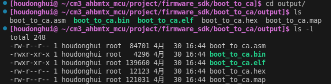
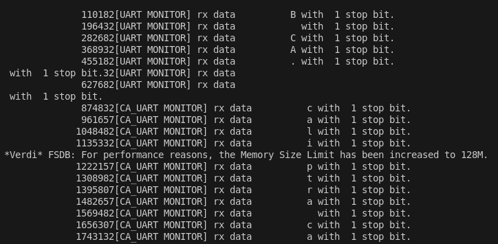
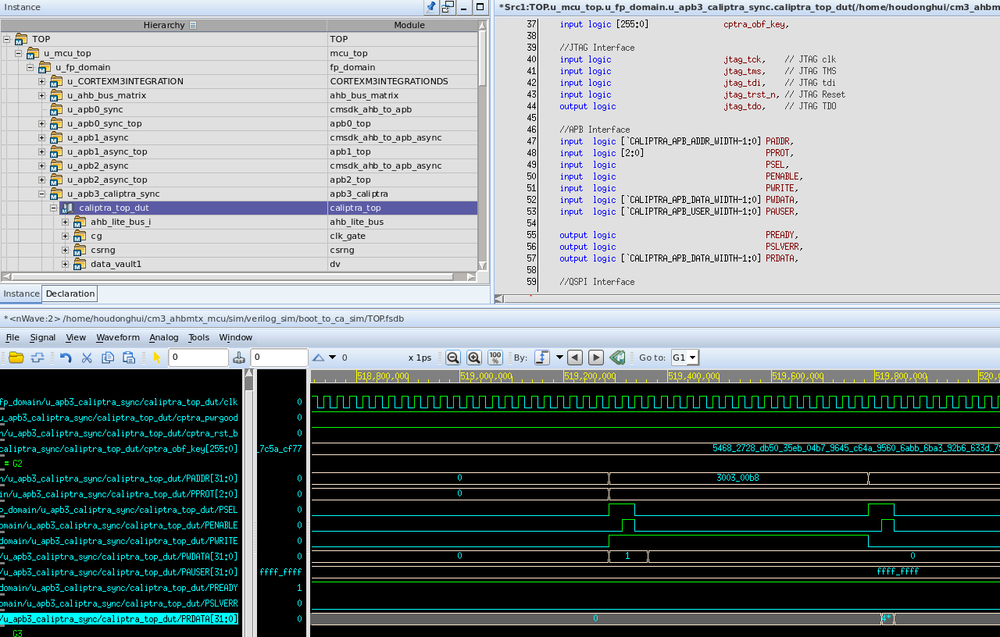

# 联合仿真流程

## ARM+RISC_V 仿真验证

**说明：**
以SOC整体作为DUT，仿真ARM核从上电运行bootrom程序到安全协处理器caliptra启动的流程，SOC和caliptra分别执行软件从串口输出信息，显示运行过程。

**运行环境：**
linux 5.10版本后系统

**基础软件环境：**

1.  VCS+Verdi 或verilater+GTKwave仿真器

2.  可信根工程全部RTL代码,以及仿真testbench、testvector

3.  SOC全部RTL源码、存储器源码

4.  Makefile、python、perl工具及脚本

5.  ARM编译工具链 gcc-arm-none-eabi v10.3-2021.10

**操作说明：**

编译写好的boot_to_ca软件。

`cd cm3_ahbmtx_mcu/user/firmware/boot_to_ca`

`make -f makefile.boot_to_ca`

编译RTL代码并运行SOC联合仿真，vcs终端输出arm驱动UART输出的字符，以及可信根输出的字符。

`cdh`

`run boot_to_ca_sim`

可在[仿真文件夹](../sim/verilog_sim/)中生成相应仿真工程

进入仿真文件夹，并用Verdi打开TOP.fsdb波形。

`verdi -ssf TOP.fsdb`

查看SOC在执行boot_to_ca驱动可信根时内部信号的变化。

## Caliptra 在 testbench 上的仿真流程 ##

**说明：**
以caliptra_top 作为DUT，在testbench中为DUT提供初始化激励来驱动caliptra运行smoke_test测试例程。并增添监视器和断言来收集反馈信号并监视信号变化。
### Caliptra Top VCS Steps: ###
1. Setup tools, add to PATH (ensure RISC-V toolchain is also available)
2. Define all environment variables above
    - For the initial test run after downloading repository, `iccm_lock` is recommended for TESTNAME
3. Create a run folder for build outputs (and cd to it)
4. Either use the provided Makefile or execute each of the following steps manually to run VCS simulations
5. Makefile usage:
    - Example command:
        `make -C <path/to/run/folder> -f ${CALIPTRA_ROOT}/tools/scripts/Makefile TESTNAME=${TESTNAME} vcs`
    - NOTE: `TESTNAME=${TESTNAME}` is optional; if not provided, test defaults to value of TESTNAME environment variable, then to `iccm_lock`
    - NOTE: Users may wish to produce a run log by piping the make command to a tee command, e.g.:
        `make ... <args> ... | tee <path/to/run/folder>/vcs.log`
    - NOTE: The following macro values may be overridden to define the hardware configuration that is built. Default values in the Makefile are shown with each macro:
      - CALIPTRA_INTERNAL_TRNG=1
      - E.g. `make -f ${CALIPTRA_ROOT}/tools/scripts/Makefile CALIPTRA_INTERNAL_TRNG=1 vcs`
6. Remaining steps describe how to manually run the individual steps for a VCS simulation
7. [OPTIONAL] By default, this run flow will use the RISC-V toolchain to compile test firmware (according to TESTNAME) into program.hex, iccm.hex, dccm.hex, and mailbox.hex. As a first pass, integrators may alternatively use the pre-built hexfiles for convenience (available for [iccm_lock](../user/verilog/Caliptra/caliptra-rtl/src/integration/test_suites/iccm_lock) test). To do this, copy [iccm_lock.hex](../user/verilog/Caliptra/caliptra-rtl/src/integration/test_suites/iccm_lock/iccm_lock.hex) to the run directory and rename to `program.hex`. [dccm.hex](../user/verilog/Caliptra/caliptra-rtl/src/integration/test_suites/iccm_lock/iccm_lock.hex) should also be copied to the run directory, as-is. Use `touch iccm.hex mailbox.hex` to create empty hex files, as these are unnecessary for `iccm_lock` test.
8. Invoke `${CALIPTRA_ROOT}/tools/scripts/Makefile` with target 'program.hex' to produce SRAM initialization files from the firmware found in `src/integration/test_suites/${TESTNAME}`
    - E.g.: `make -f ${CALIPTRA_ROOT}/tools/scripts/Makefile program.hex`
    - NOTE: TESTNAME may also be overridden in the makefile command line invocation, e.g. `make -f ${CALIPTRA_ROOT}/tools/scripts/Makefile TESTNAME=iccm_lock program.hex`
    - NOTE: The following macro values must be overridden to match the value provided (later) during hardware compilation. The full L0 regression suite includes tests that will fail if the firmware and hardware configuration has a discrepancy. Default values in the Makefile are shown with each macro:
      - CALIPTRA_INTERNAL_TRNG=1
      - E.g. `make -f ${CALIPTRA_ROOT}/tools/scripts/Makefile CALIPTRA_INTERNAL_TRNG=1 program.hex`
9. Compile complete project using `src/integration/config/caliptra_top_tb.vf` as a compilation target in VCS. When running the `vcs` command to generate simv, users should ensure that `caliptra_top_tb` is explicitly specified as the top-level component in their command to ensure this is the sole "top" that gets simulated.
    - NOTE: The following macro values must be defined (or omitted) to match the value provided during firmware compilation. The full L0 regression suite includes tests that will fail if the firmware and hardware configuration has a discrepancy.
      - CALIPTRA_INTERNAL_TRNG
10. Copy the test generator scripts to the run output directory:
    - [src/ecc/tb/ecc_secp384r1.exe](../user/verilog/Caliptra/caliptra-rtl/src/ecc/tb/)
        * Necessary for [randomized_pcr_signing](../user/verilog/Caliptra/caliptra-rtl/src/integration/test_suites/randomized_pcr_signing)
        * OPTIONAL otherwise
    - [src/doe/tb/doe_test_gen.py](../user/verilog/Caliptra/caliptra-rtl/src/doe/tb/doe_test_gen.py)
        * Allows use of randomized secret field inputs during testing.
        * Required when using the `+RAND_DOE_VALUES` plusarg during simulation
        * Also required for several smoke tests that require randomized DOE IV, such as smoke_test_doe_scan, smoke_test_doe_rand, smoke_test_doe_cg
11. Simulate project with `caliptra_top_tb` as the top target

**补充：**
`setenv.sh`中定义了两个函数是对上述命令的包装，`run`和`run_fsdb`，可方便进行caliptra_top的独立testbench仿真。