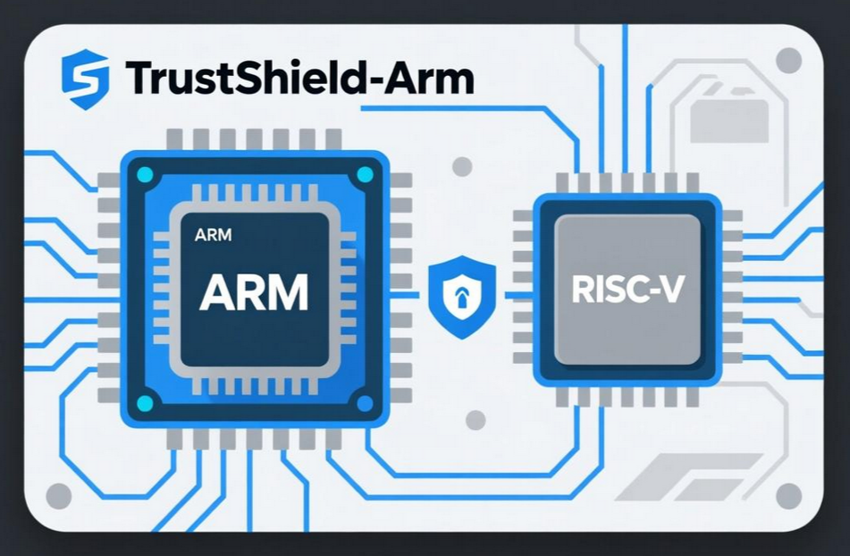

# **一级可信根** #

## **1 简介** ##

这是一个基于ARM cortex-M3内核的SOC参考设计，集成了基于risc_v的可信根。整体采用了强化安全的双核SOC架构，RISC_V安全域与ARM相互隔离。此设计为SOC固件测量引导和身份认证等功能提供了安全硬件基础，即可作为独立SOC实现，也可作为多级计算集群的一部分进行集成。

### 1.1 背景介绍 ###

随着云计算技术的快速发展，云平台（边缘计算节点、区域服务器、中心云等）已成为现代IT基础设施的核心架构。然而，云平台安全威胁日益严峻。
固件/硬件层攻击：如Bootkit、UEFI恶意代码植入、供应链攻击（如SolarWinds事件）威胁底层信任链。运行时篡改：虚拟机逃逸（VM
Escape）、侧信道攻击（如Spectre）可绕过软件安全机制。

现有的安全方案都有一定局限性。软件可信根（如TPM软件模拟器）依赖主机CPU，易受操作系统层攻击。传统静态可信度量，仅支持单次启动验证，无法适应云平台动态扩展需求。软件实现（如Linux
IMA）性能开销大，且易被恶意内核绕过。硬件可信根依赖外置芯片，如独立TPM芯片，存在接口延迟、成本高、难以覆盖云平台静态度量场景等局限。

云平台硬件级可信根有一下几个迫切需求。芯片内集成可信根，即通过RTL设计将信任锚点植入处理器，实现物理不可篡改性。静态度量硬件化，在启动阶段对固件、OS镜像进行逐级哈希验证，确保代码完整性。支持云平台的动态度量需求（如边缘设备新增节点时的自动认证）。身份链式传递，基于硬件密钥生成唯一身份，实现跨层级安全通信。

### 1.2 设计目标 ###

本设计的核心价值在于以下几点。为云平台提供"信任原点"：通过RTL实现的硬件可信根，进行静态度量，从芯片硬件层面保障设备的初始安全。兼容现有标准：支持NIST
800
-193等规范，同时优化静态度量效率（较软件方案提速10倍以上）。抵御未来威胁：通过抗侧信道攻击设计（如密钥混淆）、物理防篡改逻辑，应对量子计算时代的安全挑战。

本设计通过Verilog/SystemVerilog实现可信根RTL逻辑，确保硬件可综合性，代码包括可信根risc_v核心、互联总线、算法IP、SOC的RTL代码。SOC集成了可信根组成一个完整的安全处理器系统。同时提供一套仿真验证testbench，帮助处理器设计人员高效完成硬件移植和集成。支持集成到
CPU、GPU、NIC、SSD 等多种芯片中，满足现代边缘计算和机密计算场景的需求。

## 2 文档 ##

- [环境配置](design_doc/环境配置.md)
- [自动化脚本说明](design_doc/自动化脚本说明.md)
- [硬件RTL代码说明](design_doc/硬件RTL代码说明.md)
- [安全软件源代码解析](design_doc/安全软件源代码解析.md)
- [联合仿真流程](design_doc/联合仿真流程.md)
- [FPGA流程](design_doc/FPGA流程.md)
- [SD卡和Debug说明](design_doc/SD卡和Debug说明.md)
- [安全策略和标准定义](design_doc/安全策略和标准定义.md)

## 3 相关仓库 ##

本SOC设计分为两个仓库

|      仓库     | 描述 |
| ------------ | ----------- |
| [主硬件RTL仓库](../First_rot/)  | RTL数字逻辑设计、SIM仿真验证、FPGA原型验证。包括全部system verilog代码，EDA自动化仿真脚本，FPGA构建脚本...... |
| [软件代码仓库](../First_rot_sw/) | 包括SOC板级支持包、bootroom、runtime源码、SD卡image |

## 4 标准及定义 ##
为了提高规范定义的灵活性并最大限度地提高适用性，本设计的范围被刻意简化。这种极简主义的方法推动了行业的一致性、一致性和基础设备安全模块的更快采用。一个定义良好、范围狭窄的规范可以最大限度地提高架构的可组合性；CSP、产品和供应商之间的可重用性；以及开源的可行性。

本SOC设计定义了硅内部RoT基线的设计标准。此标准满足度量信任根（RTM）角色。开源实现为RTM和锚定硬件认证的测量机制带来了透明度。可信根必须测量其引导到SOC的代码和配置，并且必须存储这些测量值，并使用基于唯一每资产加密熵的签名证明进行报告。因此，risc_v安全协处理器是SoC的身份信任根（RTI）。

## 5 维护与支持 ##
工作组每周二上午10点举行会议。issues频道用于交互式讨论。请记住，开发活动主要集中在Git问题和Pull Request评论上，如果您遇到问题，请联系邮件1104112741@qq.com 。

**维护：** 本仓库由侯冬辉长期维护 

## 6 视频教程 ##

[视频教程](https://space.bilibili.com/388320274/lists/4988360?type=series)