# 一级可信根模块设计报告（RISC-V）

## 1 设计思路

与ARM SoC相同。


## 2 Caliptra1.0+RISC-V SoC的整体设计框架

RISCV_soc_caliptra1.0整体框架如图所示，硬件上设计集成了caliptra1.0版本的基于RISC-V Rocket内核的SOC，并在FPGA平台实现。图中右侧深灰色框中的部分为可信根Caliptra，通过wrapper（caliptra TL_to_APB）连接到RISC-V SoC中。

<div align="left">
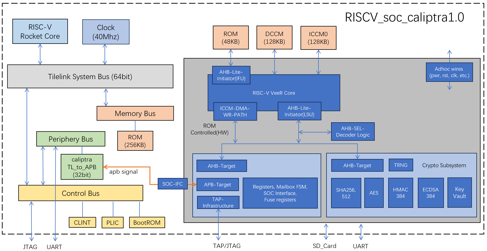
</div>

**图1 RISC-V SoC+Caliptra1.0设计架构**

1. 可信根须集成在处理器总线下，作为APB设备与主CPU进行通信。
2. SOC采用RISC-V架构CPU Rocket core并采用Tilelink总线互联，集成UART、JTAG等外设。
3. SOC采用256KiB Strachpad、2GB DRAM作为存储设备，并为可信根提供imem、iccm、dccm作为运行时存储，通过Mbox进行数据交互。
4. 可信根采用RISC_V架构CPU，AHB_lite总线，密码学IP集成sha256、sha512、ECDSA、HMAC、CSRNG、AES等。

### 2.1 CPU Rocket

SoC端的核心Rocket core是RISC-V指令集架构的发布者Berkeley开发的一个标准的五级流水处理器，它支持开源RV64GC RISC-V指令集。Rocket core具有一个MMU，该MMU支持基于页面的虚拟内存，无阻塞数据缓存，同时支持可配置的分支预测功能。对于浮点运算，Rocket利用Berkeley的Chisel浮点运算单元实现。Rocket还支持RISC-V的内核（M-mode）、管理员（S-mode）和用户（U-mode）三种特权等级，可以启动Linux操作系统。Rocket core和PTW(Page Table Walker)、L1 Cache（I-Cache与D-Cache）共同组成Rocket Tile，作为Rocketchip配置中可复制的单元。

### 2.2 SoC Rocketchip

我们选择Rocketchip开源SoC生成器作为RISC-V SoC的基础，并使用Chipyard开发框架进行进一步开发。Rocketchip与Chipyard都是来自于Berkeley的开源项目。Rocketchip作为开源SoC生成器，基于RISC-V CPU核心Rocket core。Rocketchip基于Chisel语言，以配置(config)类的形式对RTL进行模块化设计，以生成SoC的CPU核心Rocket及其他SoC组件。Chipyard则是一个RISC-V SoC的开发框架，支持基于Rocketchip对SoC进行自定义配置。

### 2.3 片内互联：SiFive Tilelink

Rocketchip采用SiFive Tilelink协议实现内部互联。TileLink是一种被设计用于SoC的芯片级缓存一致性和内存协议，以连接多处理器、协处理器、缓存、内存、外设和DMA等设备，使用快速可扩展互连以提供低延迟和高吞吐量数据搬运。Rocketchip中TileLink的部署通过Diplomacy框架实现。Diplomacy将SoC中每个模块对应一个端口（Node），自动配置总线中各个端口的参数，并通过不同端口之间的连接来表示总线结构。

Rocketchip主要定义了5类总线：SystemBus、PeripheryBus、ControlBus、MemoryBus、FrontendBus。Rocketchip还提供了Tilelink协议到AXI4等协议的转化方式，以支持与非Tilelink协议的外部设备连接。

### 2.4 Rocketchip 原始硬件

利用Chipyard开发框架可以对SoC方便地进行配置。本Caliptra1.0+RISCV SoC设计基于Chipyard提供的RocketVCU118Config配置，该配置是一个可在VCU118 FPGA开发板上部署Rocketchip的实例。除一个Rocket核外，该实例为SoC配备的组件如下：

- JTAG、UART外设。
- 2GB DRAM。
- 1KB ROM，用于存放启动代码BootROM。

### 2.5 Rocketchip 配置硬件

在RocketVCU118Config配置的基础上进行自主配置，以完成与Caliptra集成的适配。修改后的配置命名为CaliptraAPBRocketKU060Config，使用Chipyard框架将该Chisel配置转化为基于system verilog的RTL工程。将Caliptra1.0 RTL工程挂载到PeripheryBus（外设总线）下，完成RISCV_soc_caliptra1.0 SoC的设计。增加配置如下：

- 设置40MHz主时钟。
- 增加256KB ROM存储，存放可信启动代码。
- 添加Tilelink-APB总线转换模块、verilog外设配置，将Caliptra1.0挂载到PeripheryBus（外设总线）下。

### 2.6 Caliptra 硬件

以下Caliptra相关的硬件配置，与上节ARM SoC中介绍的一致：

- FW_store存放从SD卡读取的soc_firmware及caliptra_runtime，校验通过后可执行。
- 由bram构成的支持caliptra的存储器：rom 48k、iccm 128k、dccm 128k、mailbox 128k。
- fuse/otp安全的存储区域（如熔丝或者OTP）来存储Caliptra的UDS种子、公钥哈希值，用于DICE身份认证和固件验证。
- caliptra manager，负责caliptra core的非apb总线信号（上电、复位、指示信号）的控制。
- caliptra JTAG、UART及QSPI接口引出。
- caliptra manager关键指示信号、caliptra error中断，添加至cortex_M3 NVIC中断管理器。

### 2.7 系统软件

SoC端Rocket核启动时，执行ROM中的可信启动代码。需要在该bootrom启动逻辑中支持Caliptra的初始化和FMC以及runtime固件加载过程，包括等待Caliptra准备好并发送启动信号，协调caliptra完成对SOC后续可变固件的校验和执行，并配合caliptra完成DICE身份认证流程。

### 2.8 RTL结构层次

最终的RTL工程名为KU060ConfigFPGATestHarness，主要结构如下：

```
KU060ConfigFPGATestHarness
|-- KU060FPGATestHarness
|   |-- ChipTop
|   |   |-- DititalTop
|   |   |   |-- TilePCRIDomain
|   |   |   |   |-- RocketTile
|   |   |   |       |-- Rocket
|   |   |   |-- SystemBus
|   |   |   |-- PeripheryBus_pbus
|   |   |   |-- PeripheryBus_cbus
|   |   |   |-- MemoryBus
|   |   |   |-- apb3_caliptra
|   |   |       |-- caliptra_top
|   |   |-- ...
|   |-- ...
|-- ...
```

RISCV SoC主要的地址空间如下：

| 地址范围 | 描述 |
|---------|------|
| 0000 0000 | CPU reg |
| 0000 0000 - 0000 0FFF | debug-controller |
| 0000 1000 - 0000 1FFF | Boot-Address-Reg |
| 0001 0000 - 0001 FFFF | BootROM |
| 0800 0000 - 0803 FFFF | FirmWare |
| 3000 0000 - 3003 FFFF | Caliptra |
| 6400 0000 - 6400 0FFF | UART |
| 8000 0000 - FFFF FFFF | DRAM |

---

## 3 关键模块

### 3.1 KU060FPGATestHarness

KU060FPGATestHarness.sv是RISC-V SoC工程的顶层模块。由于Chipyard本身的实例化的特性，运行FPGA有关的make指令时会生成4个层次的文件，如下图所示。KU060FPGATestHarness位于该结构中的第二层，主要功能是处理连接到外部的IO信号，如DRAM、JTAG、UART、时钟等信号。另外完成对从Tilelink到AXI4总线的转换，并例化DDR4 MIG模块。

```
___________________________________________________________________
|                            TestDriver                           |
|  _____________________________________________________________  |
| |                        TestHarness                          | |
| |  _________________________________________________________  | |
| | |                        ChipTop                          | | |
| | |  _____________________________________________________  | | |
| | | |                    DigitalTop                        | | |
| | | |                 (Rest of the chip)                   | | |
| | | |_____________________________________________________| | | |
| | |_________________________________________________________| | |
| |_____________________________________________________________| |
|_________________________________________________________________|
```

### 3.2 DititalTop

DititalTop.sv位于层次结构中的第四层，也是整体架构图所位于的层级，使用基于Tilelink协议的5种总线（系统总线sbus、外设总线pbus、控制总线cbus、存储总线mbus、前端总线fbus），将CPU核心及各个组件相联。连接方式简要示意如下：

```
fbus -> sbus -> mbus
tile --/ \--> cbus -> pbus
```

- **sbus** 是总线的核心，它直接与包裹着Rocket核心的RocketTile相联，并连接mbus、cbus、fbus三种总线。
- **mbus** 连接内部ROM。
- **cbus** 连接各种控制组件，cbus控制的外设包括：BootROM（完成SoC端启动）、中断模块（包括控制Rocket核中断的CLINT和控制SoC平台中断的PLIC）、Debug模块（支持JTAG调试）。cbus还作为桥梁连接sbus与pbus。
- **pbus** 负责连接UART与自定义外设。pbus完成对Tilelink到APB总线的转换，以及数据位数的转换（SoC 64位，Caliptra 32位），暴露APB协议接口与时钟、复位等信号，通过wrapper（apb3_caliptra.sv）与Caliptra相联。
- **fbus** 主要支持连接DMA，本设计中未启用。

### 3.3 apb3_caliptra

该部分设计与ARM SoC对应模块相同。

### 3.4 caliptra_top

该部分设计与ARM SoC对应模块相同。

---

## 4 ILA调试验证

### 4.1 验证目标

验证现有的Caliptra1.0+RISC-V SoC RTL设计的可行性。现阶段完成的验证为：RTL设计可在FPGA上完成RISC-V SoC的启动与Caliptra ROM的初始化，进一步完成Caliptra的启动。

### 4.2 环境准备

**硬件设备包括：**

1. 璞致KintexUltraScale系列KU060开发板，包括板载JTAG、UART转USB线
2. 调试转接板
3. ARM仿真器Jlink v12
4. CH340 UART转USB
5. SD卡

**主机运行环境：** Ubuntu 20.04

**软件环境包括：**

1. 开发框架Chipyard 1.13.0，包括riscv64-unknown-elf-gdb编译链
2. Vivado 2022.2
3. 串口显示软件Cutecom
4. 调试软件JlinkExe

**代码准备包括：**

1. 可信根工程全部RTL代码
2. Chipyard配置生成的SoC全部RTL源码
3. 固件代码文件：SoC端BootROM、Caliptra端ROM、Caliptra smoketest及测试用例
4. Makefile编译文件

<div align="left">
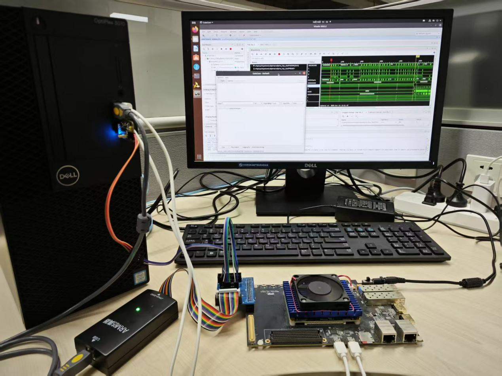
</div>

**图2 测试环境-1**

<div align="left">
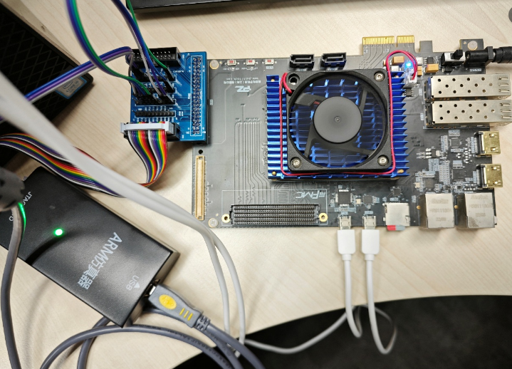
</div>

**图3 测试环境-2**

### 4.3 测试步骤

1. 在Vivado中打开Caliptra1.0+RISC-V SoC的RTL工程（KU060ConfigFPGATestHarness），使用ILA mark_debug来标记待测信号，主要探测Caliptra顶层模块与SoC侧交互的APB信号。添加相关约束文件。将Caliptra初始化的固件固化进Caliptra侧ROM，综合生成bit文件。

   为方便调试，本次测试中，SoC端完成对Caliptra启动的测试用例未固化到ROM中，而是待调试时再将对应的二进制文件加载到BRAM中。
<div style="display: flex; gap: 10px;">
  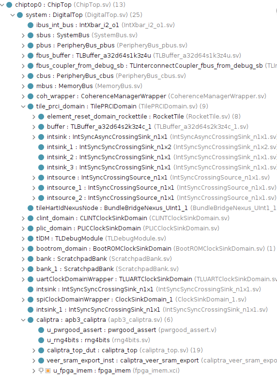
  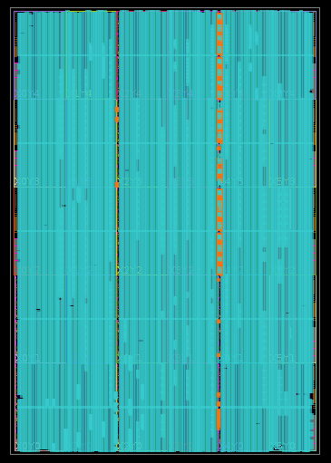
</div>

   **图4 RTL工程截图**

<div align="left">
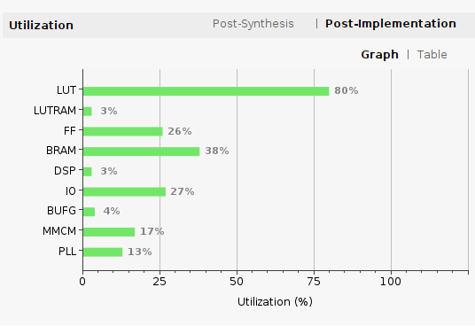
</div>

   **图5 RTL工程综合后的资源使用**

2. 打开Cutecom软件，设置波特率为115200，通过板载UART与CH340，连接Caliptra端的串口。

3. 启动开发板，通过板载JTAG对其进行bit文件烧写；打开ILA，将触发条件设置为psel=1并运行。

4. 打开JlinkExe软件，通过JLink仿真器连接开发板，输入connect，接下来的选项都选择默认参数。

<div align="left">
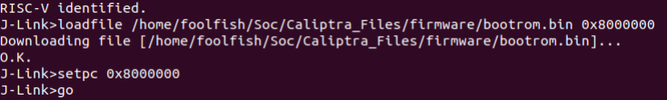
</div>

   **图6 JlinkExe初始化**

   将测试用例（bootrom.bin）加载到BRAM中（基地址0x8000000，等于SoC端ROM的跳转地址），执行代码，观察串口输出与ILA波形。

   **图7 JlinkExe加载并执行测试用例**

5. 连接SoC端的串口，重新执行步骤4。

### 4.4 测试结果

Caliptra端与SoC端的串口输出分别如下：

<div style="display: flex; gap: 10px;">
  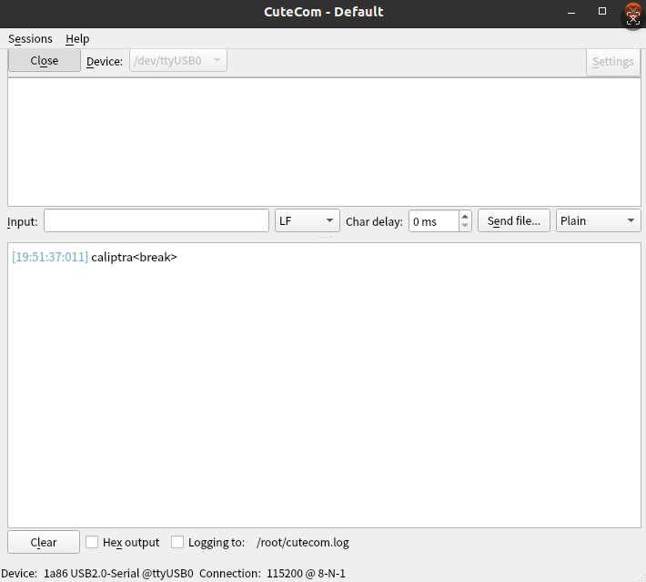
  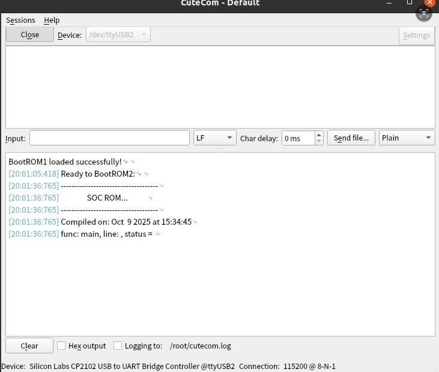
</div>

**图8 串口输出**

首先，bit文件烧写到FPGA后，SoC端串口打印"Ready to BootROM2"，来自于SoC端BootROM。表明SoC端正确启动，并将指针跳转到测试用例位于的基地址。

其次，将测试用例通过JTAG加载并执行后，SoC端串口中，分界线后的打印来自于Caliptra端ROM。表明Caliptra端完成初始化。Caliptra端串口打印"caliptra"，表示Caliptra被正确引导启动。

执行测试用例后，ILA端的波形如下：

<div align="left">
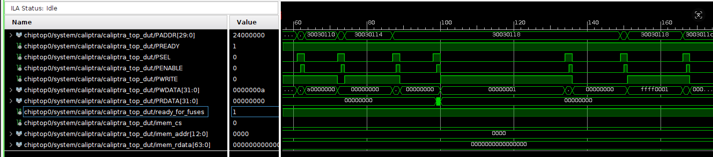
</div>

**图9 ILA局部波形：读写寄存器**

测试用例对Caliptra侧的多个寄存器进行读写。读取寄存器时，Caliptra向SoC端输出的PRDATA信号返回相应的值，表明SoC端可对Caliptra进行正常读写。

<div align="left">
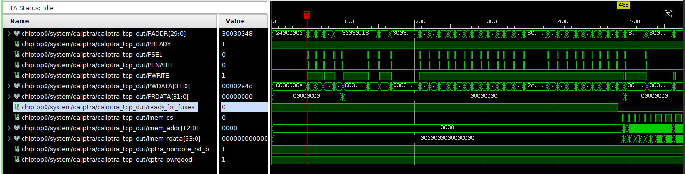
</div>

**图10 ILA整体波形**

ready_for_fuses信号拉低，表明Caliptra对fuse programming做好准备。随后Caliptra端的imem相关信号的变化，表明Caliptra内部的VeeR RISC-V核开始运行并控制imem SROM。