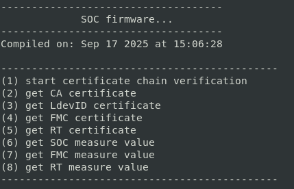
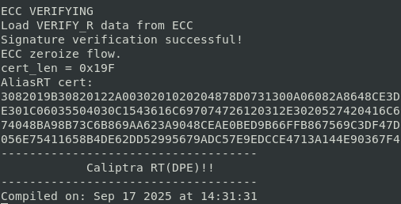

# FPGA运行测试流程
## 使用推荐的硬件平台

**软件：**
`vivado 2021.1`

**板子：**
我们采用xilinx KU060 开发板

- 购买地址：淘宝璞致旗舰店

**准备rom程序：**

SOC中的ARM核的bootrom、caliptra的imem存放启动程序。在FPGA实现中，均由xilinx IP核构成，并在synth时初始化数据。vivado 配置IP时采用的`.coe`文件是[SOC rom](../bootloader.coe)和[caliptra imem](../caliptraROMC.coe)

**FPGA实现：**

1. 进入硬件工程根文件夹
2. `source setenv.sh `
3. `run fpga_ku6_soc_ca_full_vivado`即可在[FPGA工程文件夹](https://gitcode.com/Trust_Shield/Trust_arm_soc_rot/tree/main/project/fpga_syn)中生成vivado工程。
4. vivado打开工程，替换`ram128k`和`fpga_imem`存储初始化文件为[SOC rom](../bootloader.coe)和[caliptra imem](../caliptraROMC.coe)
5. 生成bitstream和mcs文件，连接FPGA固化bitstream。
6. 逻辑资源占用情况

**准备SD卡：**
按照[SD卡和Debug说明](SD卡和Debug说明.md)烧录[SOC image](../)(bootloader-fw.bin、caliptraFMCC.bin、caliptraRTC.bin)到SD卡，并插入板卡。

**测试：**

1. 设置顶层TAP信号`security_state`=3`b111`，`scan_mode`=1`b0 。

2. 连接SOC串口和caliptra串口至主机并准备接收串口信息，Speed: 115200、Data bits: 8、Stop bits: 1、Parity: None、Flow control: None
3. FPGA上电，观察串口信息和ila波形。
4. 测试程序实现了SOC的安全启动和身份认证，详细内容参阅[安全策略和标准定义](https://gitcode.com/Trust_Shield/Trust_arm_soc_rot/blob/main/design_doc/%E5%AE%89%E5%85%A8%E7%AD%96%E7%95%A5%E5%92%8C%E6%A0%87%E5%87%86%E5%AE%9A%E4%B9%89.md)和[安全软件源代码解析](安全软件源代码解析.md)。

**预期结果：**

soc端串口显示

caliptra端串口显示

