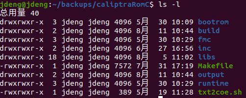
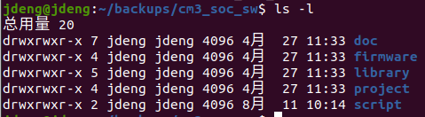
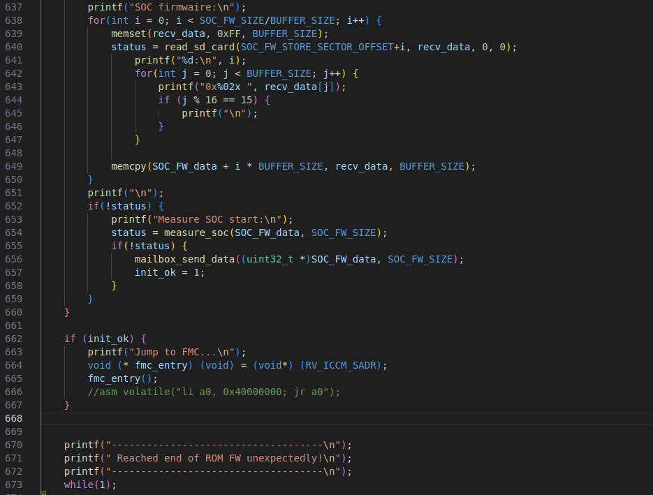
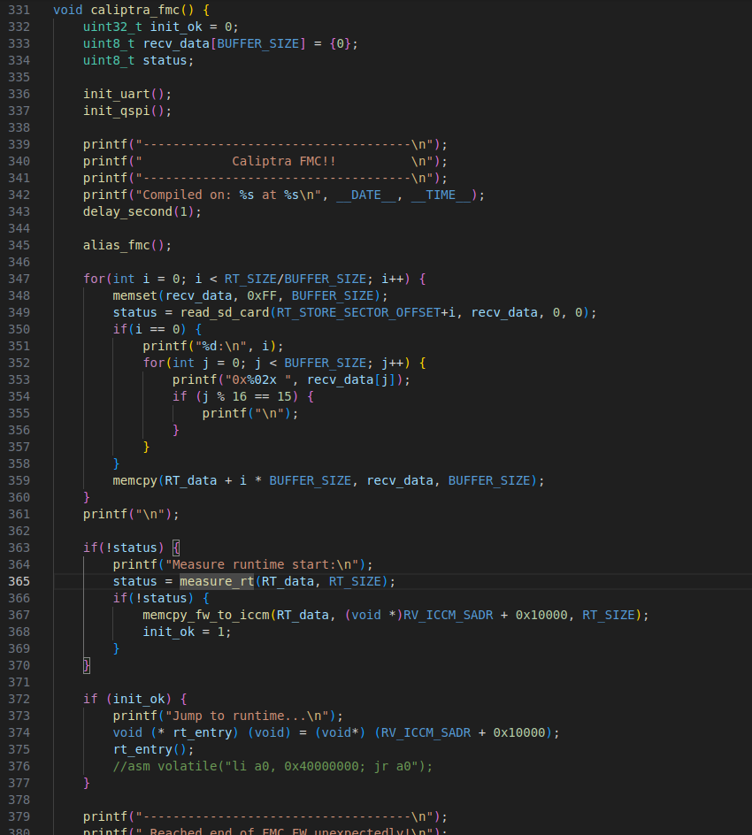

# 安全软件源代码解析 #

## 一、代码结构

### 1. Caliptra
- [caliptraRomC文件夹](../caliptraRomC)

- bootrom：Bootrom的主程序、启动汇编、链接脚本；

- build：编译生成的.o文件；

- fmc：Fmc固件的主程序、启动汇编、链接脚本；

- inc：Caliptra平台相关的头文件；

- Libs：Caliptra平台相关的库；

- Makefile：编译脚本，make编译生成Bootrom，make fmc编译生成Fmc固件，make rt编译生成RT固件；

- output：编译生成的一些文件（coe、hex、bin文件等）

- runtime：RT固件的主程序、启动汇编、链接脚本；

- Txt2coe.sh：用于生成coe文件的脚本。

### 2. Soc
- [cm3_soc_sw文件夹](../cm3_soc_sw)

- doc：soc硬件平台相关说明文档；

- firmware：Soc Bootrom、Firmware的主程序；

- library：硬件平台相关的库、驱动；

- project：编译生成的Soc Bootrom、Firmware bin文件等就在此处；

- script：makefile；

## 二、Caliptra主代码分析

### 1. CaliptraRom main.c

`caliptraRomC/bootrom/src/main.c`

606行：初始化doe，给予UDS和Field Entropy初始向量
，并交由硬件进行解混淆；

608行：生成idevid（CA）证书，使用固定的cdi和解混淆后的UDS生成ECC算法种子，生成的私钥存至硬件的密钥库，证书由idevid的私钥进行签名，公钥和签名存至硬件的数据库，证书保留在易失存储区；

609行：生成ldevid证书，使用固定的cdi和解混淆后的Field
Entropy生成ECC算法种子，证书由idevid的私钥进行签名，签名后清除idevid的私钥，并存储ldevid的私钥至硬件密钥库；

612\~628行：初始化SD卡，并获取存储的FMC固件；

629\~636行：度量获取到的FMC固件，度量通过后copy进ICCM区域；

637\~659行：获取SD卡内存储的Soc
Firmware，度量通过后，通过mailbox发送给Soc Bootrom；

662\~667行：跳转至FMC固件；

### 2. CaliptraFMC main.c

`caliptraRomC/fmc/src/main.c`

345行：生成FMC证书，使用固定的cdi和FMC固件度量值生成ECC算法种子，证书由ldevid的私钥进行签名，签名后清除ldevid的私钥，并存储FMC的私钥至硬件密钥库；

347\~361行：获取SD卡内存储的RT固件；

363\~377行：度量获取到的RT固件，度量通过后copy进ICCM区域，并跳转至RT固件；

### 3. CaliptraRT main.c

`caliptraRomC/runtime/src/main.c`

417行：生成RT证书，使用固定的cdi和RT固件度量值生成ECC算法种子，证书由FMC的私钥进行签名，签名后清除FMC的私钥，并存储RT的私钥至硬件密钥库；

422行：形成一个小的"子系统"，用于接收并处理来自SOC端的命令，使用mailbox进行通信；

## 三、Soc主代码分析

### 1. Soc Bootrom

`cm3_soc_sw/firmware/bootloader/boot/src/main.c`

81行：设置Caliptra端为Debug mode，允许使用JTAG mode；

83\~89行：填充UDS和Field Entropy，供Caliptra使用；

91行：配置Caliptra端，如Fuses等，最后给BOOTFSM_GO信号，拉起Caliptra；

94\~106行：接收来自Caliptra端的Soc Firmware；

116\~120行：将Soc Firmware 存进FW_store并执行跳转；

### 2. Soc Firmware

`cm3_soc_sw/firmware/bootloader/boot/src/main-fw.c`

57行：循环获取来自串口终端用户的输入，发送命令至caliptra端，并处理返回的结果。
