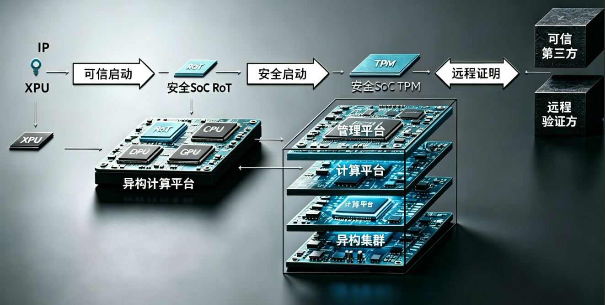
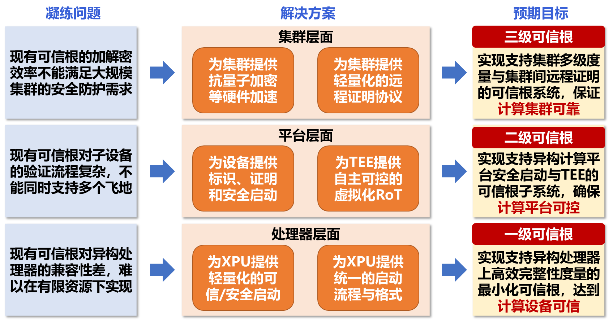
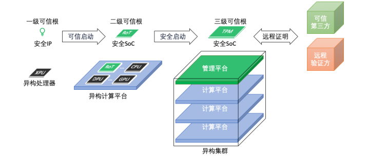

# 一、项目研究背景

## 1、网络安全的核心挑战：三大原始性缺失

Web3.0时代，网络安全风险的根源可归结为三大原始性缺失：

1. **图灵计算原理缺少攻防安全理念** —— 计算模型本身未内建安全机制
2. **冯·诺依曼体系结构缺少防护部件** —— 硬件架构层面缺乏主动防御能力
3. **重大工程应用无安全治理服务** —— 系统运行过程中缺少持续的安全管控

这些缺失导致网络空间极其脆弱，网络攻击风险显著增加，一系列安全事件频发，严重威胁数字经济的发展。应对这些挑战，必须筑牢关键基础设施的网络安全防线，构建**主动免疫的可信计算体系**，抢占核心技术创新的制高点。

## 2、主动免疫可信计算的核心思想

主动免疫可信计算是一种**运算与安全防护并行的新计算模式**：

- **技术路径**：在计算的同时，并行进行动态的全方位整体防护
- **核心目标**：确保完成计算任务的逻辑组合不被篡改和破坏，达到预期计算目标
- **密码基因**：以密码为基因实施身份识别、状态度量、保密存储等功能
- **动态控制**：对操作访问策略的四个要素（主体、客体、操作、环境）进行动态可信度量、识别和控制
- **模型突破**：纠正了传统无计算环境要素的访问控制策略模型

## 3、可信计算发展历程

### 3.1 国际发展脉络

| 时间 | 事件 | 关键内容 |
|------|------|----------|
| 1985年 | 美国国防部TCSEC | 首次提出“可信计算机”和“可信计算基（TCB）”概念，但仅局限于操作系统、数据库等产品，未涉及计算机原理和体系结构 |
| 1999年 | TCPA成立 | Intel、HP、IBM、Microsoft等发起可信计算平台联盟 |
| 2003年 | TCPA改组为TCG | 制定可信PC规范、TPM规范、TSS规范、TNC规范等 |
| 2009年 | TPM 1.2成为ISO/IEC国际标准 | ISO/IEC 11889-1～4:2009 |
| 2015年 | TPM 2.0发布 | ISO/IEC 11889-1～4:2015 |

### 3.2 TPM 2.0 相比 1.2 的主要改进

1. **密码算法更灵活**：吸收TPM 1.2和TCM优点，增加对称密码算法支持
2. **兼容性更好**：国内TPM 2.0芯片可支持SM2、SM3、SM4国密算法
3. **实现形态灵活**：TPM 1.2实现为安全芯片，TPM 2.0不限制必须以安全芯片形式存在

### 3.3 TCG方案的局限与NSA的介入

TCG架构下的证明方案**不能适应复杂的计算环境**，阻碍了可信计算在分布式环境中的发展。针对此问题，科研工作者开展了大量研究，力求将证明问题从简单的基于二进制的方法逐步发展为更适应复杂环境的**基于动态特征的证明**。

美国国家安全局（NSA）也高度重视，在技术报告《Attestation：Evidence and Trust》中重新定义了证明方案的框架和原则，给出了设计证明系统的参考方案。

## 4、中国可信计算发展历程

| 时间 | 事件 |
|------|------|
| 1992年 | 立项研制“免疫综合安全防护系统”（智能安全卡） |
| 1995年2月 | 通过测评和鉴定 |
| 2006年 | 国家密码管理局主持制定《可信计算平台密码技术方案》、《可信计算密码支撑平台功能与接口规范》 |
| 2007年 | 国家信息安全标准化委员会制定“可信平台控制模块”等4个主体标准 + “可信计算体系结构”等4个配套标准，初步构建我国可信计算标准体系框架 |

**沈昌祥院士**提出**主动免疫可信计算（可信计算3.0）**思想：
- 所有计算节点基于可信计算技术，从开机→操作系统启动→应用程序启动，全程可信验证
- 在应用程序所有执行环节对其执行环境进行可信验证，主动抵御入侵
- 验证结果形成审计记录，发送到管理中心，进行动态关联感知，形成实时态势

## 5、可信根生态与资源占用分析

### 5.1 主要开源项目

| 项目 | 发起方 | 特点 |
|------|--------|------|
| **OpenTitan** | OpenTitan联盟 | 首个集成全面硬件安全功能的商业硅芯片开源项目；模块化设计、形式化验证、生命周期管理；适用物联网、云服务器、移动设备、数据中心 |
| **Caliptra** | OCP | 可重复使用的插入式可信根IP，可集成到CPU、GPU、SSD、网络接口控制器等ASIC或SoC；满足现代边缘和机密计算更高安全要求 |

### 5.2 资源占用对比

| 开源可信根 | CLB LUT | CLB FF |
|------------|---------|--------|
| OpenTitan | 248,840 | 161,397 |
| Caliptra | 211,107 | 133,889 |
| Xilinx Kintex7 FPGA（对比） | 203,800 | 407,600 |
| MicroBlaze精简处理器（对比） | 1,471 | 1,362 |

**关键发现**：OpenTitan和Caliptra均属于“重型”可信根，完整可信根占高性能处理器（如香山RISC-V约2M个LUT）资源的10%。即使裁剪掉CSRNG、ECC、HMAC、AES、熵源生成、密钥管理等模块，仍难以低成本部署在处理器芯片内。

### 5.3 闭源可信根功能对比

| 闭源可信根 | 主要功能 | 不支持项 |
|------------|----------|----------|
| PUFsecurity | PUF静态熵源+动态噪声熵源 | 不支持TPM、不支持异构集群多级可信启动 |
| Rambus RT-63x | 可信根IP，集成PUF熵源TRNG、量子安全引擎QSE、DICE和X.509身份认证 | 不支持TPM |
| Synopsys tRoot | 安全引导、身份认证、运行时存储加密、代码防篡改 | 不支持异构集群多级可信启动 |
| 微芯CEC1702 | 可信根MCU，启动镜像验证，密钥存储 | 不支持身份认证、不支持异构集群多级可信启动 |
| 国芯CCP903T | 可信根MCU，安全BOOT rom、国密算法、高速接口、物理熵源、环境检测 | 不支持身份认证、不支持异构集群多级可信启动 |
| 海光安全处理器 | 仅支持海光CPU可信启动，支持TCM2.0、远程认证 | 不支持安全启动和多级可信启动 |

### 5.4 不同TEE对可信根的要求

| 可信执行环境 | 可信根功能要求 |
|--------------|----------------|
| Intel SGX | 可信根提供证书密钥，对SGX报告签名 |
| Intel TDX | 依赖SGX可信根证书密钥，为可信域和飞地提供远程证明 |
| Arm Trustzone | OTP或Fuse提供静态密钥（POTPK、HUK、EK、SSK等） |
| AMD SEV | 芯片级可信根保护BIOS，虚拟化环境加密验证软件堆栈 |
| RISC-V Keystone | 需提供熵源、密钥等标准硬件可信根功能 |
| RISC-V PENGLAI | 官方文档未提及可信根（申请人参与基于蓬莱TEE的南湖处理器可信根工作） |

**关键发现**：现有可信根在功能上仍聚焦底层模块安全需求；大多数闭源可信根不支持集群规模设备的多级安全启动；对TPM/TCM标准的支持极为有限；不同处理器TEE技术路线对可信根的需求不尽相同，缺乏统一标准。

## 6、本项目聚焦的核心技术瓶颈

针对上述现状，本项目聚焦异构集群内的可信计算问题，重点解决：

1. **可信根轻量化问题** —— 降低资源占用，使其可低成本部署于处理器芯片内
2. **多级设备静态度量** —— 支持集群规模下不同层级节点的完整度量链
3. **集群间远程证明** —— 实现异构集群各节点间的可信认证

**最终目标**：构建从异构处理器、固件、计算管理平台、操作系统、虚拟机到应用的**完整云平台可信链**。

## 7、产业趋势与标准化需求

随着边缘计算、云计算和机密计算的兴起，业界呼吁：

- 实现云部署服务器安全架构的**标准化**提升**可扩展性**
- 在边缘场景中，需保护物理中介层
- 机密计算需要**封装级和片上系统级的证明**，以应对新兴威胁
- 协同产业界构筑可信计算和机密计算**第二平面**，完善对应的标准和生态

> 安全性是确保云计算资源隐私的关键，标准有助于更快地推进安全性。

# 二、项目研究目标

本项目的主要研究内容为面向异构TEE集群的多级可信根系统设计空间探索和面向异构TEE集群的远程协议与密钥管理的关键技术探索。
	
## 1、面向异构TEE集群的多级可信根系统设计空间探索主要研究内容分为以下五点
1. 从安全性、功能实用性、性能、实现代价角度调研当前硬件可信根设计空间，调研面向异构系统和集群系统的硬件可信根前沿进展。

2. 研究面向集群的多级可信根系统总体设计，对各级可信根在安全性、功能、性能、代价上的需求进行分析，探索设计空间。尝试提出一套兼顾各项需求的可信根系统设计空间方法论。

3. 研究可支持多种异构处理器的轻量级可信根最小系统。定义支持异构处理器的启动流程和数据格式，精简可信/安全启动流程。同时为防止过量防护，裁剪非必要硬件安全模块、优化度量算法，达到可信基的最小化。

4. 研究用于异构计算平台上的可信根子系统。研究TCG现有的DICE流程，设计轻量化的设备标识与证明方案，实现平台的快速安全启动。定义支持异构可信执行环境的可信根接口标准，研究可信根的分时复用及硬件虚拟化等方案，满足计算平台多个飞地的需求，提出多租户场景下调用可信根的安全解决方案。

5. 研究用于集群管理平台上的可信根系统。同时探索集群层面的密码学效率提升方案，特别是后量子加密等先进密码学算法的算子抽象与硬件加速。
	
## 2、面向异构TEE集群的远程协议与密钥管理的关键技术探索，主要研究内容分为以下三点
1. 研究集群间远程证明协议及动态验证根委托关键技术。定义统一的远程证明协议，支持集群间的轻量化远程证明。

2. 探索集群内动态度量及信任边界实时更新关键技术。

3. 探索密钥分发协议，以及可信根冷迁移、热迁移关键技术。

## 3、本项目的原型系统
本项目的原型系统主要**为集群内部异构处理器与计算平台提供轻量化的可信启动/安全启动，并为集群间与可信第三方提供高效的远程证明**。多级可信根的预期架构如图所示，技术路线将分为三个研究目标分步实现：

**一级可信根**为嵌入异构处理器的安全知识产权核（IP core），利用摘要算法对相应的XPU启动过程中的固件与操作系统镜像完整性进行度量，解决集群底层异构设备带来的兼容性差难题。本项目中，一级可信根支持ARM和RISC_V两种指令集的CPU安全启动；

**二级可信根**为异构计算平台上的安全片上系统（SoC），负责收集平台内的各设备的一级可信根的度量值并提供签名功能，以及平台自身的安全启动；同时二级可信根具备一定的虚拟化能力。

**三级可信根**为集群管理平台上的安全片上系统，负责异构集群自身的安全启动，汇总集群内各个计算平台的二级可信根的启动信息，并通过远程证明完成可信第三方的验证。

多级可信根系统架构图

# 三、项目仓库说明

本项目按照不同层级可信根分为不同文件夹

|      仓库     | 描述 |
| ------------ | ----------- |
| [一级可信根(ARM)硬件仓库](First_rot/)  | 一级原型SOC的RTL逻辑设计、SIM仿真验证、FPGA原型验证。包括全部system verilog代码，EDA自动化仿真脚本，FPGA构建脚本...... |
| [一级可信根(ARM)软件代码仓库](First_rot_sw/) | 包括SOC板级支持包、bootroom、runtime源码、SD卡image |
| [二级可信根硬件仓库](Second_rot/) | 二级可信根架构图、硬件原理图、RTL代码、FPGA工程 |
| [二级可信根软件代码仓库](Second_rot_sw/) | 包括PS端系统image、rot驱动源码、虚拟机源码、SD卡image |
| [三级级可信根硬件仓库](Third_rot/) | 三级可信根SOC开发仿真环境、RTL代码、自动化脚本、FPGA工程 |
| [三级级可信根软件代码仓库](Third_rot_sw/) | 三级可信根SOC开发仿真环境、RTL代码、自动化脚本、FPGA工程 |
| [系统联调](system/) | 多级可信根联合运行时的系统框图、连接关系表、信任链构建原理、...... |
| [本项目的知识产权](Intellectual_Property/) | 论文、发明专利...... |

> *阅读建议：首先了解原型系统目标，再阅读各级可信根硬件设计报告，然后研究各级可信根软件设计，最后研究系统联调代码。*