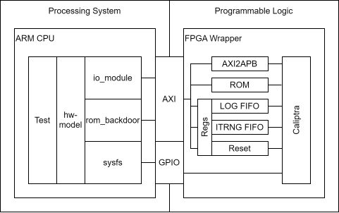
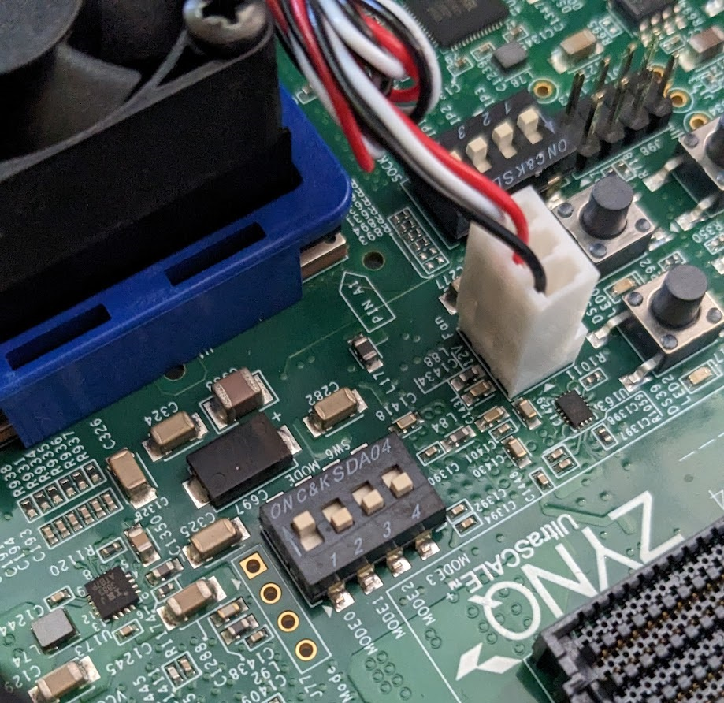

# **二级可信根 FPGA 指南** #
二级可信根采用ZYNQ硬核+ PL实现，安全协处理器采用Caliptra RTL 进行开发和测试。
Zynq 的可编程逻辑 (Programmable Logic) 被烧录了 Caliptra RTL 以及 FPGA 特定的 SoC 封装逻辑，其中包括与处理系统 (Processing System) AXI 总线的连接。
然后，处理系统的 ARM 内核将充当 SoC 主处理器，并通过内存映射方式访问 Caliptra 的公共寄存器空间。



### 环境要求： ###
 - Vivado
   - 版本 v2022.2
 - FPGA 开发板
   - [ZCU104 开发板](https://www.xilinx.com/products/boards-and-kits/zcu104.html)

### ZCU104 ###
#### 处理器操作系统一次性设置： ####
1. 安装 ZCU104 SD 卡镜像
   - https://ubuntu.com/download/amd-xilinx
1. 将 SW6 配置为从 SD1 启动。
   - 模式 SW6[4:1]: OFF, OFF, OFF, ON
     
1. 使用 Unix 指南安装 rustup：https://rustup.rs/#

#### 串口配置： ####
通过 USB 连接的串口设置。
 - 波特率：115200
 - 数据位：8
 - 停止位：1
 - 校验位：None
 - 流控：None

### FPGA 构建步骤： ###
FPGA 构建过程使用 Vivado 的批处理模式，通过 `fpga_configuration.tcl` 脚本以程序化方式创建 Vivado 项目。
该脚本提供了许多配置选项，可以通过 `-tclargs 选项=值 选项=值` 的方式启用。

| 选项        | 用途
| ------      | ------
| BUILD       | 自动开始构建 FPGA。
| GUI         | 打开 Vivado 图形界面。
| JTAG        | 将 JTAG 信号分配给 Zynq PS GPIO。
| ITRNG       | 启用 Caliptra 的 ITRNG。
| CG_EN       | 移除 FPGA 优化并允许时钟门控。
| HW_LATEST   | 使用 hw/latest 而不是 hw/1.0。

 - 无图形界面构建 FPGA 镜像
    - `vivado -mode batch -source fpga_configuration.tcl -tclargs BUILD=TRUE`
    - 上述命令生成的比特流位于：caliptra_build/caliptra_fpga.bin
    - 检查生成比特流所用的 git 版本
      - `xxd -s 0x88 -l 8 caliptra_build/caliptra_fpga.bin`
      - 结果应为 `3001 a001 xxxx xxxx`。其中 3001 a001 是写入 USR_ACCESS 寄存器的命令，其余部分是哈希值。
 - 启动 Vivado 图形界面
    - `vivado -mode batch -source fpga_configuration.tcl -tclargs GUI=TRUE`
    - 运行综合：`launch_runs synth_1`
    - [可选] 在综合后的设计上设置调试信号
    - 运行实现：`launch_runs impl_1`
    - 生成比特流：`write_bitstream -bin_file \tmp\caliptra_fpga`

### 加载和执行步骤（原caliptra采用，现已废弃。须参考二级软件仓库）： ###
[setup_fpga.sh](setup_fpga.sh) 执行每次启动后所需的平台设置。
 - 禁用 CPU 空闲 (IDLE)。在空闲状态下访问 Vivado HW Manager 会导致崩溃。
 - 通过将与风扇控制器 FULLSPD 引脚相连的 GPIO 引脚设置为输出，来降低风扇转速。
   - 参考链接：https://support.xilinx.com/s/question/0D52E00006iHuopSAC/zcu104-fan-running-at-max-speed?language=en_US
 - 构建并安装 rom_backdoor 和 io_module 内核模块。
 - 设置 FPGA 逻辑的时钟。
 - 烧录提供的 FPGA 镜像。
> *适配本项目的setup_fpga.h*

TODO

```shell
sudo ./hw/fpga/setup_fpga.sh caliptra_fpga.bin

CPTRA_UIO_NUM=4 cargo test --features=fpga_realtime,itrng -p caliptra-test smoke_test::smoke_test
```

### 处理系统 - 可编程逻辑接口 ###
#### AXI 内存映射 ####
 - 用于驱动 caliptra-top 信号的 SoC 适配器
   - 0x80000000 - Generic Input Wires
   - 0x80000008 - Generic Output Wires
   - 0x80000010-0x8000002C - Deobfuscation key (256 bit)
   - 0x80000030 - Control
     - `[0] -> cptra_pwrgood`
     - `[1] -> cptra_rst_b`
     - `[3:2] -> device_lifecycle`
     - `[4] -> debug_locked`
   - 0x80000034 - Status
     - `[0] <- cptra_error_fatal`
     - `[1] <- cptra_error_non_fatal`
     - `[2] <- ready_for_fuses`
     - `[3] <- ready_for_fw`
     - `[4] <- ready_for_runtime`
   - 0x80000038 - PAUSER
     - `[31:0] -> 发送给 Caliptra APB 的 PAUSER 值`
   - 0x80001000 - 日志 FIFO 数据。读取时从 FIFO 中弹出数据。
     - `[7:0] -> 下一个日志字符`
     - `[8] -> 日志字符有效标志`
   - 0x80001004 - 日志 FIFO 寄存器
     - `[0] -> 日志 FIFO 为空`
     - `[1] -> 日志 FIFO 为满（可能溢出）`
   - 0x80001008 - ITRNG FIFO 数据。写入时向 FIFO 加载数据。
     - `[31:0] -> 32 位随机数据，将按 4 位一组馈送给 itrng_data`
   - 0x8000100C - ITRNG FIFO 状态。
     - `[0] -> ITRNG FIFO 为空`
     - `[1] -> ITRNG FIFO 为满`
     - `[2] -> ITRNG FIFO 复位`
 - ROM 后门 - 32K
   - `0x82000000 - 0x82007FFF`
 - Caliptra SoC 寄存器接口
   - `0x90000000`
#### 中断 ####
 - 89 - 日志 FIFO 半满。

### JTAG 调试
要求：
- 安全状态必须满足 debug_locked == false 或 lifecycle == manuf。
- 在固件配置文件中设置 "debug = true"，以便为 GDB 提供行号信息。
- openocd 0.12.0（必须使用 --enable-sysfsgpio 配置）
- gdb-multiarch

#### 调试器启动步骤 ####
Caltripta 的 JTAG 引脚直接连接到桥接 PS 和 PL 的 EMIO GPIO 引脚。OpenOCD 在 ARM 内核上运行，并使用 SysFs 接口与 GPIO 引脚通信。
1. 启动 OpenOCD 服务器
    - `sudo openocd --file caliptra-sw/hw/fpga/openocd_caliptra.txt`
1. 连接客户端进行调试
    - GDB：`gdb-multiarch [二进制文件] -ex 'target remote localhost:3333'`
    - Telnet：`telnet localhost 4444`

#### Caliptra SoC 接口寄存器 ####
通过 Telnet 连接至 OpenOCD：`riscv.cpu riscv dmi_read [地址]`

#### JTAG 测试 ####
OpenOCD 和 GDB 的测试要求：
- 当 debug_locked == true 或 lifecycle == manufacturing 时，JTAG 端口可访问。否则端口不可访问。
- 使用 8、16、32、64 位读取访问 ROM 空间。
- 使用 8、16、32、64 位访问读写 DCCM。
- 使用 32、64 位读取和 32 位写入访问 ICCM。
- 访问 VEER 内核寄存器。
- 硬件和软件断点能暂停 CPU。
- 对 DCCM 和 Caliptra 寄存器访问的观察点能暂停 CPU。

仅 GDB 的测试要求：
- 所有基本命令均能正常工作（step、next、frame、info、bt、ni、si 等）。

仅 OpenOCD 的测试要求：
- 所有基本命令均能正常工作（reg、step、resume 等）。
- 访问 VEER CSR。
- 访问调试模块寄存器。
- 暴露给 JTAG 的 Caliptra 寄存器的读写/只读状态与预期一致。