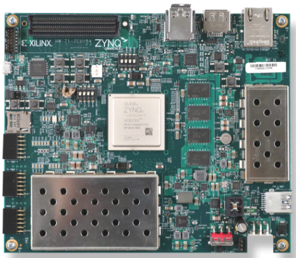
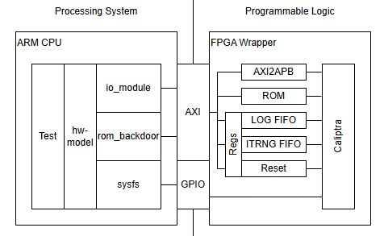
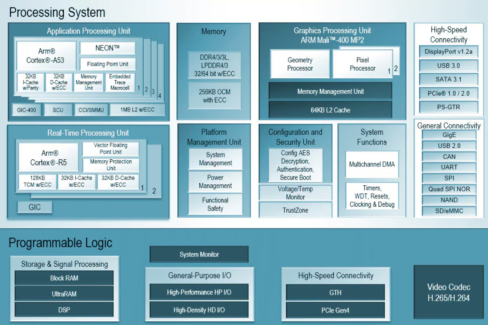
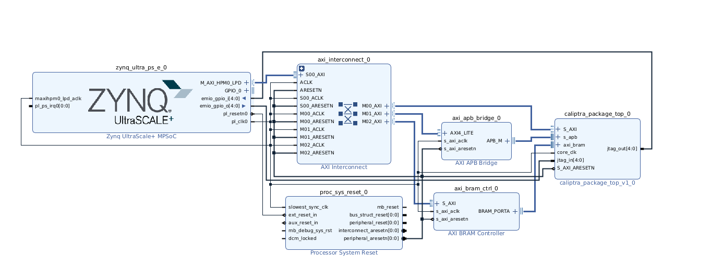

# 二级可信根硬件设计

## 1、系统架构概述

### 1.1 整体系统架构

基于Xilinx Zynq UltraScale + MPSoC ZCU104评估套件，以ARM Cortex-A53处理器为核心计算单元，在PL可编程逻辑构建Caliptra安全协处理器。系统采用分层总线结构，在PL侧，AXI高速总线和APB总线连接ARM处理器核心与安全协处理器系统形成完整的数据通路和控制网络。

并在ZCU104评估套件上运行linux操作系统ubuntu 20.04，为虚拟机和VTPM提供基本运行平台。

### 1.2 核心器件介绍

Zynq UltraScale+ MPSoC 是Xilinx推出的异构多处理器片上系统芯片，采用16nm FinFET工艺制造，在单一芯片上集成了处理系统（PS）与可编程逻辑（PL），实现了高性能计算与灵活硬件加速的深度融合。其处理系统包含多核ARM处理器集群，其中四核Cortex-A53应用处理单元主频可达1.5GHz，支持运行Linux等复杂操作系统，适用于通用计算任务；双核Cortex-R5实时处理单元则专为实时控制和功能安全类应用设计，支持锁步运行模式，满足高可靠性场景需求。此外，芯片还集成ARM Mali-400图形处理单元，可用于图形渲染与视频处理。

在可编程逻辑部分，Zynq MPSoC采用UltraScale+架构，提供大量可编程资源，包括逻辑单元、DSP切片、块RAM以及高速收发器，支持用户自定义硬件加速功能和外设接口。该芯片还具备丰富的外设接口，如USB、千兆以太网、PCIe与多种存储控制器，并支持DDR4/LPDDR4等高速内存标准。

其核心优势在于以单芯片集成高性能处理、实时控制、可编程硬件加速与丰富接口，能够显著降低系统复杂度与功耗，为复杂嵌入式系统提供高度灵活、性能卓越且安全可靠的统一硬件平台。

## 2、可编程逻辑设计

### 2.1 PL端总体架构
基于Xilinx Zynq UltraScale+ MPSoC平台的可编程逻辑资源，构建了一个完整的安全协处理器系统。该系统采用异构计算架构，集成了Caliptra硬件信任根模块和zynq ARM cortex a53处理器核心，通过高性能AXI总线实现处理系统与可编程逻辑之间的高效数据通信。目标器件选用xczu7ev-ffvc1156-2-e FPGA，系统运行在100MHz主时钟频率下，采用分布式存储与Block RAM混合的存储器架构，支持AXI4、AXI4-Lite和APB4多层级总线协议，为安全关键应用提供可靠的硬件基础。

### 2.2 处理器核心

安全核心采用VEER el2 64位RISC-V处理器，该处理器支持RV64IMAC指令集架构。处理器集成硬件乘除法单元和可配置的缓存子系统，通过专门的FPGA优化实现高效运行。优化措施包括支持FPGA专用时钟门控单元、优化时钟网络分布以及可选的功耗优化模式。

### 2.3 存储系统

存储器子系统采用多层次设计，指令存储器采用真双端口RAM架构，提供6144×64位存储容量，支持64位端口A和32位端口B的双向访问，配备独立的端口复位控制，专门用于RISC-V处理器指令存储和安全启动代码存放。邮箱存储器配置为32768×39位的单端口RAM，用于处理器间通信和安全消息传递。ECC安全存储器采用64×384位的真双端口RAM架构，为密钥存储和安全数据缓存提供可靠的错误检测校正功能。此外，系统还包含深度为8192×8位的日志FIFO和具有非对称端口宽度的TRNG FIFO，分别用于UART日志输出缓冲和真随机数数据缓冲。

### 2.4 总线互联架构

总线互联采用分层设计，AXI互联矩阵形成三从设备拓扑结构，主设备为Zynq PS HPM0 LPD接口，从设备包括Caliptra AXI接口、AXI-APB桥接器和AXI BRAM控制器，所有设备在统一的100MHz时钟域下运行，采用同步复位控制策略。APB外设总线通过AXI-APB桥接器实现协议转换，支持APB4协议规范，配置单从设备连接Caliptra安全模块，地址空间映射在0x90000000至0x900FFFFF范围内，为系统提供灵活的外设扩展能力。

### 2.5 安全子系统

安全子系统的核心是Caliptra硬件信任根模块，该模块提供硬件级可信启动验证、硬件密钥存储管理、专用加密算法硬件加速以及远程证明和身份验证等安全功能。系统支持内部TRNG和外部TRNG两种真随机数生成器架构选择，内部TRNG基于环形振荡器或相位抖动熵源，为系统提供高质量的随机数生成能力。安全通信接口通过专用8位FIFO缓冲实现UART日志系统，支持可编程中断阈值和安全事件日志记录，确保系统安全状态的可监控性。

### 2.6调试和测试接口

调试系统提供灵活的JTAG接口配置，通过PS EMIO GPIO实现TCK、TMS、TDI、TDO、TRST_N等JTAG信号路由，配备专用时序约束保证信号完整性。关键信号采用vivado的ILA嵌入式逻辑分析仪引出，方便查看实时波形。

## 3、ZYNQ PS处理器系统在硬件系统中的核心作用

### 3.1 系统架构核心

ZYNQ PS处理器系统作为硬件架构的中央运算和控制单元，承担系统级管理和协调的核心职能。该基于ARM Cortex_A53的硬核处理器为整个平台提供完整的处理环境，在系统运行、软硬件管理、安全策略执行三个关键维度发挥主导作用，构建了主处理器、系统软件应用与安全协处理器高效协作的异构计算基础架构。

ZYNQ处理器与caliptra硬件协处理器硬件直接连接。并在linux系统层面运行虚拟机和Vtpm。ZYNQ ps构成了VTPM和物理可信根之间的桥梁。PS承担系统硬件资源的统一协调，内置DDR控制器支持外部存储器扩展，为密码学运算提供存储保障。

### 3.2 时钟与复位控制

PS通过精确的时钟网络实现对系统的全局时序管理。技术上，PS配置CRL_APB模块产生100MHz的PL参考时钟，为Caliptra协处理器及所有AXI外设提供同步时钟源。同时，PS输出pl_resetn0信号至处理器系统复位模块，通过同步复位链确保PL侧逻辑的可靠初始化。

### 3.3 总线架构主导

在总线系统中，PS作为AXI主设备通过M_AXI_HPM0_LPD接口连接AXI互联矩阵。该架构支持PS通过三个独立地址空间访问PL资源：Caliptra AXI寄存器空间（0x80000000）、BRAM控制器空间（0x82000000）和APB桥接空间（0x90000000），实现对安全协处理器的多层级精细控制。32位数据宽度的AXI4接口在40MHz时钟下提供1600MB/s的理论带宽，确保高效数据交换。

### 3.4 调试与维护支持

PS集成了完善的调试基础设施，通过EMIO GPIO转发JTAG信号至Caliptra协处理器，实现统一的调试访问接口。该系统支持TCK、TMS等全功能JTAG信号路由，配合调试时钟域同步和权限分级管理，为系统开发提供完整调试支持。运行期间，PS实时采集性能指标和安全日志，通过UART接口输出诊断信息，助力系统状态分析和故障定位。PS通过IRQ0中断接收Caliptra安全事件告警，支持优先级中断处理和快速响应。