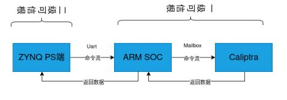

# 二级可信根软件测试

## 一、整体环境启动测试

`start.sh` 综合了二级可信根所有配置过程：测试过程通过执行 `start.sh` 脚本完成二级可信根环境的整体配置与功能验证。该脚本整合了硬件初始化、内核模块加载、vTPM 环境搭建及虚拟机启动等关键步骤。

<div align="center">

</div>

- **10行**：烧写 PL 端，并加载 Caliptra 的 `rom_backdoor` 和 `io_module` 内核模块；
- **15行**：通过 `rom_backdoor` 烧写 CaliptraROM；
- **17~20行**：依次配置硬件信号：`debug_locked`、`device_lifecycle`、`cptra_pwrgood`、`cptra_rst_b`，完成硬件状态初始化；
- **22~26行**：向 ITRNG FIFO 中填充初始随机数数据，为真随机数生成模块提供熵源；
- **28行**：启动 CaliptraROM；
- **33行**：加载 `caliptra_dev` 设备节点，为用户态程序提供访问底层硬件功能的接口；
- **38~59行**：搭建虚拟 TPM 环境，包含 TPM 状态存储、设备文件创建、权限配置，并通过 Unix 域套接字实现进程间通信；
- **62行**：启动 QEMU 虚拟机，并挂载 SWTPM 作为虚拟 TPM 设备。

## 二、真随机数生成测试

为验证 Caliptra 真随机数生成功能是否正常，我们通过以下两种方式进行测试：

### 1. SWTPM自检阶段调用验证

在虚拟机启动过程中，SWTPM 会执行自检并调用底层熵源。若出现如下日志输出，说明 SWTPM 已正确调用 Caliptra 硬件随机数生成器：

<div align="center">

</div>


### 2. 用户态ioctl调用验证

通过自定义用户态程序直接调用 ioctl 接口获取随机数，进一步验证功能完整性。下图为 CaliptraROM 内部打印（左）与用户态调用过程（右）的对照：

<div align="center">

</div>

> *测试视频：https://www.bilibili.com/video/BV15ajT6pEvW/?spm_id_from=333.1387.collection.video_card.click*


## 三、虚拟机内TPM功能测试

执行：
```bash
sudo tpm2_getrandom 24 --hex
```
若命令成功执行并输出随机字节，则表明 vTPM 功能正常，随机数生成与传递链路完整：

<div align="center">

</div>


## 四、PCR验证

为验证二级可信根与一级可信根之间的协同工作能力，我们进行了 PCR 扩展测试：

### 1. 硬件连接与通信

将一级可信根与二级可信根通过物理串口连接，系统启动后两者通过串口协议进行交互。下图为实际连接：

<div align="center">

</div>


### 2. 通信流程说明

下图展示了一级可信根和二级可信根的完整通信流程：

<div align="center">

</div>


### 3. PCR读取验证

在扩展操作完成后，我们通过用户态可执行程序读取 PCR 寄存器内容。如下所示，PCR 值已成功获取，表明 PCR 扩展功能正常：

<div align="center">

</div>


## 五、测试结论

本测试完成了二级可信根软件的完整环境搭建与功能验证，包括：

1. CaliptraROM 固件加载与初始化正常；
2. 真随机数生成功能工作稳定，熵源调用正确；
3. 虚拟 TPM 环境成功部署，可在虚拟机内正常调用；
4. PCR 扩展功能符合设计预期，与一级可信根通信可靠。
