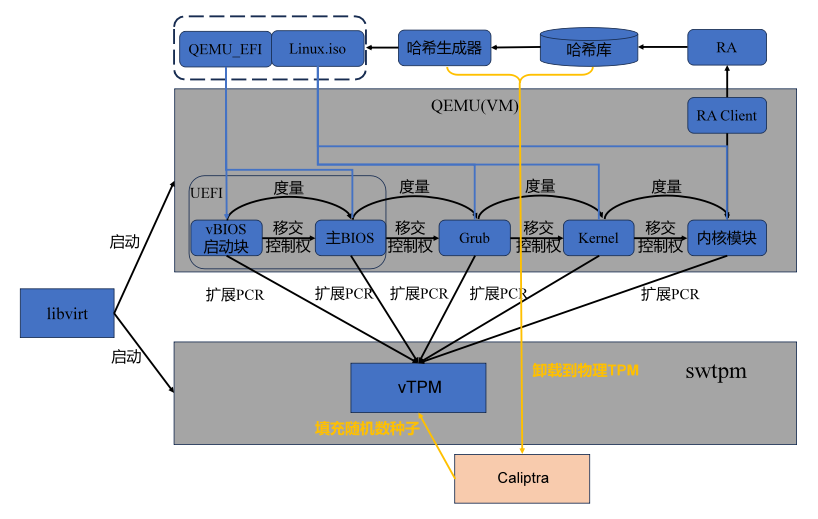
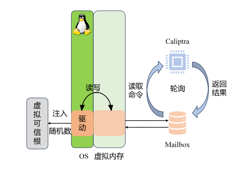

# 二级可信根软件设计
基于Xilinx Zynq UltraScale + MPSoC ZCU104评估套件的PS-PL协同架构，通过二级可信根软件实现虚拟可信平台模块（vTPM）的硬件功能卸载，利用可编程逻辑（PL）端的加密引擎加速关键操作，为虚拟机提供符合行业标准的安全服务。

具体实现包括以下组件：

- 虚拟机环境：采用Ubuntu 20.04 Minimal 等轻量级镜像，通过精简内核和动态资源分配避免内存溢出，启动后需手动集成TPM驱动栈；

- vTPM：通过AXI总线接口将加密运算、密钥派生等核心功能卸载至PL端的Caliptra，实现与ARM处理器的硬件级隔离；

- 安全驱动接口：提供符合Linux TPM驱动标准的二级可信根用户态接口，通过对CaliptraROM 的系统调用支持TCG定义的命令集（如真随机数生成、PCR扩展等）；

- CaliptraROM：作为二级可信根，通过硬件安全机制实现底层可信功能，并基于邮箱（Mailbox）双向通信机制，保障固件级与系统级指令可靠交互。

## 1 虚拟机环境

虚拟机环境通过软件模拟独立计算机系统，为开发、测试和部署提供‌隔离、可移植‌的运行环境，支持多系统并行且互不干扰，极大地提高了资源利用率和开发效率。

最小虚拟机（如Ubuntu 20.04 Minimal Cloudimg）通过精简设计（仅保留基础组件）实现‌快速启动和低资源占用（内存约140MB）‌，尤其适合云计算场景，能够高效应对大规模部署和快速扩展的需求，同时保持最低的资源消耗。

## 2 vTPM

vTPM（Virtual Trusted Platform Module，虚拟可信平台模块）是一种通过软件模拟实现的可信计算组件，旨在为虚拟化环境中的虚拟机提供与物理 TPM（Trusted Platform Module）等价的安全功能。

本设计中的vtpm在由纯软件模拟实现的swtpm的基础上，将随机数生成等功能卸载到物理Caliptra芯片中，确保了vtpm中随机数的随机性，并且在该设计的基础上还可以实现对vtpm中其他TPM命令的卸载，从而实现对密码学算法的硬件加速。

## 3 安全驱动接口

Caliptra作为开源硬件信任根实现，通过标准化的ioctl系统调用向用户空间程序提供安全可控的访问接口。该机制基于Linux设备驱动模型，将Caliptra的可信执行环境和安全启动功能封装为一系列预定义的ioctl命令码，确保用户空间只能通过严格验证的通道与硬件安全模块交互。

ioctl系统调用通过与Caliptra的Mailbox机制进行协同工作，构建了用户空间与安全模块之间的受控通信通道。这种设计将Caliptra的硬件安全特性与操作系统的标准设备访问接口完美结合，实现了以下关键功能：

- 命令路由机制‌：用户空间通过预定义的ioctl命令码发起请求，驱动层解析后通过Mailbox将操作命令转发至Caliptra；

- LOCK/PAUSER机制‌：通过LOCK寄存器确保只有当前持有锁的请求者才能访问Mailbox，从而防止并发竞态和非法操作；同时，PAUSER字段用于标识请求者身份，保证只有获得锁的设备才能访问相关寄存器，有效防止其他设备在未解锁状态下越权访问Mailbox数据；

- 寄存器保护层‌：敏感寄存器访问被封装为特定的Mailbox消息格式，硬件自动过滤非法地址访问，防止直接寄存器操作。

## 4 caliptraROM

CaliptraROM作为Caliptra二级可信根架构的核心固件，承担着信任链初始化和关键安全功能的实现。其特点包括：

- 固化存储‌：以只读二进制文件（.bin）形式存在，并通过设备驱动烧录至ROM Backdoor，确保物理层面不可篡改；

- 安全启动‌：严格执行固件签名校验、密钥隔离及硬件访问控制策略，仅允许经过认证的固件加载与执行；

- 通信机制‌：基于Mailbox双向通信协议，实现固件层与系统层指令的可靠交互，保障命令与响应的完整性。

该设计通过硬件级防护（如只读存储、强制校验）和协议级保障（如Mailbox），有效抵御后门植入与恶意篡改，为系统提供坚实可靠的底层安全支撑。

## 5 功能设计

二级可信根软件的功能设计围绕硬件可信根可信根（Caliptra）与虚拟化环境（vTPM）的深度融合展开，构建了一套完整的可信服务提供体系。各功能模块在系统启动、运行及扩展过程中协同工作，实现了从硬件密码学功能到虚拟机内部可信服务的完整链路。具体功能设计如下：

### 5.1 系统启动与初始化
系统启动过程通过集成脚本实现自动化，依次完成以下关键操作：
- PL端固件加载：通过ROM_Backdoor机制将CaliptraROM固件烧写至PL端，完成硬件信任根的初始化；

- 硬件状态配置：设置关键硬件信号，确保Caliptra模块启动并处于可信的初始状态；

- 虚拟机启动：在完成所有硬件与固件初始化后，启动虚拟机并挂载SWTPM作为虚拟TPM设备，为上层应用提供标准TPM服务接口。

### 5.2 真随机数生成
Caliptra硬件真随机数生成器作为系统熵源，具备两种调用方式：
- SWTPM自检调用：在虚拟机启动过程中，SWTPM自检流程自动调用Caliptra TRNG，完成熵源验证与初始化；

- 用户态主动获取：用户程序可通过ioctl系统调用直接访问Caliptra设备节点，通过安全驱动接口获取随机数数据，满足各类密码学应用需求。

- 该功能模块通过硬件隔离与固件保护，确保随机数生成过程不可被预测或干扰，符合国家密码算法应用与随机数生成相关标准。
### 5.3 虚拟TPM服务
vTPM服务基于SWTPM与libtpms构建，并将关键密码学操作卸载至Caliptra硬件模块执行，具备以下特点：
- 标准指令集支持：完整支持TPM 2.0命令集，虚拟机内部可调用tpm2_getrandom等标准命令；

- 进程间通信：基于Unix域套接字实现宿主机与虚拟机之间的TPM命令传递与响应。
### 5.4 PCR扩展与可信链传递
二级可信根通过串口与一级可信根建立物理连接，实现跨层级的可信度量与PCR扩展：
- 通信协议：基于串口通信协议完成度量数据的传递与确认；

- PCR寄存器操作：支持对PCR寄存器进行扩展与读取操作，确保度量日志与硬件状态一致；

- 用户态验证工具：提供专用工具读取PCR寄存器内容，便于调试与功能验证。

该功能确保在系统启动与运行过程中，各级信任根之间能够形成完整的可信链，为系统安全启动与远程证明提供基础支撑。‌