# Opentitan 三级可信根硬件设计报告

**版本**: 1.0

**撰写人**: 侯冬辉

## 一、硬件设计规格

### 1. 设计概述与核心特性

#### 1.1 背景与定位

Top Earlgrey 是 OpenTitan 项目公开的顶级芯片配置实例，旨在构建一个开源的、高安全性的、可独立部署的可信根（Root of Trust, RoT）SoC。本设计作为三级可信根的硬件平台，为整个信任链提供不可篡改的、可验证的硬件基础。它适用于服务器主板、存储设备、外设认证等需要高保证级安全性的场景。

<div align="center">
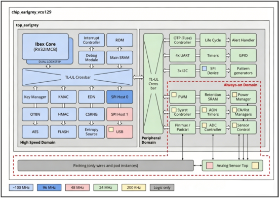
</div>


#### 1.2 核心特性汇总

| 特性类别 | 详细参数 |
| :--- | :--- |
| 处理器 | RV32IMCB RISC-V "Ibex" 核心，3级流水线，单周期乘法器，支持M/U模式，增强型物理内存保护（ePMP） |
| 主频 | 系统域: 100MHz 抖动时钟；外设域: 24MHz 固定时钟；常开域: 低速时钟 |
| 指令缓存 | 4KB，2路组相连，支持低延迟内存加扰 |
| 存储 | - 2 × 512KB eFlash (共1MB)<br>- 128KB 主SRAM<br>- 4KB 常开保留SRAM (AON)<br>- 32KB ROM<br>- 2KB OTP (16kbit) |
| 安全加速 | - AES-128/192/256 (ECB/CBC/CFB/OFB/CTR)<br>- SM3<br>- SM4<br>- PUF<br>- HMAC / SHA2-256<br>- KMAC / SHA3-224/256/384/512, SHAKE128/256<br>- OTBN (可编程大数加速器，支持RSA/ECC)<br>- CSRNG (NIST SP800-90A/B兼容) |
| IO外设 | - 47个可复用IO引脚<br>- 32个GPIO (通过复用)<br>- 4个UART<br>- 3个I2C (主/从)<br>- SPI设备 (TPM/闪存/直通模式)<br>- 2个SPI主机<br>- USB设备 (全速)<br>- PWM, 模式发生器 |
| 定时器 | 固定频率定时器，常开定时器，看门狗定时器 |
| 总线协议 | TileLink Uncached Light (TL-UL) |
| 调试接口 | RISC-V 兼容 JTAG 调试模块 |
| 工艺目标 | ASIC与FPGA (VCU129) |

### 2. 处理器子系统：Ibex RISC-V Core

<div align="center">
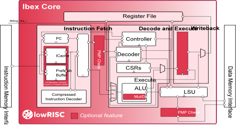
</div>


#### 2.1 架构与指令集

- **指令集架构**: RV32IMCB
  - I: 基本整数指令
  - M: 整数乘除法扩展（单周期乘法器）
  - C: 压缩指令（16位指令）
  - B: 位操作扩展（完整 ratified 子集及部分未 ratified 子集）
- **特权模式**: 支持机器模式（M-mode）和用户模式（U-mode），提供硬件隔离基础。
- **流水线**: 3级流水线（取指、译码/执行、写回），静态分支预测。

#### 2.2 安全增强特性

- **双核锁步配置**: 可选实例化两个Ibex核心，运行相同代码并比较输出，检测单粒子翻转等故障。
- **数据独立时序**: 关键操作（如乘法、内存访问）采用恒定时间设计，防止时序侧信道攻击。
- **虚指令插入**: 随机插入空操作，增加攻击者观测难度。
- **总线与寄存器文件完整性**: ECC或奇偶校验保护。
- **硬化PC（程序计数器）**: 防止控制流劫持攻击。
- **增强型物理内存保护（ePMP）**: 提供比标准PMP更细粒度的区域访问控制，支持机器模式下的代码隔离。

#### 2.3 指令缓存

- **容量**: 4KB
- **关联度**: 2路组相连
- **安全特性**: 支持低延迟内存加扰，防止缓存内容被侧信道分析。

#### 2.4 性能数据

- **CoreMark/MHz**: 1.93 (实测值，使用LLVM编译器)
- **优化极限**: 在GCC 9.2.0 + 理想单周期内存下可达3.07 CoreMark/MHz
- **优化标志示例**: `-march=rv32imc -mabi=ilp32 -O3 -falign-functions=16 -funroll-all-loops`

### 3. 存储系统与启动

#### 3.1 存储类型与安全特性

| 存储类型 | 容量 | 硬件安全特性 | 功能角色 |
| :--- | :--- | :--- | :--- |
| ROM | 32KB | 硬编码，不可更改，只读 | 存储一级引导代码（Boot ROM），执行RSA签名验证 |
| eFlash（FPGA模仿行为） | 2 × 512KB | 访问控制、内存加扰、页面擦除/编程 | 存储BL0、OS、应用固件及安全资产 |
| 主SRAM | 128KB | 低延迟内存加扰、奇偶校验 | 运行时数据存储（堆、栈） |
| AON SRAM | 4KB | 常电域保留，内存加扰 | 休眠时保持关键数据 |
| OTP | 2KB (16kbit) | 访问控制、内存加扰、一次性编程 | 存储设备唯一秘密（UDS）、生命周期状态、硬件密钥 |

#### 3.2 启动步骤

1. 硬件复位释放后，CPU 硬件跳转至 `test_rom`，完成堆栈、MPU、基础外设（UART、SPI等）的初始化。
2. `test_rom` 读取生命周期控制器的状态寄存器，并根据状态分流：
   - 若为 `TEST_UNLOCKED` 或 `DEV` 等开发/测试状态：进入 **测试/引导加载模式**（步骤 3）。
   - 若为 `PROD` 或 `PROD_END` 等状态：`test_rom`仅执行极少量硬件清理，随后直接跳转至`主引导 ROM`，由后者继续安全启动流程。
3. **测试模式下的命令等待**: 在测试状态中，`test_rom` 会通过 SPI 或 UART 接口等待外部测试主机发送的有效命令帧。它会持续轮询外设接收缓冲区。
4. **命令解析与执行**: 接收到命令后，`test_rom` 解析指令并执行相应操作，典型操作包括：
   - Flash 编程：擦除并烧写初始固件镜像（如 `ROM_EXT`）到内部嵌入式 Flash。
   - 代码加载执行：将主机发送的下级测试镜像加载到 SRAM 并校验签名后，跳转执行。
5. **引导最终镜像**: 当接收到"启动"或"跳转"指令时，`test_rom` 会验证目标镜像（位于 Flash 或 SRAM 中）的哈希和数字签名，验证通过后，锁定部分硬件安全属性，并将 CPU 控制权移交给该镜像。

### 4. 时钟、复位与电源管理

#### 4.1 时钟架构

<div align="center">
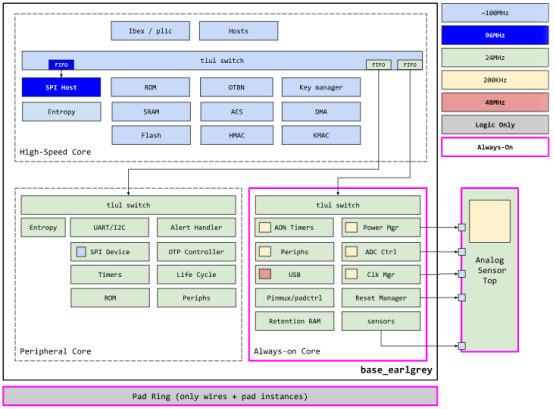
</div>


时钟由模拟顶层（AST）统一提供，并经过时钟管理器分发。

| 时钟域 | 标称频率 | 特性 | 目标模块 |
| :--- | :--- | :--- | :--- |
| sys | 100MHz | 抖动时钟（jittery），安全增强 | 处理器、内存、加密模块 |
| io | 24MHz | 固定频率 | 定时器、SPI、I2C、UART、GPIO等 |
| usb | 48MHz | 固定频率 | USB设备模块 |
| aon | 低速 (kHz) | 常开，低功耗 | 常开域、电源管理、AON定时器 |

**AST到Top Earlgrey的时钟映射**:

| AST端口 | Top Earlgrey时钟域 |
| :--- | :--- |
| clk_ast_adc_i | aon |
| clk_ast_alert_i | io_div4 (6MHz) |
| clk_ast_es_i | sys |
| clk_ast_rng_i | sys |
| clk_ast_tlul_i | io_div4 |
| clk_ast_usb_i | usb |

#### 4.2 复位架构

复位源主要来自AST的电源正常信号：
- `vcaon_pok`：常开域电源就绪
- `vcmain_pok`：主域电源就绪

当任一电源正常信号跌落时，对应域将产生异步低有效复位。复位管理器负责分发复位信号到各模块。

**复位场景分类**:
1. 外部电源跌落（brown-out）：AST检测到VCC下降，触发系统复位，Flash进入保护序列。
2. 内部请求复位：如AON定时器超时、软件复位请求。Flash直接复位。
3. 低功耗进入/退出：电源管理器确保在Flash操作未完成时不会进入休眠。

#### 4.3 电源域

- **常开域（Always-On）**: 始终供电，包含AON SRAM、AON定时器、电源管理逻辑、部分AST接口。
- **主域（Main）**: 可被关闭以进入睡眠模式。包含处理器、大部分外设和加密模块。

### 5. 总线与互联架构

#### 5.1 协议：TL-UL

TileLink Uncached Light (TL-UL) 是TileLink协议的轻量级变体，专为单片机系统优化：
- **无缓存**: 所有传输都是非缓存、非推测的。
- **简单接口**: 类似于AHB-Lite，但具有更简洁的时序和更小的面积。
- **支持多主多从**: 通过交叉开关实现。

#### 5.2 拓扑结构：两级层次

- **高速集群（High-Speed Cluster）**: 直连CPU，访问延迟极低。包含ROM、eFlash、SRAM、OTBN、密钥管理器等安全关键模块。典型延迟：2个CPU周期。
- **低速集群（Low-Speed Cluster）**: 通过低速桥接器连接，用于大部分IO外设和安全外设（AES、HMAC等）。典型延迟：18-20个CPU周期。

#### 5.3 主交叉开关（xbar_main）

- **主设备接口**: Ibex指令接口、Ibex数据接口、DMA控制器（如有）。
- **从设备接口**: 所有高速集群和低速集群的入口。
- **仲裁策略**: 可配置优先级或轮询。
- **地址解码**: 完全由 `xbar_main.hjson` 定义，支持地址窗口的灵活划分。

### 6. 中断系统

- **控制器**: 符合RISC-V PLIC (Platform-Level Interrupt Controller) 标准。
- **生成**: 由 `reg_rv_plic.py` 工具根据 `data/rv_plic.hjson` 中的参数自动生成RTL。
- **特性**:
  - 支持最多256个中断源。
  - 可配置中断优先级和等级。
  - 目标上下文数量可配置（通常为1，即Ibex核心）。
- **连接**: 所有外设的中断输出（如UART_TX_EMPTY, AES_DONE）连接到PLIC的输入向量。PLIC仲裁后向Ibex核心发出单个中断请求。

### 7. 安全功能模块集群

#### 7.1 OTBN (OpenTitan Big Number Accelerator)

<div align="center">
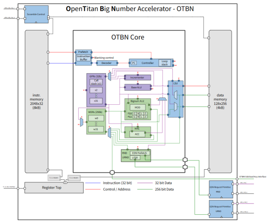
</div>


- **类型**: 可编程的、专门用于大数运算的协处理器。
- **指令集**: 专用的RISC-V子集，支持多精度乘法、模幂、椭圆曲线点运算等。
- **隔离**: 拥有独立的指令存储器和数据存储器（IMEM/DMEM），与主CPU完全隔离。
- **抗侧信道**: 采用恒定时间算法、掩码等技术。
- **用途**: 加速RSA（最高4096位）、ECC（NIST P256/P384, Brainpool P256r1, X25519/Ed25519）。

#### 7.2 AES引擎

<div align="center">
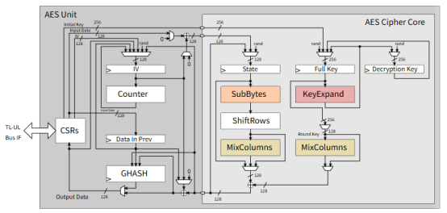
</div>


- **密钥长度**: 128, 192, 256位。
- **工作模式**: ECB, CBC, CFB, OFB, CTR。（GCM未硬件实现，但可用CTR模式加软件构造）
- **数据接口**: 32位寄存器写入，块大小为16字节。
- **安全特性**: 侧信道防护（掩码），可配置数据掩码。

#### 7.3 HMAC/SHA-256引擎

- **哈希**: SHA-256（输出256位）。
- **消息认证**: HMAC，支持任意长度密钥。
- **操作流程**: 软件通过寄存器写入消息块（32位字），启动哈希，完成后读取摘要。

#### 7.4 KMAC/SHA3引擎

- **支持函数**:
  - SHA3-224, SHA3-256, SHA3-384, SHA3-512
  - cSHAKE128, cSHAKE256 (可定制函数)
  - KMAC128, KMAC256
- **用途**: 可用于后量子密码、NIST标准合规场景。

#### 7.5 CSRNG与熵源

- **组成**: 模拟熵源 + 数字健康检查 + 确定随机数生成器(DRBG)
- **标准**: NIST SP800-90A（DRBG）、SP800-90B（熵源健康测试）
- **接口**: 通过EDN（熵分发网络）向其他模块提供随机数。

#### 7.6 密钥管理器 (Key Manager)

- **DICE支持**: 实现设备标识组合引擎，支持UDS派生IDevID/LDevID及别名密钥。
- **密钥版本控制**: 支持密钥滚动和版本管理。
- **硬件隔离**: 密钥材料仅在密钥管理器内部可见，软件只能通过句柄使用。

#### 7.7 生命周期控制器 (Lifecycle Controller)

- **状态机**: 管理芯片从制造、测试、开发、生产、RMA到报废的完整生命周期。
- **权限控制**: 不同状态下，调试接口、安全密钥访问、熔丝编程等具有不同权限。例如，生产状态下调试接口被永久锁定。

#### 7.8 告警处理器 (Alert Handler)

- **定义**: 按照Comportability规范，告警是安全敏感的中断，需要及时处理。
- **两级响应**:
  1. 第一级：作为标准中断发送给处理器，由软件处理。
  2. 第二级：若软件未在规定时间内响应，告警处理器可执行硬件自处理（如复位芯片、锁定密钥等）。
- **编码**: 每个外设的多个告警通过唯一编码发送。

#### 7.9 OTP控制器

<div align="center">
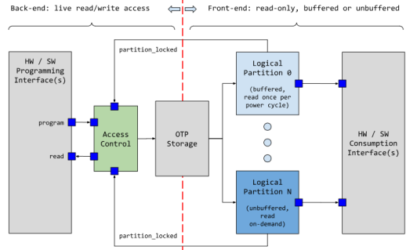
</div>

- **容量**: 2KB (16kbit)
- **安全特性**: 访问控制（读/写锁定）、内存加扰。
- **存储内容**: UDS种子、生命周期状态、硬件配置熔丝、测试密钥等。

#### 7.10 闪存控制器 (Flash Controller)

<div align="center">
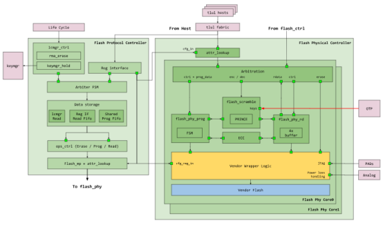
</div>


- **命令**: 读（通过内存映射）、擦除（页面级）、编程（字级）。
- **保护**: 对敏感区域实施读/写保护，防止软件越权访问。
- **加扰**: 内存加扰防止探针攻击。
- **页面大小**: 参数可配置（用于模拟不同工艺参数）
- **操作时序**:
  - 擦除：毫秒级（典型值）
  - 编程：微秒级
- **写限制**: Flash只能将1写为0，恢复1需要整页擦除。因此后续写入实际上是当前值与写入值的AND操作。
- **复位保护**: 系统设计了三种复位场景下的Flash保护机制：
  1. 外部电源跌落（brown-out）：由AST和Flash协同处理，确保存储单元不受损。
  2. 内部复位请求：Flash直接复位，假定在供电下能安全处理。
  3. 低功耗进入：电源管理器（pwrmgr）会中止进入低功耗的请求，直到Flash操作完成。

#### 7.11 PUF物理不可克隆函数

1. 自主研发的PUF物理不可克隆函数硬件IP，在PUF的RNG熵源模式下产生带有物理随机性的熵源，经过CSRNG模块进行随机性扩展，生成高质量的随机数，再通过EDN熵分布网络直接将随机数转发给各密码算法模块。实现软件无法访问的随机数传输，提升系统安全性。

2. PUF模块的C_R计算模式实现了输入任意激励，输出带有安全芯片自生物理特性的响应，这种响应具有唯一性，可以作为身份ID使用。多次C_R计算中，对相同的激励，PUF的输出数据经过RS CODE电路纠错后产生唯一且固定的响应，可作密钥使用。这为芯片带来了私钥不存储、根密钥内生、身份指纹的特性。

<div align="center">
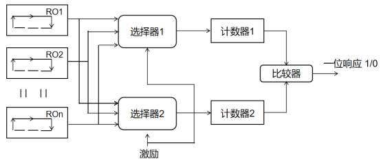
</div>

> *PUF core*

<div align="center">
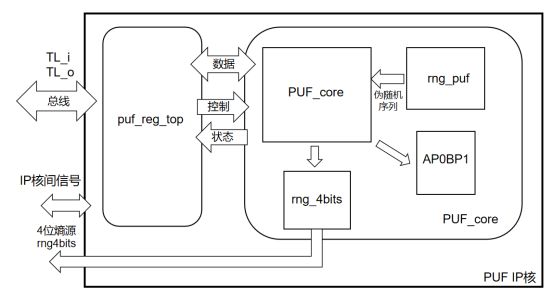
</div>

> *PUF IP*

### 8. IO外设与引脚复用

#### 8.1 引脚复用器 (PinMux)

<div align="center">
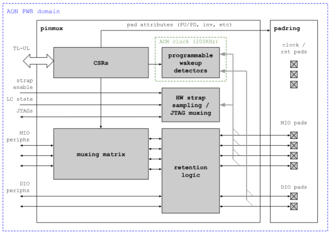
</div>


- **功能**: 将外设功能（UART TX, I2C SCL等）路由到47个可复用IO引脚。
- **可配置属性**: 驱动强度、上拉/下拉、开漏使能、施密特触发、输入使能等。
- **寄存器接口**: TL-UL从设备，软件可动态配置。

#### 8.2 主要外设规格

| 外设 | 实例数量 | 主要特性 |
| :--- | :--- | :--- |
| UART | 4 | 全双工，可配置波特率（最高数Mbps），支持CTS/RTS流控 |
| GPIO | 32 | 通过PinMux映射到任意MIO引脚，支持输入、输出、中断（边沿/电平） |
| I2C主机 | 3 | 标准、快速、快速+模式（最高1Mbaud），支持7位和10位寻址 |
| SPI主机 | 2 | 支持单、双、四线模式，可配置时钟极性和相位 |
| SPI设备 | 1 | 四种模式：固件模式（通用数据传输）、TPM模式（符合TPM规范）、闪存模式（模拟串行闪存）、直通模式（桥接外部闪存） |
| USB设备 | 1 | 全速（12Mbps），支持控制、批量、中断端点，支持挂起/唤醒，可与低功耗模式集成 |
| PWM | 1 | 多通道脉宽调制，用于LED调光、电机控制 |
| 定时器 | 1 | 64位自由运行计数器，固定频率 |
| AON定时器 | 1 | 常开域，低功耗，可用于系统唤醒 |
| 看门狗 | 1 | 可配置超时，防止软件锁死 |

### 9. 熵分发网络 (EDN)

<div align="center">
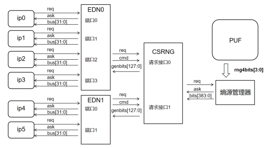
</div>


Earlgrey设计了专门的熵分发网络，确保不同模块对随机数质量和速率的需求得到满足。

| EDN实例 | 端点数量 | 配置模式 | 连接的模块 |
| :--- | :--- | :--- | :--- |
| u_edn0 | 8 | 高数据速率（略微降低质量） | 密钥管理器、OTP控制器、AST、KMAC、告警处理、AES、OTBN（URND端口）、Ibex核心 |
| u_edn1 | 1（活跃）+7（悬空） | 最高质量（用于密码学秘密） | OTBN（RND端口） |

**说明**:
- `u_edn0` 适用于需要大量随机数的场景，如掩码生成、随机延时等，对统计质量要求略低。
- `u_edn1` 专用于生成长期密钥、临时秘密等对随机性要求最高的场景。

### 10. 内存映射与地址分配

Earlgrey的地址空间通过主交叉开关的配置进行划分。一个重要的设计决策是：`0x0`地址未映射任何内存。这样，空指针访问会立即触发总线解码错误，便于软件调试和捕获非法访问。

以下为典型地址映射：

| 模块 | 基地址 | 大小 | 所属集群 |
| :--- | :--- | :--- | :--- |
| ROM | 0x00010000 (示例) | 32KB | 高速 |
| eFlash Bank 0 | 0x20000000 | 512KB | 高速 |
| eFlash Bank 1 | 0x20080000 | 512KB | 高速 |
| SRAM | 0x10000000 | 128KB | 高速 |
| AON SRAM | 0x40000000 | 4KB | 低速 |
| 外设（UART, GPIO, I2C, SPI等） | 0x40010000 -- 0x400FFFFF | 可变 | 低速 |
| 安全外设（AES, HMAC, OTBN等） | 0x41100000 -- 0x411FFFFF | 可变 | 低速 |
| PLIC | 0x48000000 | 可变 | 低速 |
| PinMux | 0x40100000 | 4KB | 低速 |

> **注意**: 实际地址映射随OpenTitan版本变化，请以发布的数据手册为准。地址空间划分在 `xbar_main.hjson` 中定义，并通过TopGen生成 `tl_main_pkg.sv` 中的参数。

### 11. 硬件接口定义

**引脚列表摘要**

| 引脚名称 | 引脚编号示例 | 类型 | 功能描述 |
| :--- | :--- | :--- | :--- |
| POR_N | 0 | 输入 | 系统复位，低有效 |
| USB_P / USB_N | 1,2 | 双向差分 | USB设备数据线 |
| FLASH_TEST_VOLT | 5 | 模拟输入 | Flash测试电压 |
| FLASH_TEST_MODE[0:1] | 6,7 | 输入 | Flash测试模式信号 |
| OTP_EXT_VOLT | 8 | 模拟输入 | OTP外部电压 |
| SPI_HOST_D[0:3] | 9-12 | 双向 | SPI主机数据线 |
| SPI_HOST_CLK | 13 | 双向 | SPI主机时钟 |
| SPI_HOST_CS_L | 14 | 双向 | SPI主机片选 |
| SPI_DEV_D[0:3] | 15-18 | 双向 | SPI设备数据线 |
| SPI_DEV_CLK | 19 | 输入 | SPI设备时钟 |
| SPI_DEV_CS_L | 20 | 输入 | SPI设备片选 |
| IOA[0:8], IOB[0:12], IOC[0:12], IOR[0:13] | 可变 | 双向 | 可复用IO引脚，可配置为GPIO或外设功能 |

### 12. FPGA实现与ASIC目标

- **ASIC目标**: `chip_earlgrey_asic` 网表，用于最终的硅实现。将集成真正的模拟单元（AST、eFlash、OTP等）。
- **FPGA目标**: `chip_earlgrey_cw310` 网表，用于在VCU129 FPGA开发板上进行原型验证。FPGA版本会模拟ASIC中模拟单元的行为（如用Block RAM模拟eFlash时序、用PRBS模拟TRNG）。
- **差异提醒**: 两个目标在引脚定义和某些模拟特性上存在差异，但顶层逻辑和寄存器接口保持兼容。

## 二、硬件扩展及软件引导

### 1. 辅助引导和通信硬件SAM3X

<div align="center">
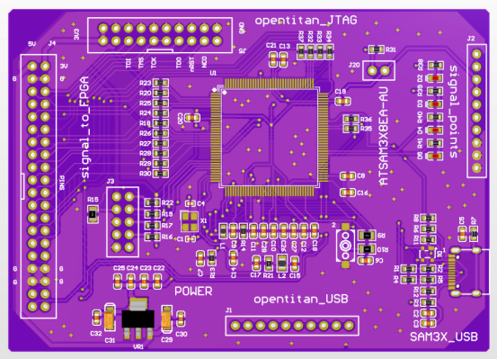
</div>

> *PCB电路图*

- 主机通过uart将opentitan运行的软件程序传送给SAM3X（mcu）；
- SAM3X将opentitan的软件程序通过SPI 接口加载到opentitan内部伪flash；
- SAM3X通过gpio控制opentitan的运行/启动方式和复位，主机可通过命令行控制；
- 引导流程参考《一、3.存储系统与启动》
- SAM3X同时可以将opentitan的UART0、UART2转接至可信第三方和二级可信根；

<div align="center">
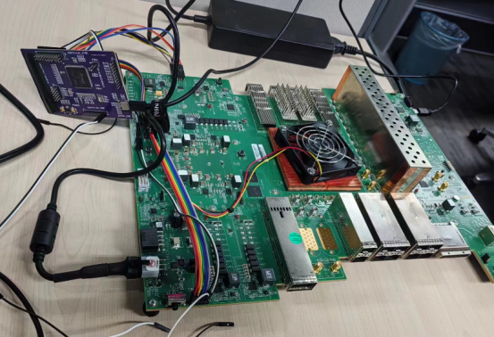
</div>

> *实物照片*

### 2. 软件引导步骤

<div align="center">
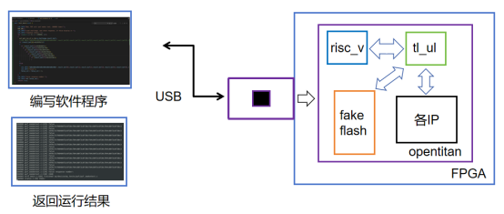
</div>


整个过程分为准备硬件与连接、加载FPGA位流、启动软件三个阶段。

#### 2.1 准备硬件与连接

1. 设置板卡：为VCU129连接电源和USB-C数据线。
2. 安装驱动规则：创建`/etc/udev/rules.d/90-lowrisc.rules`文件，添加官方提供的USB设备权限规则，执行`sudo udevadm control --reload-rules`命令使规则生效。
3. 检测连接：使用`sudo dmesg -Hw`命令查看系统日志，确认板卡已被识别，并分配`/dev/ttyACM1`类串口设备文件。

#### 2.2 手动加载FPGA bitstream

bitstream是FPGA的硬件配置文件，需先加载到板卡。进入代码仓库顶层目录，使用Vivado工具加载bitstream文件。加载成功后，UART串口会输出测试ROM版本信息。

#### 2.3 手动编译并加载软件

软件以二进制镜像形式加载到OpenTitan嵌入式Flash，该过程称为Bootstrapping。

1. 打开终端，使用串口工具连接查看输出，波特率设置为115200。
2. 另开终端执行加载操作：

   ① 可选操作：设置PLL时钟，通常仅需执行一次。
   ```bash
   bazel run //sw/host/opentitantool -- --interface=${BOARD} fpga set-pll
   ```
   ② 构建hello_world示例二进制文件。
   ```bash
   bazel build //sw/device/examples/hello_world:hello_world_fpga_${BOARD}_bin
   ```
   ③ 使用bootstrap命令将二进制文件加载到FPGA并运行。
   ```bash
   bazel run //sw/host/opentitan_tool -- bootstrap $(ci/scripts/target-location.sh //sw/device/examples/hello_world:hello_world_fpga_${BOARD}_bin)
   ```
   执行成功后，串口终端会输出`Hello World!`等信息。

### 3. 自动化硬件集成：TopGen工具链

Top Earlgrey的顶层硬件设计并非手工编写，而是由 TopGen 工具驱动，这体现了其"配置优先"的设计思想。所有顶层集成、总线互连和中断控制器均由工具链根据配置文件自动生成，开发者必须遵循"以配置为中心"的方法。

#### 3.1 设计约束

核心规则：严禁直接修改由TopGen生成的RTL文件（如 `top_earlgrey.sv`, `xbar_main.sv`, `rv_plic*.sv` 等）。所有硬件修改必须通过修改相应的 `.hjson` 配置文件完成。

#### 3.2 生成流程与输出

TopGen工具（路径：`util/topgen.py`）读取顶层配置文件 `data/top_earlgrey.hjson`，执行以下命令生成完整顶层：
```bash
../../util/topgen.py -t data/top_earlgrey.hjson -o . -v
```

**生成的关键硬件模块**:

| 生成文件 | 功能描述 | 生成工具 |
| :--- | :--- | :--- |
| `rtl/top_earlgrey.sv` | 顶层集成模块：实例化CPU、总线、所有外设和存储接口。基于 `top_earlgrey.sv.tpl` 模板生成。 | topgen.py |
| `rtl/xbar_main.sv`, `rtl/tl_main_pkg.sv` | 主交叉开关：系统的数据中枢，实现多主到多从的TL-UL互联与仲裁。 | tlgen 库 |
| `rtl/rv_plic_*.sv`, `data/rv_plic.hjson` | 平台级中断控制器（PLIC）：管理所有外设中断，其参数（如中断源数量、优先级位数）由配置定义。 | reg_rv_plic.py |

#### 3.3 硬件扩展方法

要添加新的硬件模块，需遵循以下配置流程：

1. **修改顶层配置**: 在 `data/top_earlgrey.hjson` 的 `module` 列表中添加新IP名称；若新模块有中断，需在 `interrupt_module` 中声明。
2. **修改互连配置**: 在 `data/xbar_main.hjson` 中定义新主/从设备及其地址映射。确保交叉开关中的实例名称与 `top_earlgrey.hjson` 的 `module` 字段中的名称完全匹配。
3. **（罕见）修改模板**: 仅当需要修改硬编码的RISC-V核心或调试模块，或集成不符合Comportability规范的IP时，才需修改 `top_earlgrey.sv.tpl` 模板。

<div align="center">
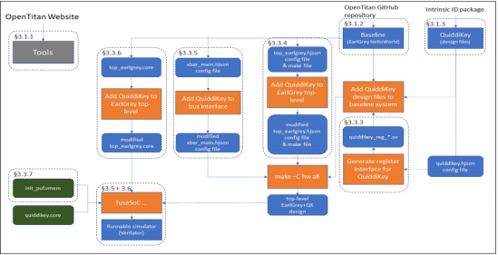
</div>


## 三、安全用例

### 1. 支持集群管理平台可信启动

#### 1.1 系统总体架构

基于 OpenTitan（三级可信根）设计了的集群管理平台可信启动机制。通过硬件信任根（RoT）对 BMC 固件FW进行度量（SHA256）与比对，证明在固件未被篡改的情况下，BMC 能被正常启动，FW才能被运行，从而建立从硬件到固件的完整信任链。

<div align="center">
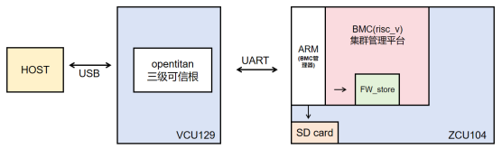
</div>

> *实验系统结构*

#### 1.2 系统组成

| 组件 | 说明 |
| :--- | :--- |
| 三级可信根 | OpenTitan（RISC-V），负责存储期望摘要、计算SHA256、比对hash |
| BMC管理器 | ARM处理器（ZCU104），负责读取SD卡、与OpenTitan交互、控制BMC复位 |
| 集群管理平台 | BMC（RISC-V），实际被保护的固件执行单元 |
| 固件存储 | SD卡（待度量固件）、FW_store（验证后固件存储） |
| 通信接口 | UART（日志输出）、USB（HOST连接验证） |
| 硬件平台 | VCU129 / ZCU104 |

#### 1.3 可信启动过程

信任链建立流程如下：

1. **度量请求**: OpenTitan向ARM发送"对BMC FW的度量命令"。
2. **固件读取**: ARM从SD卡读取BMC固件，并发送给OpenTitan。
3. **哈希计算与比对**: OpenTitan使用SHA256计算固件哈希，并与内部预置的"期望摘要"比对。
4. **结果反馈**: 比对成功→发送成功标志；失败→发送失败标志。
5. **条件启动**: 仅当收到成功标志后，ARM将固件写入FW_store，释放BMC复位信号，BMC从FW_store启动。

**核心证明点**: BMC的启动完全依赖于OpenTitan的度量结果，无法绕过。

#### 1.4 测试结果

<div align="center">
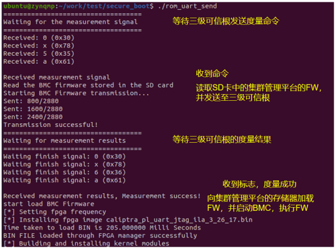
</div>

> *BMC管理器输出信息*

<div align="center">
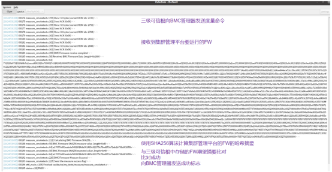
</div>

> *三级可信根输出信息*

**最终结论**: 本实验成功证明，基于 OpenTitan 的三级可信根能够有效支持集群管理平台（BMC）的可信启动，实现了从硬件信任根到固件执行的信任链传递，具备防篡改、可度量、可验证的可信启动能力。

### 2. 作为集群的TPM模块

#### 2.1 总体分析

OpenTitan作为一个开源、高保证的硅信任根，其设计目标之一就是支持TPM等安全用例。文档中的要求（认证等级、加密算法、预置流程、物理封装等）与OpenTitan的核心能力高度匹配。满足认证要求（如EAL4+）需要额外的形式化分析、渗透测试和流程审计，这属于认证范畴而非技术可行性问题。

#### 2.2 详细需求对照分析

| 要求类别 | 具体需求 | OpenTitan满足情况分析 |
| :--- | :--- | :--- |
| 认证要求 | EAL 4增强级，含ALC_FLR.1和AVA_VAN.4 | 技术上可行。OpenTitan设计遵循高保证开发流程（如使用形式化验证的Ibex核心、内存保护），并有公开的漏洞披露政策。但要获得官方认证，需由认证实验室评估并支付费用，这取决于具体项目投入。 |
| TRNG | NIST SP 800-90B兼容的熵源 | 满足。OpenTitan内置符合800-90B的熵源和确定性随机数生成器（DRBG），并提供健康测试。 |
| 哈希算法 | SHA2-256, SHA2-384，支持extend功能 | 满足。OpenTitan的HMAC模块支持SHA-256/384，可执行哈希链式更新。 |
| 对称加密 | HMAC，AES-CFB 128/192/256 | 满足。AES模块支持CFB模式，HMAC由HMAC模块支持。 |
| 非对称算法 | RSA-3072（签名/验证），ECDSA P-256/P-384 | 满足。OpenTitan内置OTBN（大数协处理器）可执行RSA/ECDSA，并有专用密钥管理器管理私钥。 |
| 密钥派生 | SP800-108计数器模式，HMAC为PRF | 满足。密钥管理器支持基于HMAC的KDF。 |
| 唯一标识符 | 最长256b，存储在OTP | 满足。OpenTitan有设备标识符（DEVICE_ID）存储在OTP中。 |
| 背书种子 | 加密/掩码存储，与密钥管理器绑定 | 满足。密钥管理器可派生背书种子，并存储在硬件保护的OTP或Flash中。 |
| EK证书 | 每种非对称密钥一个证书，链至根CA | 满足。OpenTitan支持证书链存储和验证。所有权转移流程可支持证书更新。 |
| 出厂固件 | 支持SPI/I2C固件更新，TPM 2.0命令集 | 满足。OpenTitan的ROM和ROM_EXT支持通过SPI/I2C更新固件，且可运行TPM 2.0栈（需要开发对应固件）。 |
| 非HDI封装 | 必须 | 满足。OpenTitan设计可用于标准封装，如QFN、BGA（非HDI）。 |
| TPM兼容封装 | 可选 | 满足。可以设计符合TPM规范的封装。 |
| NV存储 | 至少8KB | 满足。OpenTitan内置Flash远大于8KB（通常≥1MB）。 |
| SPI接口 | 支持TPM流控协议（PTP spec 6.4.5） | 需要固件/硬件支持。OpenTitan的SPI控制器可以配置为支持流控，但需要TPM栈正确实现该协议。硬件层无阻碍。 |
| I2C接口 | 符合PTP规范 | 满足。OpenTitan的I2C控制器可支持SMBus，能够实现PTP要求。 |
| GPIO | 用于平台安全流程 | 满足。OpenTitan有通用GPIO，可配置为中断或控制信号。 |

#### 2.3 需要特别说明的几点

(1). **认证（EAL4+）**: OpenTitan的设计和开发流程（如使用形式化验证、安全编码指南、持续渗透测试）使其具备了高保障基础，但要获得商业认证仍需项目方投入资源完成正式评估。文档中的"ALC_FLR.1"和"AVA_VAN.4"在OpenTitan社区有对应流程（如公开的漏洞报告、安全审计），但认证要求严格的文档化证据。

(2). **TPM命令集实现**: 文档要求出厂固件支持"TPM 2.0完整或子集命令"。OpenTitan本身提供硬件加速和灵活的执行环境，但完整的TPM栈（如处理TPM命令、会话管理、授权策略等）需要作为固件开发。OpenTitan社区或第三方可以提供参考实现（如基于TSS），但并非开箱即用。

(3). **所有权转移与证书链**: 文档中的EK证书管理（中间CA交叉签名、仅用于某类设备、链至根CA）完全符合OpenTitan的所有权转移模型。硅制造商和硅所有者可以分别管理证书层级。

(4). **流控协议硬件**: 文档"硬件实现流控"，OpenTitan的SPI控制器可以硬件处理流控（如使用Ready信号），或通过固件处理。两种方式均可满足。

#### 2.4 潜在差距（需额外开发）

| 项目 | 说明 |
| :--- | :--- |
| TPM规范符合性测试 | 需要运行TCG的TPM 2.0测试套件，确保命令行为和时序完全符合规范。OpenTitan硬件可以支持，但需要完整的固件实现并通过测试。 |
| 证书链管理 | 需要实现证书存储、更新、验证逻辑，以及处理EK证书与所有者证书的关系。OpenTitan的Flash和OTP提供存储基础，但策略逻辑在固件中。 |
| 休眠/恢复性能 | 文档中未在TPM部分强调，但通常TPM需要快速恢复。OpenTitan的电源管理和唤醒延迟需要符合平台要求。 |

#### 2.5 最终评估

- **技术上完全可行**: OpenTitan的硬件原语（密钥管理器、OTBN、HMAC/AES、TRNG、OTP、Flash、SPI/I2C/GPIO）直接覆盖了TPM所需的所有加密和接口要求。
- **需配套固件**: TPM功能主要依赖固件实现TPM 2.0规范，OpenTitan提供安全执行环境（如ROM、ROM_EXT、闪存隔离）来承载该固件。
- **认证需要额外投入**: 通过TCG认证和通用标准EAL4+评估是商业可行的，但需要项目方走完认证流程。

OpenTitan从芯片层面完全满足TPM文档列出的所有技术要求，并且其高保证开发流程有助于达到所需的安全认证级别。若需要实际部署TPM解决方案，基于OpenTitan开发或移植TPM 2.0固件栈是合理且高效的选择。
