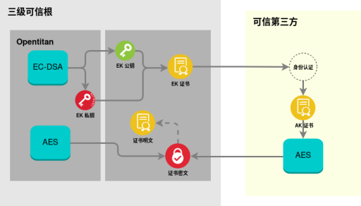
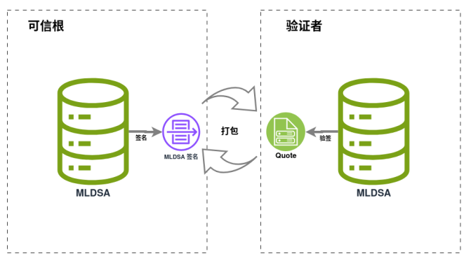
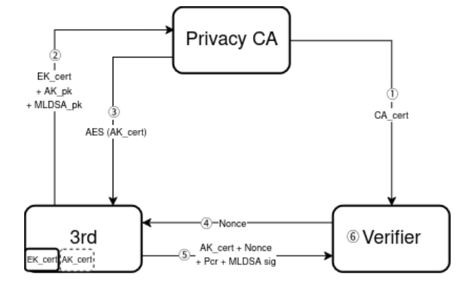

# 三级可信根软件设计

本设计基于 Xilinx VCU129 FPGA 开发板与 OpenTitan 安全芯片，围绕设备身份认证、密钥证书管理、远程证明等核心需求，完成主机测和设备侧软件的架构设计、模块实现及交互逻辑，为面向集群的多级可信根系统提供了一个不可篡改、可验证且唯一的信任锚点。

## 设计内容

1. 适配 VCU129 平台的 OpenTitan 原型，实现主机与设备之间稳定可靠的串口数据传输；
2. 构建完整的 PKI 证书体系，实现 EK/AK 密钥生成、证书签发、安全传输与存储；
3. 集成 ML-DSA 后量子签名算法，将公钥与设备身份强绑定，提升身份认证与数据完整性防护能力；
4. 实现远程证明全流程自动化，支持证书签发、身份校验、平台状态度量与抗重放验证；
5. 整套软件支持一键式数据抓取、证书签发与远程可信验证，便于调试、演示与体系验证。

## 核心功能模块

### 串口通信

本模块基于 OpenTitan 安全芯片的 UART 控制器实现。

由于芯片发送/接收 FIFO 深度仅为 32 字节，常规串口调试的简单收发方式无法满足大数据量可靠传输，因此设计了专用的传输机制：

- 采用固定分块发送策略，严格匹配 32 字节硬件缓冲区限制，避免溢出丢包；
- 通过环形缓冲区实现流式接收，结合帧头长度字段与结束标记完成数据边界识别；
- 同时内置超时检测与异常重连机制，在硬件资源受限条件下，实现主机与设备间大数据的无丢失、无截断稳定传输。

### PKI证书管理

本模块基于 X.509 标准构建系统信任链，依托 OpenTitan 硬件安全能力实现证书全生命周期管理，为设备身份与远程证明提供可信身份锚点。

- **硬件级 EK 证书生成**：利用 OpenTitan 硬件 EC-DSA 模块，在芯片安全边界内生成 EK（背书密钥）密钥对并完成自签名。EK 私钥仅存于硬件安全存储区，不可外部读取或导出，与芯片唯一标识绑定，作为设备硬件身份根凭证。
- **AES 加密传输 AK 证书**：AK 证书从可信第三方下发至设备时，使用 AES-ECB 模块加密传输，三级可信根再使用 OpenTitan 硬件 AES-ECB 模块进行解密。双方预先协商密钥，主机加密、设备硬件解密，确保证书在链路上不被窃听、篡改或伪造。

*图 1 PKI证书管理原理图*

### ML-DSA

本功能为系统提供抗量子攻击的高安全密码支撑，严格遵循 NIST FIPS 204 标准，选用 ML-DSA-87 高安全等级参数，可抵御量子计算带来的传统密码破解风险。

算法基于纯软件 mldsa-native 库实现，轻量化优化内存与运算开销，适配设备端资源受限场景，核心功能包括：

- **设备端签名**：在远程证明过程中，三级可信根对包含 Nonce、PCR 平台度量值的 Quote 数据包，使用本地 ML-DSA 私钥进行签名，保证数据完整、不可篡改、不可否认。
- **验证端验签**：验证者从 AK 证书扩展字段中提取 ML-DSA 公钥，对 Quote 包签名进行验签，确认数据来源可信且未被篡改，为远程证明提供抗量子安全支撑。

*图 2 ML-DSA签名与验签流程图*

## 远程证明

远程证明是本设计的核心业务载体，也是整个三级可信根体系的最终验证目标，遵循 TCG 可信计算规范，采用挑战-响应安全模型，整合底层 OpenTitan 硬件安全能力、PKI 证书体系与 ML-DSA 后量子密码能力，构建完整的设备远程可信证明体系。

整个远程证明全流程分为 6 个阶段，核心逻辑如下：

1. **根CA证书部署阶段**：为后续的证书校验预置唯一可信信任锚，完成验证端的信任基础初始化；
2. **设备身份初始化阶段**：三级可信根在启动阶段完成 EK 证书与 AK 密钥对生成，向可信第三方提交 EK 证书、AK 公钥、ML-DSA 公钥；
3. **AK证书下发阶段**：可信第三方完成身份校验与 AK 证书签发，将 AK 证书进行 AES 加密，返回到三级可信根，存储于本地，完成信任链初始化；
4. **挑战发起阶段**：验证者生成 32 字节高熵值 Nonce 随机数，作为挑战因子发送至待验证设备，确保本次证明流程的唯一性，抵御重放攻击风险；
5. **证明响应阶段**：设备接收到 Nonce 挑战后，采集当前平台 PCR 寄存器的度量值，使用 ML-DSA 私钥完成签名，将 AK 证书、Nonce、PCR、ML-DSA 签名值组成Quote包，发送至验证者；
6. **可信校验阶段**：验证者接收到响应报文后，完成可信校验，所有校验项全部通过，才判定设备为可信设备，建立端到端安全通信链路；任意一项校验不通过，直接判定设备不可信，拒绝接入并触发安全告警。

*图 3 远程证明流程图*

## 配套验证工具实现

为完成三级可信根远程证明体系的端到端验证，本设计配套开发了两套工具，分别实现可信第三方与验证者的核心能力，工具基于 OpenSSL 等库开发，可直接在通用 Linux 主机上运行，无需专用硬件，便于调试、演示与批量验证。

### 可信第三方

可信第三方是整个远程证明体系的信任锚，承担根CA管理、设备准入校验、证书签发的核心职责，核心实现功能如下：

- **根CA证书创建与维护**：遵循 X.509 标准生成根CA证书，作为整个可信体系的信任源头，安全存储CA私钥，保障证书签发的权威性；
- **基于白名单的EK证书校验**：接收由三级可信根生成的EK证书，与系统预置的合法设备白名单比对，仅授权设备可进入后续流程，从源头拦截非法设备接入；
- **签发AK证书并嵌入ML-DSA公钥**：EK证书校验通过后，使用CA证书为其AK公钥签发AK证书，同时将ML-DSA公钥写入AK证书的自定义扩展字段，实现设备身份与ML-DSA公钥的绑定；
- **AK证书加密回传**：完成AK证书签发后，使用与三级可信根预先协商的密钥，通过AES-ECB对AK证书进行加密，再通过串口返回给三级可信根，保证证书在传输过程中不被窃取或篡改。

### 验证者

验证者是远程证明流程的发起方与可信判定主体，负责完成挑战发起、报文解析与可信校验，核心实现功能如下：

- **发起验证请求并解析Quote包**：验证者生成随机数Nonce发送给设备，防止报文被重复使用；接收设备返回的Quote包后，从中解析出AK证书、Nonce、PCR度量值和ML-DSA签名；
- **按顺序逐项完成可信检查**（任意一步不通过则直接判定设备不可信，不再进行后续检查）：
  1. 首先验证AK证书是否合法有效，确认由可信第三方签发，未被篡改；
  2. 然后检查Quote包里的Nonce是否与本次发送的随机数一致，防止重放攻击；
  3. 再比对PCR度量值是否与标准可信值一致，确认设备固件和运行环境未被篡改；
  4. 最后将Nonce与PCR拼接计算SHA256摘要，使用AK证书中的ML-DSA公钥验证签名是否合法；
- **根据检查结果进行处理**：全部检查通过则认为设备可信，可进行后续数据交互；任意一项不通过则拒绝设备接入，并记录异常信息。