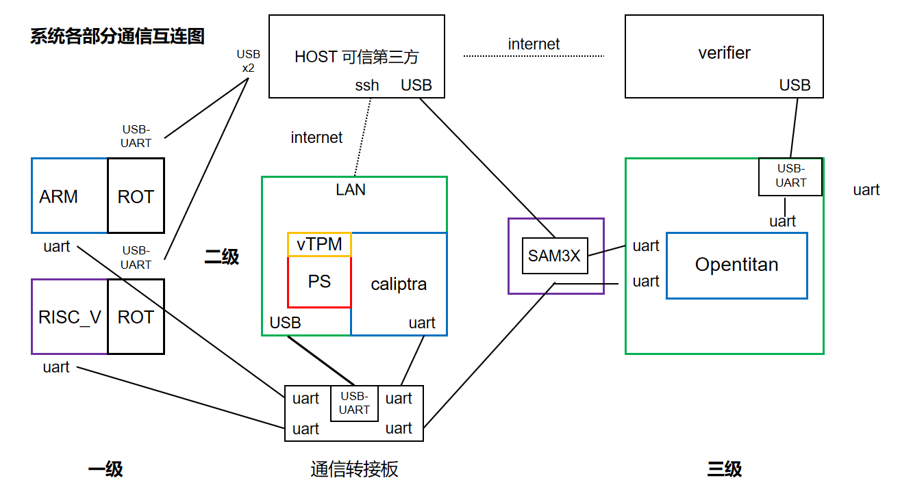

# 系统整体说明

## 一、系统连接关系

[多级可信根系统实物图](./system_image/system.png)

### 1.通信接口说明：

- **一级到二级**：目前一级可信根SOC端通过uart连接到uart-usb转接板，再连接至二级PS端USB口

- **一级caliptra的log**：uart信号连接至KU060 uart-usb，再连接至主机查看log

- **二级caliptra_pl的log打印**：二级可信根caliptra的uart连接到uart-usb转接板，再连接至二级PS端USB口，PS端可以查看log信息

- **二级的操作控制**：二级可信根PS通过网线连接网络，HOST可以通过SSH登录二级可信根Ubuntu

- **三级到二级**：三级可信根opentitan通过uart连接到uart-usb转接板，再连接至二级PS端USB口

- **三级到HOST**：三级可信根opentitan通过SAM3X将uart信号转为usb，再连接至HOST

- **三级到verify**：三级可信根opentitan通过FT4232将uart信号转为usb，再连接至verify

- **HOST和verify**：通过网络通信

### 2. pin to pin 连接表

#### 【1】一级可信根模式设置
<table>
<tr>
<td valign="top">

一级可信根(ARM)运行模式设定：**产品**

| 管脚 | 信号 | 值 | 
|------|------|------|  
| AG11 | security_state[0] | 1 |
| AF12 | security_state[1] | 1 | 
| AE12 | security_state[2] | 1 | 
| AH13 | scan_mode | 0 |

</td>
<td valign="top">

一级可信根(ARM)运行模式设定：**调试**

| 管脚 | 信号 | 值 | 
|------|------|------|  
| AG11 | security_state[0] | 0 |
| AF12 | security_state[1] | 0 | 
| AE12 | security_state[2] | 0 | 
| AH13 | scan_mode | 1 |

</td>
</tr>
</table>

#### 各级可信根到通信转接板MUTI_UART的连接

[MUTI_UART板子图](./system_image/muti_uart.png)

| 一级ROT信号 | 一级转接板引脚 | MUTI_UART引脚 | 
|------|------|------|
| SOC TXD | AD10 | RX3 |
| SOC RXD | AE10 | TX3 |
| - | GND | GND3 |
*******************************************
| 二级ROT信号 | ZCU104板引脚 | MUTI_UART引脚 | 
|------|------|------|
| caliptra RX | J55_1 | TX0 |
| caliptra TX | J55_3 | RX0 |
| - | J55_9 | GND0 |
| - | UAB接口 | TYPE_C |
*******************************************
| 三级ROT信号 | SAM3X信号 | MUTI_UART引脚 | 
|------|------|------|
| opentitan_IOB5_TX | J1_right1 | RX1 |
| opentitan_IOB4_RX | J1_right2 | TX1 |
| - | GND(129) | GND1 |

#### 【2】三级ROT到SAM3X板的连接

| opentitan IO | FPGA pins | VCU129板子信号 | SAM3X_40P插口 | 
|------|------|------|------|  
| POR_N | J33 | PMOD0_0 | 40P_5 |
| IOC4 | P36 | PMOD0_4 | 40P_13 | 
| IOC3 | L35 | PMOD0_3 | 40P_11 |
| IOA0 | BA22 | FAT232_T |-|
| IOA1 | AY22 | FAT232_R |-|
| IOC0 | L34 | PMOD0_5 | 40P_15 |
| IOC1 | L33 | PMOD0_6 | 40P_17 |
| IOC2 | M37 | PMOD0_7 | 40P_19 |
| IOC5 | E22 | PMOD1_1 | 40P_23 |
| IOC8 | C23 | PMOD1_0 | 40P_21 |
| IOB4 | J32 | PMOD0_1 | 40P_18 |
| IOB5 | K35 | PMOD0_2 | 40P_20 |
| SPI_DEV_CLK | F22 | PMOD1_2 | 40P_25 |
| SPI_DEV_D0 | A23 | PMOD1_3 | 40P_27 |
| SPI_DEV_D1 | A24 | PMOD1_4 | 40P_29 |
| SPI_DEV_D2 | B24 | PMOD1_5 | 40P_31 |
| SPI_DEV_D3 | C24 | PMOD1_6 | 40P_37 |
| SPI_DEV_CS_L | D23 | PMOD1_7 | 40P_39 |

[SAM3X_40P插口引脚位置图](./system_image/pins.png)

> *同时参阅各级FPGA工程的引脚约束*

[一级ROT(ARM)引脚约束](/First_rot/project/fpga_syn/script/fpga_ku6_mcu_full_pin_assignments.xdc)

[二级ROT引脚约束](/Second_rot/fpga/src/jtag_constraints.xdc)

[三级ROT引脚约束](/Third_rot/xdc_129/pins_vcu129.xdc)

## 系统整体设计报告

[系统整体设计报告](system_top3.md)

[系统测试](系统测试.md)

[动画演示](./TS_visualization/README.md)