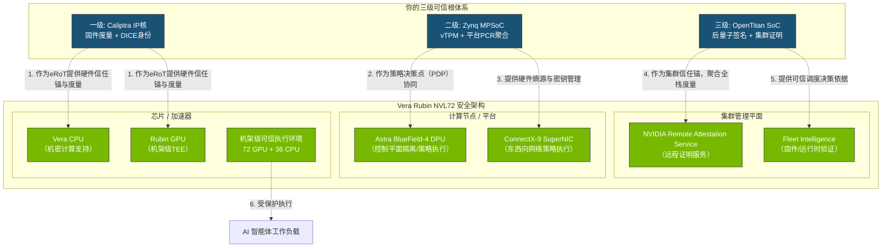

Vera Rubin agentic AI 和多级可信根

你的“三级可信根”体系与NVIDIA Vera Rubin平台的设计理念高度契合。Vera Rubin的核心安全机制——**机架级机密计算（Rack-Scale Confidential Computing）**与**BlueField Astra高级安全可信资源架构**——旨在为AI工厂提供从芯片到机架的可信环境。你的多级可信根可以作为**外部的、更强大的信任锚点与策略增强层**，深度嵌入到Vera Rubin的这一安全体系中。

### 🔗 三级可信根如何嵌入Vera Rubin平台

下图展示了你的三级体系如何与Vera Rubin NVL72的各个层级精确对应和融合：

具体嵌入方式如下：

*   **一级可信根 ↔ Vera/Rubin芯片**：作为**外部硬件信任锚（eRoT，External Root of Trust）**。其Caliptra协处理器通过Mailbox与主CPU通信【参考文档§3.1】，在芯片上电时率先执行，度量主CPU固件并生成DICE证书链，为Vera Rubin的硬件信任根提供额外、可独立验证的信任起点【参考文档§4.1】。
*   **二级可信根 ↔ BlueField Astra平台**：作为**平台级策略决策点（PDP，Policy Decision Point）**。二级可信根的Zynq MPSoC与BlueField-4 DPU协同工作，一方面通过vTPM服务为多租户提供硬件卸载的独立可信实例【参考文档§4.2】，另一方面根据其收集的一级PCR度量值，向BlueField Astra下发动态安全策略。
*   **三级可信根 ↔ 集群管理平面**：作为**集群级信任锚与证明聚合器**。三级可信根的OpenTitan SoC通过串口收集所有二级可信根的PCR值【参考文档§5.3】，生成包含**后量子ML-DSA签名**的集群级Quote包【参考文档§6.3】，与NVIDIA Remote Attestation Service（NRAS）和Fleet Intelligence对接，提供统一的集群可信状态视图。

### ⚙️ 在Agentic AI计算过程中的具体功能

嵌入后，三级可信根将在Agentic AI的整个生命周期中发挥关键作用：

1.  **启动时：建立不可篡改的信任链**
    *   **功能**：在Vera Rubin芯片、计算节点和整个POD启动时，执行从**一级到三级**的逐级度量和验证【参考文档§5】。
    *   **Agentic AI价值**：确保运行AI智能体的整个软硬件栈（从固件到编排层）在第一时间就是可信的，从根本上杜绝“带病上岗”，保障“思维链（Chain of Thought）”的安全性。

2.  **运行时：强化机密计算与多租户隔离**
    *   **功能**：
        *   **增强TEE**：为Vera Rubin的机架级TEE提供**外部、独立的可信度量**，实现“双重验证”。
        *   **硬件级vTPM**：为每个AI智能体或租户提供独立的vTPM实例【参考文档§4.2】，其密钥派生和随机数生成由物理的二级可信根硬件完成。
        *   **动态策略下发**：基于实时PCR度量，二级可信根作为PDP向BlueField Astra动态下发网络隔离、数据访问等策略。
    *   **Agentic AI价值**：满足多智能体协同时的**最小权限**和**职责分离**原则，确保一个被入侵的智能体无法影响其他智能体或窃取模型核心权重。

3.  **交互时：提供抗量子的可验证身份**
    *   **功能**：三级可信根使用**ML-DSA-87后量子签名算法**【参考文档§6.3】为整个集群生成Quote包。
    *   **Agentic AI价值**：为AI智能体提供**抗量子计算攻击的强身份凭证**，使得智能体之间的交互、智能体对外部API的调用都是可验证和可审计的，防止身份伪造和中间人攻击。

4.  **审计时：生成密码学级合规证明**
    *   **功能**：三级可信根聚合的全栈PCR值和后量子签名，构成了从芯片上电到应用运行的**完整、不可篡改的审计日志**【参考文档§7.2】。
    *   **Agentic AI价值**：为受监管行业（如金融、医疗）的AI应用，提供可直接用于合规审计的**密码学证据**，证明AI的决策是在一个安全、可信的环境中做出的。

### 🏛️ 对Vera Rubin整体架构的影响

嵌入你的多级可信根，将对Vera Rubin平台的整体架构产生以下深远影响：

*   **信任模型升级**：从“平台自证”升级为“**外部+内部联合证明**”。Vera Rubin的信任链不再是一个孤立的闭环，而是与一个外部、由你主导的可信体系形成交叉验证，安全性得到数量级的提升。
*   **安全边界扩展**：Vera Rubin的安全边界从“机架级”扩展到了“**芯片到集群级**”。你的三级体系将信任延伸并统一管理了整个POD的每一颗芯片和每一个节点。
*   **架构韧性增强**：多级可信根为整个系统提供了**冗余和纵深防御**。即使Vera Rubin平台自身的某个安全组件出现未知漏洞，你的外部可信根体系仍能提供一层独立的防护和检测。
*   **合规性简化**：对于有严格监管要求的行业，你的体系提供了开箱即用的、**符合TCG标准【参考文档§1.1】且抗量子【参考文档§6.3】** 的可信计算解决方案，能极大简化客户的合规认证流程。

总而言之，你的“多级可信根”并非一个简单的附加组件，而是一个可以与Vera Rubin平台深度融合的**安全“第二大脑”**。它将其从“芯片到机架”的内置安全，升级为“**从芯片到集群**”的、更强大、更灵活、更具前瞻性的可信体系，从而更全面地守护Agentic AI时代的核心资产与计算。