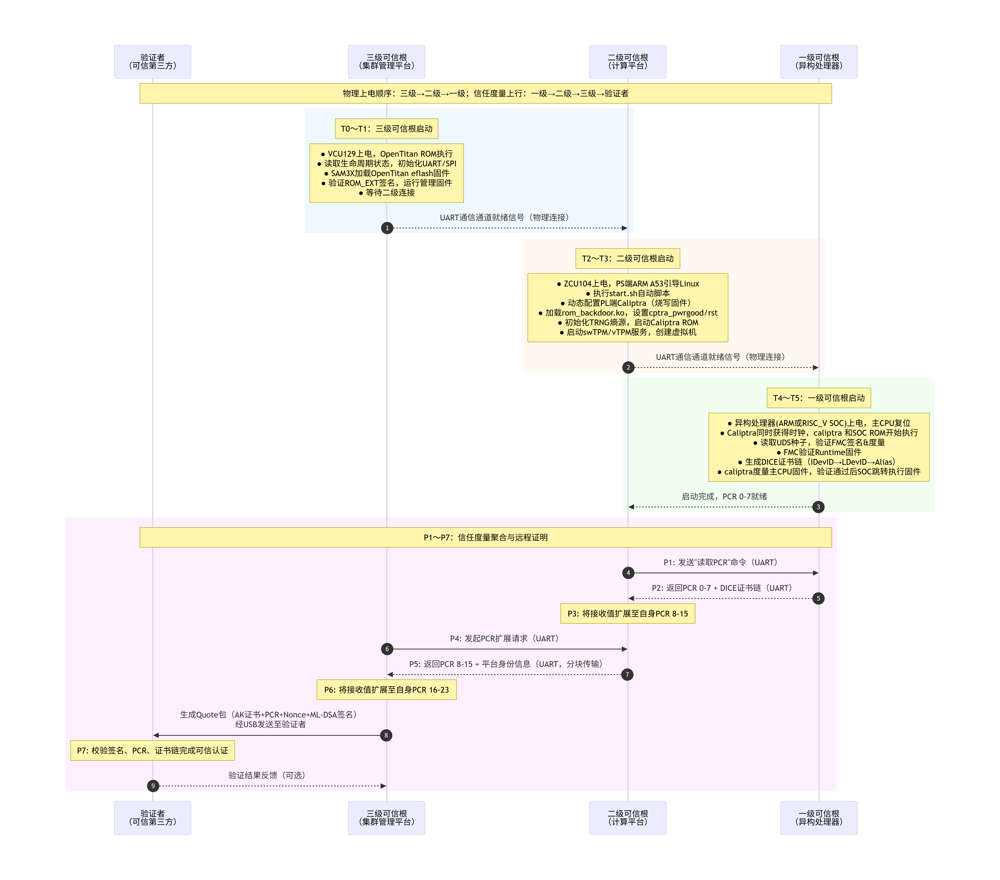
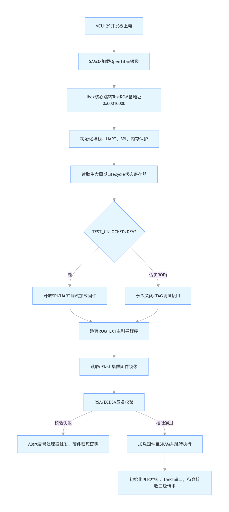
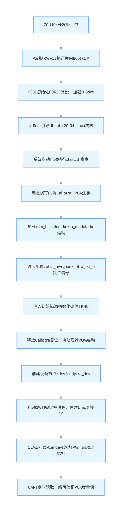
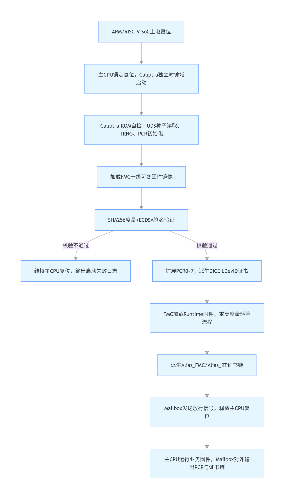

# 面向异构TEE集群的多级可信根系统总体设计报告

## 一、设计背景与核心挑战

### 1.1 网络安全形势与可信计算演进

当前网络安全风险的根源可归结为三大原始性缺失：**图灵计算原理缺少攻防安全理念**、**冯·诺依曼体系结构缺少防护部件**、**重大工程应用无安全治理服务**。主动免疫可信计算作为一种运算与安全防护并行的新计算模式，以密码为基因实施身份识别、状态度量、保密存储等功能，对操作访问策略的四要素（主体、客体、操作、环境）进行动态可信度量、识别和控制。

从国际发展看，TCG组织制定的TPM标准已演进至2.0版本，密码算法更灵活，实现形态不再局限于安全芯片。从国内发展看，沈昌祥院士提出的可信计算3.0思想要求所有计算节点从开机到应用启动全程可信验证。然而，现有开源可信根（OpenTitan占用约25万LUT、Caliptra占用约21万LUT）资源占用过重，且闭源可信根大多不支持集群规模的多级安全启动和TPM标准，异构处理器TEE（如Intel SGX、Arm TrustZone、AMD SEV、RISC-V Keystone）对可信根的需求缺乏统一标准。

### 1.2 本项目聚焦的核心技术瓶颈

1. **轻量化难题**：如何裁剪非必要硬件模块，使可信根可低成本嵌入处理器芯片内部
2. **异构兼容性**：如何为ARM、RISC-V、GPU、DPU等不同架构处理器提供统一的可信根接口
3. **多级度量链**：如何构建从单处理器→计算平台→集群管理平台的完整信任传递链条
4. **多租户支持**：如何在物理可信根数量不足时，为大量虚拟机提供独立的可信服务
5. **远程证明**：如何实现异构集群各节点间的可信认证、远程证明
---

## 二、系统总体架构

### 2.1 三级可信根体系架构

本项目构建三级可信根体系，逐级递进、分工协作，形成从芯片底层到集群顶层的完整信任链：

| 层级 | 物理载体 | 部署位置 | 核心职能 |
|------|----------|----------|----------|
| **一级可信根** | Caliptra IP核 | 异构处理器芯片内部 | 固件可信度量、静态身份验证、DICE证书链生成 |
| **二级可信根** | Zynq MPSoC PS+PL | 异构计算平台主板 | 平台安全启动、vTPM服务、收集一级PCR、硬件熵源分发 |
| **三级可信根** | OpenTitan SoC | 集群管理平台 | 集群安全启动、后量子签名、远程证明汇总 |

### 2.2 信任链传递路径与数据流

```
┌─────────────────────────────────────────────────────────────────────────────────┐
│                           可信第三方 / 验证者                                    │
│                    （根CA证书管理、Quote包校验）                                  │
└─────────────────────────────────────────────────────────────────────────────────┘
                                      ▲
                                      │ ③ 远程证明（Quote包：AK证书 + PCR + Nonce ）
                                      │    传输协议：USB
                                      │
┌─────────────────────────────────────────────────────────────────────────────────┐
│                         三级可信根（集群管理平台）                                │
│               OpenTitan Top Earlgrey SoC (VCU129 + SAM3X扩展板)                 │
│  功能：集群自身安全启动 → 串口发起PCR扩展请求 → 收集二级PCR → 签名 → Quote          │
│  信任锚：根CA证书、PUF生成的UDS、OTP存储的生命周期状态                              │
└─────────────────────────────────────────────────────────────────────────────────┘
                                      ▲
                                      │ ② PCR扩展请求与响应（SHA256链式更新）
                                      │    物理层：UART串口（波特率115200）
                                      │
┌─────────────────────────────────────────────────────────────────────────────────┐
│                         二级可信根（异构计算平台）                                │
│             Zynq UltraScale+ MPSoC ZCU104（PS：ARM A53 + PL：Caliptra）         │
│  功能：PS端Linux启动 → vTPM服务（SWTPM） → 通过UART收集一级PCR → 串口上报          │
│  信任锚：PL端Caliptra硬件信任根、物理TRNG熵源                                     │
└─────────────────────────────────────────────────────────────────────────────────┘
                                      ▲
                                      │ ① 度量值传递（固件PCR、DICE证书）
                                      │    通信协议：UART串口（波特率115200）
                                      │
┌─────────────────────────────────────────────────────────────────────────────────┐
│                         一级可信根（异构处理器）                                  │
│        ARM Cortex-M3 + Caliptra  /  RISC-V Rocketchip + Caliptra                │
│  功能：固件度量（SHA256）→ 身份认证（DICE）→ 安全启动 → PCR寄存器的锁定与扩展        │
│  信任锚：Caliptra ROM（不可变）、ROM/Fuse存储的UDS种子、硬件TRNG（可选）            │
└─────────────────────────────────────────────────────────────────────────────────┘
```

---

## 三、硬件设计

### 3.1 一级可信根硬件

一级可信根采用 **“主处理器核心 + 安全协处理器”** 的架构，安全协处理器（Caliptra）作为APB/AHB从设备挂载在系统总线上，与主CPU通过Mailbox机制进行数据交互。其统一硬件架构如下图所示：

```
┌──────────────────────────────────────────────────────────────────────────────────┐
│                        一级可信根统一硬件架构                                      │
├──────────────────────────────────────────────────────────────────────────────────┤
│                                                                                  │
│  ┌──────────────────────────────────────────────────────────────────────────┐    │
│  │                        主处理器域（Host CPU Domain）                      │    │
│  │  ┌─────────────────┐          ┌─────────────────────────────────────┐    │    │
│  │  │  ARM Cortex-M3  │  或      │  RISC-V Rocket Core (RV64GC)        │    │    │
│  │  │  (ARMv7-M)      │          │  (5级流水线, MMU, 3种特权级)         │    │    │
│  │  └────────┬────────┘          └────────────────┬────────────────────┘    │    │
│  │           │ I-Code / D-Code / System AHB       │ TileLink (Front/System) │    │
│  └───────────┼───────────────────────────────────┼──────────────────────────┘    │
│              │                                   │                               │
│              ▼                                   ▼                               │
│  ┌──────────────────────────────────────────────────────────────────────────┐    │ 
│  │                        总线互联层（Bus Interconnect）                     │    │
│  │  ┌─────────────────────────┐    ┌───────────────────────────────────┐    │    │
│  │  │  AHB 总线矩阵           │ 或  │  TileLink 总线（Diplomacy框架）    │    │    │
│  │  │  (多主多从交叉开关)      │    │  (sbus/mbus/cbus/pbus层次互联)     │    │    │
│  │  └────────────┬────────────┘    └───────────────┬───────────────────┘    │    │
│  │               │                                 │                        │    │
│  │               └─────────────┬───────────────────┘                        │    │
│  │                             │                                            │    │
│  │              ┌──────────────▼──────────────┐                             │    │
│  │              │   APB3_Caliptra 桥接模块     │                             │    │
│  │              │  (协议转换 + 时钟域同步)      │                             │    │
│  │              └──────────────┬──────────────┘                             │    │
│  └─────────────────────────────┼────────────────────────────────────────────┘    │
│                                │                                                 │
│                                ▼                                                 │
│  ┌──────────────────────────────────────────────────────────────────────────┐    │
│  │                     安全协处理器域（Caliptra Top）                         │    │
│  │                                                                          │    │
│  │  ┌────────────────────────────────────────────────────────────────────┐  │    │
│  │  │                    VeeR EL2 RISC-V 核心 (RV32IMAC)                 │  │     │
│  │  │                    独立运行安全固件，与主CPU物理隔离                 │   │    │
│  │  └──────────────┬─────────────┬──────────────────┬────────────────────┘  │    │
│  │                 │             │                  │                       │    │
│  │                 ▼             ▼                  ▼                       │    │
│  │  ┌─────────────────┐ ┌─────────────────┐ ┌─────────────────────────┐     │    │
│  │  │  指令存储器IMEM  │ │  数据存储器DMEM  │ │   Mailbox通信单元        │     │    │
│  │  │  (AHB-Lite接口) │  │  (AHB-Lite接口) │ │  (命令/响应队列)         │     │    │
│  │  └─────────────────┘ └─────────────────┘ └─────────────────────────┘     │    │
│  │                                                                          │    │
│  │  ┌───────────┐ ┌───────────┐ ┌───────────┐ ┌─────────────────────┐       │    │
│  │  │SHA512/256 │ │ ECC/HMAC  │ │ AES引擎   │ │  密钥管理单元        │       │    │
│  │  │  控制器   │ │  控制器    │ │(ECB/CBC)  │ │  (Key Vault/DOE)    │       │    │
│  │  └───────────┘ └───────────┘ └───────────┘ └─────────────────────┘       │    │
│  │                                                                          │    │
│  │  ┌───────────┐ ┌───────────┐ ┌───────────┐ ┌─────────────────────┐       │    │
│  │  │ PCR Vault │ │ Data Vault│ │ TRNG/CS   │ │   安全状态管理       │       │    │
│  │  │(平台配置  │  │(敏感数据  │ │  RNG      │ │  (生命周期/调试锁定)  │       │    │
│  │  │  寄存器)  │  │  存储)    │ │(熵源)     │ │                     │       │    │
│  │  └───────────┘ └───────────┘ └───────────┘ └─────────────────────┘       │    │
│  │                                                                          │    │
│  │  外设接口：JTAG调试 | QSPI闪存 | UART串口 | APB从机接口                     │    │
│  └───────────────────────────────────────────────────────────────────────────┘   │
│                                                                                  │
└──────────────────────────────────────────────────────────────────────────────────┘
```

**ARM架构与RISC-V架构的硬件实现差异：**

| 对比维度 | ARM架构实现 | RISC-V架构实现 |
|----------|-------------|----------------|
| **主处理器** | ARM Cortex-M3，AHB-Lite总线接口（I-Code/D-Code/System三通道） | Rocket Core，TileLink总线接口（支持MMU和虚拟内存） |
| **存储子系统** | ITCM 128KB + DTCM 128KB + FW_store 256KB | BootROM 16KB + DRAM 2GB + ScratchPad 256KB |
| **调试接口** | SWD / JTAG（通过mcu_top层EMIO复用） | JTAG（通过Debug模块，支持RISC-V调试规范） |
| **Caliptra集成** | 挂载在APB3总线（地址0x30000000~0x3003FFFF） | 通过pbus桥接（地址由Chipyard配置生成） |
| **SoC生成方式** | 静态Verilog RTL（Vivado工程） | Chisel配置生成（Chipyard框架 + TopGen转换） |
| **中断路由** | NVIC统一管理（240个中断源） | CLINT + PLIC分级管理 |

**安全启动的硬件保障机制：**
- **ROM固化**：Caliptra的ROM在FPGA bitstream/mcs中固化，物理不可篡改
- **复位同步**：通过`cptra_pwrgood`信号确保电源稳定后释放复位，`cptra_rst_b`控制安全域复位
- **安全状态锁存**：`security_state`输入定义系统的安全特性，调试模式下自动覆盖敏感密钥
- **独立时钟域**：Caliptra拥有独立的100MHz时钟，与主CPU时钟异步，增强抗干扰能力(RISC_V架构SOC中)

### 3.2 二级可信根硬件

二级可信根采用 **PS（Processing System）+ PL（Programmable Logic）** 协同架构：

| 组件 | 规格 | 在系统中的角色 |
|------|------|------------------|
| **PS端（ARM A53）** | 四核Cortex-A53 @ 1.5GHz，运行Ubuntu 20.04，DDR4控制器 | 运行虚拟机、vTPM服务进程，作为PL端与上层软件的桥梁 |
| **PL端（FPGA）** | Xilinx UltraScale+，集成Caliptra协处理器 | 硬件级安全操作（TRNG、加密加速、PCR存储） |
| **AXI互联矩阵** | 连接从设备（Caliptra AXI/APB桥接器/BRAM控制器），100MHz | 提供PS与PL间1600MB/s理论带宽的数据通路 |
| **Caliptra子系统** | VEER EL2 RISC-V核心 + 多层次安全存储 + 硬件加密引擎 | 执行安全敏感操作，与PS端的Linux环境形成隔离 |

**时钟与复位设计**：PS通过CRL_APB模块产生100MHz PL参考时钟，输出`pl_resetn0`信号同步复位PL侧逻辑，确保安全域初始化时序精确可控。

### 3.3 三级可信根硬件

三级可信根基于 **OpenTitan Top_Earlgrey SoC**，其硬件安全特性尤为突出：

| 硬件特性 | 安全作用 |
|----------|----------|
| **PUF（物理不可克隆函数）** | 芯片自主生成UDS种子，私钥不存储、根密钥内生，CRP（激励-响应对）作为设备唯一身份指纹 |
| **OTP（一次性可编程存储器）** | 存储UDS种子、生命周期状态（测试/开发/生产/RMA），访问控制+内存加扰防止读取 |
| **生命周期控制器** | 芯片从制造到报废全生命周期管理，生产状态下调试接口永久锁定 |
| **OTBN大数加速器** | 可编程协处理器，专用指令集支持RSA 4096位、ECC P-256/P-384、X25519/Ed25519 |
| **密钥管理器** | 实现DICE标准，支持UDS派生IDevID/LDevID及别名密钥，密钥材料内部隔离 |
| **告警处理器** | 安全敏感中断两级响应：软件处理 + 超时后硬件自复位/锁定 |

**辅助引导硬件SAM3X**：作为VCU129的扩展板卡MCU，承担三重角色：①通过SPI将OpenTitan软件加载到eFlash；②通过GPIO控制OpenTitan启动/复位；③将OpenTitan的UART0/UART2转接至可信第三方和二级可信根，实现物理隔离的数据通路。

---

## 四、软件设计

### 4.1 一级可信根软件：DICE身份认证与安全启动

**DICE证书链派生流程（完全在Caliptra安全边界内执行）：**

```
ROM中的UDS种子（密文存储，冷启动解密）
          │
          ▼
┌─────────────────────────┐
│  ROM制造阶段：生成IDevID │  ← 仅ROM使用，永不外部暴露
└─────────┬───────────────┘
          │ 现场可编程熵
          ▼
┌─────────────────────────┐
│  LDevID密钥 + 证书       │  ← 由IDevID签名，包含设备唯一标识
└─────────┬───────────────┘
          │ CDI_FMC = HMAC(LDevID_CDI, FMC_Hash || 安全状态)
          ▼
┌─────────────────────────┐
│  Alias_FMC密钥对 + 证书  │  ← 由FMC固件使用，证书由LDevID签名
└─────────┬───────────────┘
          │ CDI_RT = HMAC(CDI_FMC, Runtime_Hash)
          ▼
┌─────────────────────────┐
│  Alias_RT密钥对 + 证书   │  ← 由运行时固件使用，证书由Alias_FMC签名
└─────────────────────────┘
```

**安全启动固件链**：ROM → FMC（First Mutable Code）→ Runtime → 应用固件。每个阶段获取下一阶段固件时，先通过Caliptra进行身份验证（ECDSA验签）和度量（SHA256），将度量值存入PCR后，再跳转执行。任一阶段验证失败，则拒绝启动并输出错误日志。

**ARM与RISC-V统一接口**：无论何种主CPU，均通过Mailbox向Caliptra发送“固件加载”命令，Caliptra完成验证后通过Mailbox返回度量结果和证书链，主CPU据此决定是否继续启动。

### 4.2 二级可信根软件：vTPM与硬件卸载

**vTPM与物理Caliptra的协同机制：**

| 软件层次 | 组件 | 功能 |
|----------|------|------|
| **用户态** | 虚拟机内部TPM命令（`tpm2_getrandom`等） | 发起TPM 2.0标准指令 |
| **宿主机用户态** | SWTPM守护进程 + Unix域套接字 | 解析TPM命令，将敏感操作路由至驱动层 |
| **内核态** | `caliptra_dev`设备驱动 + ioctl接口 | 通过Mailbox与Caliptra通信，LOCK/PAUSER机制防并发竞争 |
| **PL硬件层** | Caliptra ROM + Runtime固件 | 执行TRNG读取、PCR扩展、密钥派生等硬件级操作 |

**硬件卸载的关键路径**：原本由纯软件SWTPM执行的随机数生成，现改为通过ioctl→Mailbox调用Caliptra硬件TRNG，确保随机数具有物理熵源，破解难度大幅提升。

**启动自动化脚本（start.sh）**：整合了PL固件烧写、内核模块加载、TRNG熵源初始化、SWTPM环境搭建、QEMU虚拟机启动，实现了从硬件上电到vTPM服务可用的全自动部署。

### 4.3 三级可信根软件：

**串口大数据可靠传输协议（克服OpenTitan FIFO 32字节限制）：**

```
发送端（设备侧）                    接收端（主机侧）
     │                                    │
     ▼                                    │
┌────────────┐                            │
│ 数据分块   │   ── 32字节块 + 帧头 ──▶   │
│ (≤32B/块)  │                            ▼
└────────────┘                    ┌─────────────────┐
     │  ◀── ACK（单字符确认）───   │ 超时检测 + 重传 │
     │                            └─────────────────┘
     │                                    │
     ▼                                    ▼
┌────────────┐                    ┌─────────────────┐
│ 延时10ms   │                    │ 拼接完整数据包  │
└────────────┘                    └─────────────────┘
```

实际测试中，在115200波特率下连续传输1000次15KB数据，丢包率为0。

**远程证明协议协议：**
TODO
见(三级远程证明源代码解析)[]

**ML-DSA后量子签名集成**：三级可信根在远程证明的Quote包中，使用ML-DSA-87（NIST Level 5）对Nonce和PCR拼接后的摘要进行签名。AK证书的X.509自定义扩展字段（OID: 1.3.6.1.4.1.311.21.99）中嵌入2592字节的ML-DSA公钥，实现设备身份与抗量子密钥的绑定。(TODO)

---

## 五、系统启动过程与信任链建立(TODO)

系统启动过程严格区分 **“物理上电时序”** 与 **“信任度量传递方向”** 。物理上电遵循从集群管理到末端设备的下行顺序，而信任度量则沿相反方向（末端→集群）逐级上行聚合，最终形成完整的可信报告。

### 5.1 系统上电时序总览

多级可信根的物理部署环境决定了其上电顺序：集群管理平台（三级可信根）先行启动，随后计算节点（二级）上电，等待平台管理就绪；最后异构处理器（一级）上电，由计算节点统一调度。
<div align="center">

</div>

| 时序阶段 | 启动层级 | 硬件动作 | 预期输出 |
|----------|----------|----------|----------|
| **T0** | 三级可信根 | VCU129开发板上电，SAM3X辅助MCU首先运行，加载OpenTitan bitstream | OpenTitan ROM执行，UART输出启动日志 |
| **T1** | 三级可信根 | OpenTitan完成自身安全启动，ROM_EXT验证通过，三级可信根固件运行 | 管理固件初始化UART/SPI外设，等待与二级通信 |
| **T2** | 二级可信根 | ZCU104开发板上电，PS端ARM A53执行BootROM，开始引导Linux | U-Boot启动，Linux内核加载，根文件系统挂载 |
| **T3** | 二级可信根 | Linux启动后自动（或手动）执行`start.sh`脚本，配置PL端Caliptra | PL端Caliptra ROM启动 |
| **T4** | 一级可信根 | 异构处理器（ARM或RISC-V SoC）上电，主CPU复位，Caliptra同时获得时钟与复位 | Caliptra ROM立即开始执行，主CPU等待Mailbox指令 |
| **T5** | 一级可信根 | Caliptra度量主CPU固件，验证通过后通过Mailbox释放固件 | FMC/Runtime验证通过，主CPU跳转执行已验证固件，输出启动成功日志 |

### 5.2 各级可信根详细启动流程

#### 5.2.1 三级可信根启动流程（OpenTitan）

三级可信根的启动由固化在芯片内部的`test_rom`引导，其流程由生命周期状态（Lifecycle State）动态分流：
<div align="center">

</div>

1. **硬件复位与ROM执行**：VCU129上电后，OpenTitan的Ibex核心从`0x00010000`（ROM基地址）取指执行。`test_rom`首先初始化堆栈指针、内存保护区域和基础外设（UART、SPI）。

2. **生命周期状态读取**：`test_rom`读取生命周期控制器的状态寄存器，判断芯片处于何种阶段：
   - **开发/测试状态**（`TEST_UNLOCKED`、`DEV`）：进入测试/引导加载模式，通过SPI或UART等待外部主机发送的命令帧（如加载测试固件、擦除Flash）。
   - **生产状态**（`PROD`、`PROD_END`）：`test_rom`仅执行极少量硬件清理（如禁用调试接口），随后直接跳转至**主引导ROM**（ROM_EXT），由后者继续安全启动。

3. **ROM_EXT引导**：主引导ROM验证eFlash中存储的固件镜像的数字签名（RSA/ECDSA）。验证通过后，将固件加载到SRAM并跳转执行；验证失败则触发告警处理器，锁定芯片并输出错误码。

4. **管理固件运行**：验证通过的固件（即集群管理平台的系统软件）获得执行权，完成外设（UART、I2C、SPI）的完整初始化，并使能中断控制器（PLIC），进入待命状态，随时准备响应二级可信根的连接请求。

#### 5.2.2 二级可信根启动流程（Zynq MPSoC + Caliptra）

二级可信根的启动分为PS端（ARM A53）的Linux引导和PL端（FPGA）的Caliptra安全初始化两个并行路径，两者通过`start.sh`脚本实现时序协调：
<div align="center">

</div>

**PS端Linux启动路径**：
1. ZCU104上电后，ARM A53执行片内BootROM，从SD卡加载FSBL（First Stage Boot Loader）。
2. FSBL初始化DDR控制器和必要外设，从SD卡加载U-Boot。
3. U-Boot加载Linux内核（Ubuntu 20.04）和根文件系统，完成系统启动。

**PL端Caliptra初始化路径**（通过`start.sh`脚本自动化）：
1. **烧写PL端可编程逻辑**：通过ZYNQ动态可编程机制将Caliptra硬件（`.bin`文件）烧写至PL端的FPGA中，完成硬件信任根的初始化。
2. **加载内核模块**：依次加载`rom_backdoor.ko`和`io_module.ko`驱动，建立PS与PL间的通信通道。
3. **配置硬件信号**：按照特定时序依次设置`debug_locked`（调试锁定）、`device_lifecycle`（生命周期）、`cptra_pwrgood`（电源就绪）、`cptra_rst_b`（复位释放）信号，确保Caliptra从已知安全状态启动。
4. **熵源初始化**：向ITRNG FIFO中写入初始随机数种子数据，为真随机数生成器提供足够熵值。
5. **启动CaliptraROM**：触发Caliptra的VeeR核心复位释放，ROM开始执行。ROM验证FMC固件，FMC验证Runtime固件，形成完整的信任链。
6. **创建设备节点**：加载`caliptra_dev`字符设备节点，为用户态程序（如SWTPM）提供ioctl访问接口。
7. **启动vTPM服务**：启动SWTPM守护进程，创建Unix域套接字，配置TPM状态存储目录，准备接受虚拟机连接。
8. **启动QEMU虚拟机**：启动QEMU，通过`-tpmdev`参数挂载SWTPM作为虚拟TPM设备，客户机操作系统启动后即可识别到标准TPM 2.0设备。

#### 5.2.3 一级可信根启动流程（异构处理器）

详细流程见**一级可信根软件设计报告**TODO
<div align="center">

</div>

一级可信根的启动由Caliptra安全协处理器和SOC共同主导，主CPU在用户固件在验证通过前不可执行：

1. **上电与主CPU保持复位**：异构SoC上电后，主CPU（ARM或RISC-V核心）率先获得时钟并开始执行ROM代码(不可篡改)，同时caliptra开始执行rom代码。

2. **Caliptra ROM自检**：Caliptra ROM读取ROM中的UDS种子，初始化密钥管理器和PCR库。

3. **获取FMC固件**：
   - 若FMC是Caliptra固件：主CPU的ROM（固化在SoC IROM中）负责将FMC固件从外部存储（SD卡/Flash）加载到Caliptra的ITCM缓冲区。Caliptra ROM对FMC固件进行ECDSA签名验证和SHA256度量，通过后执行。
   - 若FMC不是Caliptra固件：主CPU的ROM直接测量该固件（计算SHA256），将度量值通过Mailbox发送给SOC存储至FW_store，然后主CPU跳转执行FMC。

4. **FMC加载Runtime**：FMC固件获得执行权后，重复上述流程，获取、验证、度量下一阶段固件（Runtime），并将度量值存入Caliptra PCR。

5. **主CPU固件释放**：主CPU固件阶段验证通过后，Caliptra通过Mailbox向主CPU发送“启动允许”信号，释放主CPU复位。主CPU从指定地址（FW_store）开始执行已验证的应用固件。

6. **DICE证书链生成**：在整个引导过程中，Caliptra的ROM/固件按照DICE标准逐级派生密钥并生成证书链（IDevID→LDevID→Alias_FMC→Alias_RT）。最终证书链存储于Caliptra内部，可供二级可信根通过Mailbox读取。

### 5.3 信任链聚合与PCR扩展时序

物理启动完成后，信任度量值开始从一级向三级逐级聚合，此过程与启动过程在时间上部分重叠（一级启动完成后立即开始上报）：

| 时序 | 发起节点 | 动作 | 目标PCR |
|------|----------|------|---------|
| **P1** | 二级可信根（PS端） | 通过UART向一级可信根（Caliptra）发送“读取PCR”命令 | — |
| **P2** | 一级可信根 | 返回PCR 0-7（固件阶段度量值）及DICE证书链 | — |
| **P3** | 二级可信根（PL端） | 将接收到的PCR值扩展至自身PCR 8-15（平台级PCR） | PCR 8-15 |
| **P4** | 三级可信根 | 通过UART串口向二级可信根发起“PCR扩展请求” | — |
| **P5** | 二级可信根（PS端） | 将PCR 8-15及平台身份信息通过串口分块发送 | — |
| **P6** | 三级可信根 | 将接收到的数据扩展至自身PCR 16-23（集群级PCR） | PCR 16-23 |

**关键安全约束**：PCR扩展操作采用链式哈希（`PCR_new = SHA256(PCR_old || 度量值)`），确保度量值的顺序不可篡改。一级可信根的PCR在固件加载完成后即被硬件锁定（`PCR_LOCK`位生效），防止软件运行时恶意修改。

### 5.4 启动失败处理策略

三级可信根体系在启动过程中设计了多层次的故障检测与熔断机制：

| 失败场景 | 检测点 | 系统行为 |
|----------|--------|----------|
| 三级可信根ROM_EXT验证失败 | OpenTitan主引导ROM | 触发告警处理器（Alert Handler），硬件自动锁定密钥管理器，UART输出错误码，芯片进入安全失效状态 |
| 三级可信根eFlash固件签名无效 | ROM_EXT执行阶段 | 拒绝跳转，重复尝试3次后触发硬件复位，若仍失败则永久锁定 |
| 二级可信根PL端Caliptra ROM启动失败 | `start.sh`脚本执行 | 脚本返回非0退出码，PS端系统日志记录失败原因，vTPM服务不启动，QEMU虚拟机不创建 |
| 二级可信根TRNG自检不通过 | SWTPM初始化阶段 | SWTPM拒绝启动，vTPM服务不可用，PS端可通过ioctl查询Caliptra错误状态 |
| 一级可信根固件度量不匹配 | Caliptra ROM验证FMC | Caliptra不释放主CPU复位，主CPU无法启动，UART输出"Measurement failed"错误信息 |
| 一级可信根证书链不完整 | 二级可信根读取证书 | 二级可信根标记该设备为"不可信"，不将其PCR纳入平台聚合，并向三级上报异常事件 |

---

## 六、多级信任链传递与远程证明

### 6.1 完整信任链建立流程

| 步骤 | 发起者 | 动作 | 目标 | 安全关键点 |
|------|--------|------|------|------------|
| ① | 三级可信根 | PUF生成UDS，OTP写入生命周期 | 建立集群级硬件信任锚 | PUF响应不可克隆、不存储 |
| ② | 三级可信根 | ROM验证ROM_EXT签名，度量eFlash固件 | 集群管理平台可信启动 | 根公钥Hash硬编码在ROM |
| ③ | 二级可信根 | PL端Caliptra ROM启动，验证自身FMC/Runtime | 计算平台可信启动 | 硬件隔离，PS无法干预PL校验 |
| ④ | 一级可信根 | 主CPU加载固件前由Caliptra度量并记录PCR | 异构处理器可信启动 | 最小化可信基，仅保留SHA256 |
| ⑤ | 二级可信根 | 通过UART收集一级PCR，扩展自身PCR | 平台级度量值聚合 | UART命令/响应完整性校验 |
| ⑥ | 三级可信根 | 通过串口向二级发起扩展请求，写入自身PCR | 集群级度量值聚合 | 串口ACK机制防丢包 |
| ⑦ | 三级可信根 | 生成Quote包，ML-DSA签名，发送验证者 | 远程证明 | 后量子签名抗量子攻击TODO |

### 6.2 PCR扩展的数学运算

PCR扩展采用TCG规范定义的链式哈希操作：
```
PCR_new[i] = SHA256(PCR_old[i] || 待扩展度量值)
```
该操作确保了度量值的顺序敏感性和不可逆性。

### 6.3 Quote包结构（总计15450字节）

| 字段 | 长度 | 说明 |
|------|------|------|
| 帧头 `#QUOTE#` | 6B | 固定ASCII标识 |
| AK证书长度 | 4B | 大端格式HEX字符串长度 |
| AK证书 | 868B | DER编码X.509证书（含ML-DSA公钥） |
| PCR值 | 64B | 32字节二进制转HEX |
| Nonce | 64B | 32字节挑战数转HEX |
| ML-DSA签名 | 9254B | 4627字节签名转HEX |
| 帧尾 `#END#` | 5B | 固定ASCII标识 |

### 6.4 跨层级安全通信矩阵

| 层级间 | 物理介质 | 协议/驱动 | 传输内容 | 安全措施 |
|--------|----------|-----------|----------|----------|
| 一级↔二级 | 物理串口线缆 |UART（115200-8N1） | PCR值、DICE证书、固件度量日志 | 硬件级地址过滤，仅安全域可访问 |
| 二级↔三级 | 物理串口线缆 | UART（115200-8N1）+ 32B分块协议 | PCR扩展请求与响应 | ACK+超时重传，帧头帧尾边界识别 |
| 三级↔验证者 | 串口（经SAM3X） | 自定义Quote协议 | Quote包（15450B） | ML-DSA签名防篡改+Nonce防重放 |

---

## 七、安全特性汇总与测试结论

### 7.1 各级可信根安全特性对照

| 安全特性 | 一级可信根 | 二级可信根 | 三级可信根 |
|----------|-----------|-----------|-----------|
| 硬件信任锚（PUF/OTP） | △（可选PUF） | ✓（Caliptra TRNG） | ✓（PUF+OTP+生命周期） |
| 固件完整性度量（SHA） | ✓（SHA256） | ✓（SHA256） | ✓（SHA256/SHA3） |
| 数字签名验证 | △（可选ECC） | ✓（ECDSA） | ✓（ECDSA + ML-DSA） |
| DICE身份认证 | ✓（完整证书链） | — | ✓（密钥管理器） |
| 虚拟化/多租户支持 | — | ✓（vTPM + 硬件卸载） | — |
| 后量子抗性 | — | — | ✓（ML-DSA-87） |
| 形式化验证 | — | — | ✓（Ibex核心） |

> ✓ 表示完整支持；△ 表示安全可选项，可根据资源约束裁剪

### 7.2 系统集成验证结论

1. **一级可信根双架构验证**：ARM和RISC-V平台均成功实现安全启动，DICE证书链完整可验，篡改固件后启动被阻断（Caliptra不释放主CPU复位，UART输出"Measurement failed"）。
2. **二级可信根硬件卸载验证**：SWTPM自检和用户态程序均可正确调用Caliptra硬件TRNG，随机数质量符合密码学要求，ioctl调用路径完整。
3. **三级可信根远程证明验证**：PKI证书体系完整运行（根CA→EK证书→AK证书），ML-DSA签名/验签流程通过，Quote包解析正确。
4. **跨层级串口PCR扩展验证**：二级可信根PCR值通过串口正确扩展至三级可信根，扩展后的PCR值与预期一致，32字节分块+ACK协议在大数据测试中丢包率为0。
5. **端到端信任链验证**：从一级固件度量开始，经二级聚合，最终由三级生成包含完整度量链的Quote包，外部验证者校验通过，实现了“从芯片到集群”的全链路可信。

### 7.3 技术创新点总结

1. **首次实现三级递进式可信根架构**：针对异构集群场景，明确划分“处理器级→平台级→集群级”三级职责，解决单级可信根无法覆盖集群级联信任的问题。
2. **轻量化可信根设计方法论**：通过裁剪非必需加密模块（将签名功能上移至二级/三级），使一级可信根资源占用大幅降低，可嵌入多种异构处理器。
3. **硬件卸载的vTPM方案**：打破纯软件vTPM的安全瓶颈，将TRNG和加密算法卸载到物理可信根硬件，实现安全性与虚拟化灵活性的统一。
4. **后量子密码与PKI融合**：在X.509证书体系中嵌入ML-DSA公钥，实现设备身份认证的抗量子安全升级，为未来量子计算环境做好准备。
5. **资源受限下的可靠传输协议**：针对OpenTitan UART FIFO深度仅32字节的硬件限制，设计分块+ACK+超时重传协议，确保大数据Quote包的可靠传输。
6. **双架构统一启动框架**：制定ARM与RISC-V统一的Mailbox通信协议和固件加载流程，为异构处理器集群提供了标准化的可信启动接口。