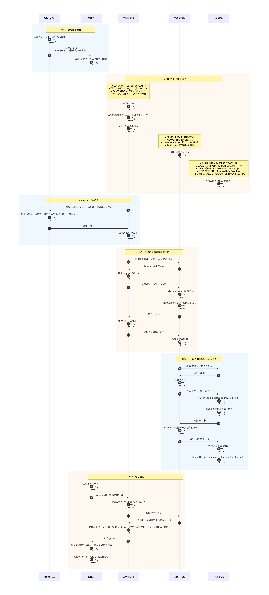
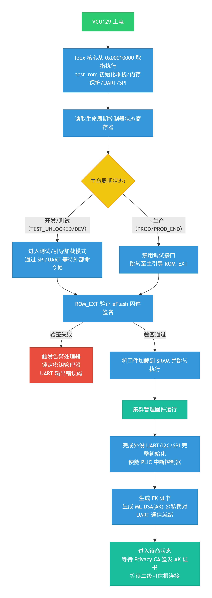
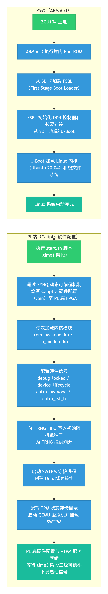
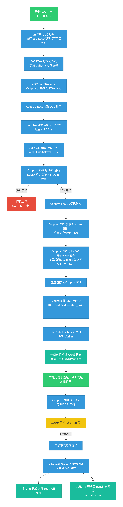

# 面向异构TEE集群的多级可信根系统总体设计报告

## 一、设计背景与核心挑战

### 1.1 网络安全形势与可信计算演进

当前网络安全风险的根源可归结为三大原始性缺失：**图灵计算原理缺少攻防安全理念**、**冯·诺依曼体系结构缺少防护部件**、**重大工程应用无安全治理服务**。主动免疫可信计算作为一种运算与安全防护并行的新计算模式，以密码为基因实施身份识别、状态度量、保密存储等功能，对操作访问策略的四要素（主体、客体、操作、环境）进行动态可信度量、识别和控制。

从国际发展看，TCG组织制定的TPM标准已演进至2.0版本，密码算法更灵活，实现形态不再局限于安全芯片。从国内发展看，沈昌祥院士提出的可信计算3.0思想要求所有计算节点从开机到应用启动全程可信验证。然而，现有开源可信根（OpenTitan占用约25万LUT、Caliptra占用约21万LUT）资源占用过重，且闭源可信根大多不支持集群规模的多级安全启动和TPM标准，异构处理器TEE（如Intel SGX、Arm TrustZone、AMD SEV、RISC-V Keystone）对可信根的需求缺乏统一标准。

### 1.2 本项目聚焦的核心技术瓶颈

1. **轻量化难题**：如何裁剪非必要硬件模块，使可信根可低成本嵌入处理器芯片内部
2. **异构兼容性**：如何为ARM、RISC-V、GPU、DPU等不同架构处理器提供统一的可信根接口
3. **多级度量链**：如何构建从单处理器→计算平台→集群管理平台的完整信任传递链条
4. **多租户支持**：如何在物理可信根数量不足时，为大量虚拟机提供独立的可信服务
5. **远程证明**：如何实现异构集群各节点间的可信认证、远程证明
---

## 二、系统总体架构

### 2.1 多级可信根体系架构

本项目构建多级可信根体系，逐级递进、分工协作，形成从芯片底层到集群顶层的完整信任链：

| 层级 | 物理载体 | 部署位置 | 核心职能 |
|------|----------|----------|----------|
| **一级可信根** | Caliptra IP核 | 异构处理器芯片内部 | 固件可信度量、静态身份验证、DICE证书链生成、设备密钥生成与TBS证书签发请求、应用固件安全跳转 |
| **二级可信根** | Zynq MPSoC PS+PL | 异构计算平台主板 | 平台安全启动、被三级度量授权启动、vTPM服务、校验一级PCR并授权一级启动、签发一级设备证书、验证一级度量值、硬件熵源分发 |
| **三级可信根** | OpenTitan SoC | 集群管理平台 | 集群安全启动、度量授权二级启动、签发二级设备证书、后量子签名、远程证明汇总 |

### 2.2 一级可信根硬件

一级可信根采用 **"主处理器核心 + 安全协处理器"** 的架构，安全协处理器（Caliptra）作为APB/AHB从设备挂载在系统总线上，与主CPU通过Mailbox机制进行数据交互。其统一硬件架构如下图所示：

```
┌──────────────────────────────────────────────────────────────────────────────────┐
│                        一级可信根统一硬件架构                                      │
├──────────────────────────────────────────────────────────────────────────────────┤
│                                                                                  │
│  ┌──────────────────────────────────────────────────────────────────────────┐    │
│  │                        主处理器域（Host CPU Domain）                      │    │
│  │  ┌─────────────────┐          ┌─────────────────────────────────────┐    │    │
│  │  │  ARM Cortex-M3  │  或      │  RISC-V Rocket Core (RV64GC)        │    │    │
│  │  │  (ARMv7-M)      │          │  (5级流水线, MMU, 3种特权级)         │    │    │
│  │  └────────┬────────┘          └────────────────┬────────────────────┘    │    │
│  │           │ I-Code / D-Code / System AHB       │ TileLink (Front/System) │    │
│  └───────────┼───────────────────────────────────┼──────────────────────────┘    │
│              │                                   │                               │
│              ▼                                   ▼                               │
│  ┌──────────────────────────────────────────────────────────────────────────┐    │ 
│  │                        总线互联层（Bus Interconnect）                     │    │
│  │  ┌─────────────────────────┐    ┌───────────────────────────────────┐    │    │
│  │  │  AHB 总线矩阵           │ 或  │  TileLink 总线（Diplomacy框架）    │    │
│  │  │  (多主多从交叉开关)      │    │  (sbus/mbus/cbus/pbus层次互联)     │    │
│  │  └────────────┬────────────┘    └───────────────┬───────────────────┘    │    │
│  │               │                                 │                        │    │
│  │               └─────────────┬───────────────────┘                        │    │
│  │                             │                                            │    │
│  │              ┌──────────────▼──────────────┐                             │    │
│  │              │   APB3_Caliptra 桥接模块     │                             │    │
│  │              │  (协议转换 + 时钟域同步)      │                             │    │
│  │              └──────────────┬──────────────┘                             │    │
│  └─────────────────────────────┼────────────────────────────────────────────┘    │
│                                │                                                 │
│                                ▼                                                 │
│  ┌──────────────────────────────────────────────────────────────────────────┐    │
│  │                     安全协处理器域（Caliptra Top）                         │    │
│  │                                                                          │    │
│  │  ┌────────────────────────────────────────────────────────────────────┐  │    │
│  │  │                    VeeR EL2 RISC-V 核心 (RV32IMAC)                 │  │     │
│  │  │                    独立运行安全固件，与主CPU物理隔离                 │   │    │
│  │  └──────────────┬─────────────┬──────────────────┬────────────────────┘  │    │
│  │                 │             │                  │                       │    │
│  │                 ▼             ▼                  ▼                       │    │
│  │  ┌─────────────────┐ ┌─────────────────┐ ┌─────────────────────────┐     │    │
│  │  │  指令存储器IMEM  │ │  数据存储器DMEM  │ │   Mailbox通信单元        │     │    │
│  │  │  (AHB-Lite接口) │  │  (AHB-Lite接口) │ │  (命令/响应队列)         │     │    │
│  │  └─────────────────┘ └─────────────────┘ └─────────────────────────┘     │    │
│  │                                                                          │    │
│  │  ┌───────────┐ ┌───────────┐ ┌───────────┐ ┌─────────────────────┐       │    │
│  │  │SHA512/256 │ │ ECC/HMAC  │ │ AES引擎   │ │  密钥管理单元        │       │    │
│  │  │  控制器   │ │  控制器    │ │(ECB/CBC)  │ │  (Key Vault/DOE)    │       │    │
│  │  └───────────┘ └───────────┘ └───────────┘ └─────────────────────┘       │    │
│  │                                                                          │    │
│  │  ┌───────────┐ ┌───────────┐ ┌───────────┐ ┌─────────────────────┐       │    │
│  │  │ PCR Vault │ │ Data Vault│ │ TRNG/CS   │ │   安全状态管理       │       │    │
│  │  │(平台配置  │  │(敏感数据  │ │  RNG      │ │  (生命周期/调试锁定)  │       │    │
│  │  │  寄存器)  │  │  存储)    │ │(熵源)     │ │                     │       │    │
│  │  └───────────┘ └───────────┘ └───────────┘ └─────────────────────┘       │    │
│  │                                                                          │    │
│  │  外设接口：JTAG调试 | QSPI闪存 | UART串口 | APB从机接口                     │    │
│  └───────────────────────────────────────────────────────────────────────────┘   │
│                                                                                  │
└──────────────────────────────────────────────────────────────────────────────────┘
```

**ARM架构与RISC-V架构的硬件实现差异：**

| 对比维度 | ARM架构实现 | RISC-V架构实现 |
|----------|-------------|----------------|
| **主处理器** | ARM Cortex-M3，AHB-Lite总线接口（I-Code/D-Code/System三通道） | Rocket Core，TileLink总线接口（支持MMU和虚拟内存） |
| **存储子系统** | ITCM 128KB + DTCM 128KB + FW_store 256KB | BootROM 16KB + DRAM 2GB + ScratchPad 256KB |
| **调试接口** | SWD / JTAG（通过mcu_top层EMIO复用） | JTAG（通过Debug模块，支持RISC-V调试规范） |
| **Caliptra集成** | 挂载在APB3总线（地址0x30000000~0x3003FFFF） | 通过pbus桥接（地址由Chipyard配置生成） |
| **SoC生成方式** | 静态Verilog RTL（Vivado工程） | Chisel配置生成（Chipyard框架 + TopGen转换） |
| **中断路由** | NVIC统一管理（240个中断源） | CLINT + PLIC分级管理 |

**安全启动的硬件保障机制：**
- **ROM固化**：Caliptra的ROM在FPGA bitstream/mcs中固化，物理不可篡改
- **复位同步**：通过`cptra_pwrgood`信号确保电源稳定后释放复位，`cptra_rst_b`控制安全域复位
- **安全状态锁存**：`security_state`输入定义系统的安全特性，调试模式下自动覆盖敏感密钥
- **独立时钟域**：Caliptra拥有独立的100MHz时钟，与主CPU时钟异步，增强抗干扰能力(RISC_V架构SOC中)

### 2.3 二级可信根硬件

二级可信根采用 **PS（Processing System）+ PL（Programmable Logic）** 协同架构：

| 组件 | 规格 | 在系统中的角色 |
|------|------|------------------|
| **PS端（ARM A53）** | 四核Cortex-A53 @ 1.5GHz，运行Ubuntu 20.04，DDR4控制器 | 运行虚拟机、vTPM服务进程，作为PL端与上层软件的桥梁 |
| **PL端（FPGA）** | Xilinx UltraScale+，集成Caliptra协处理器 | 硬件级安全操作（TRNG、加密加速、密钥存储） |
| **AXI互联矩阵** | 连接从设备（Caliptra AXI/APB桥接器/BRAM控制器），100MHz | 提供PS与PL间1600MB/s理论带宽的数据通路 |
| **Caliptra子系统** | VEER EL2 RISC-V核心 + 多层次安全存储 + 硬件加密引擎 | 执行安全敏感操作，与PS端的Linux环境形成隔离 |

**时钟与复位设计**：PS通过CRL_APB模块产生100MHz PL参考时钟，输出`pl_resetn0`信号同步复位PL侧逻辑，确保安全域初始化时序精确可控。

### 2.4 三级可信根硬件

三级可信根基于 **OpenTitan Top_Earlgrey SoC**，其硬件安全特性尤为突出：

| 硬件特性 | 安全作用 |
|----------|----------|
| **PUF（物理不可克隆函数）** | 芯片自主生成UDS种子，私钥不存储、根密钥内生，CRP（激励-响应对）作为设备唯一身份指纹 |
| **OTP（一次性可编程存储器）** | 存储UDS种子、生命周期状态（测试/开发/生产/RMA），访问控制+内存加扰防止读取 |
| **生命周期控制器** | 芯片从制造到报废全生命周期管理，生产状态下调试接口永久锁定 |
| **OTBN大数加速器** | 可编程协处理器，专用指令集支持RSA 4096位、ECC P-256/P-384、X25519/Ed25519 |
| **密钥管理器** | 实现DICE标准，支持UDS派生IDevID/LDevID及别名密钥，密钥材料内部隔离 |
| **告警处理器** | 安全敏感中断两级响应：软件处理 + 超时后硬件自复位/锁定 |

**辅助引导硬件SAM3X**：作为VCU129的扩展板卡MCU，承担三重角色：①通过SPI将OpenTitan软件加载到eFlash；②通过GPIO控制OpenTitan启动/复位；③将OpenTitan的UART0/UART2转接至可信第三方和二级可信根，实现物理隔离的数据通路。

---

## 三、软件设计

### 3.1 一级可信根软件：DICE身份认证与安全启动

**DICE证书链派生流程（完全在Caliptra安全边界内执行）：**

```
ROM中的UDS种子（密文存储，冷启动解密）
          │
          ▼
┌─────────────────────────┐
│  ROM制造阶段：生成IDevID │  ← 仅ROM使用，永不外部暴露
└─────────┬───────────────┘
          │ 现场可编程熵
          ▼
┌─────────────────────────┐
│  LDevID密钥 + 证书       │  ← 由IDevID签名，包含设备唯一标识
└─────────┬───────────────┘
          │ CDI_FMC = HMAC(LDevID_CDI, FMC_Hash || 安全状态)
          ▼
┌─────────────────────────┐
│  Alias_FMC密钥对 + 证书  │  ← 由FMC固件使用，证书由LDevID签名
└─────────┬───────────────┘
          │ CDI_RT = HMAC(CDI_FMC, Runtime_Hash)
          ▼
┌─────────────────────────┐
│  Alias_RT密钥对 + 证书   │  ← 由运行时固件使用，证书由Alias_FMC签名
└─────────────────────────┘
```

**安全启动固件链**：一级可信根内部存在两条并行的固件启动链——**SoC主CPU固件链**（BootROM→SOCFirmware应用固件）与**Caliptra协处理器固件链**（ROM→FMC→Runtime）。每个阶段获取下一阶段固件时，先通过Caliptra进行身份验证（ECDSA验签）和度量（SHA256），将度量值存入PCR后，再跳转执行。任一阶段验证失败，则拒绝启动并输出错误日志。

**ARM与RISC-V统一接口**：无论何种主CPU，均通过Mailbox与Caliptra双向通信，Caliptra完成验证后通过Mailbox返回度量结果和固件，主CPU据此决定是否继续启动。

### 3.2 二级可信根软件：vTPM与硬件卸载

**vTPM与物理Caliptra的协同机制：**

| 软件层次 | 组件 | 功能 |
|----------|------|------|
| **用户态** | 虚拟机内部TPM命令（`tpm2_getrandom`等） | 发起TPM 2.0标准指令 |
| **宿主机用户态** | SWTPM守护进程 + Unix域套接字 | 解析TPM命令，将敏感操作路由至驱动层 |
| **内核态** | `caliptra_dev`设备驱动 + ioctl接口 | 通过Mailbox与Caliptra通信，LOCK/PAUSER机制防并发竞争 |
| **PL硬件层** | Caliptra ROM + Runtime固件 | 执行TRNG读取、密钥派生等硬件级操作 |

**硬件卸载的关键路径**：原本由纯软件SWTPM执行的随机数生成，现改为通过ioctl→Mailbox调用Caliptra硬件TRNG，确保随机数具有物理熵源，破解难度大幅提升。

**启动自动化脚本（start.sh）**：整合了PL端FPGA硬件配置（bitstream烧写）、内核模块加载、硬件信号配置、TRNG熵源初始化、SWTPM环境搭建、QEMU虚拟机启动，实现二级可信根PS端Linux环境与PL端Caliptra硬件的就绪。

> **注意**：start.sh在time1阶段仅完成PL端Caliptra的**硬件结构配置**（bitstream烧写、信号初始化），Caliptra ROM固件的正式加载与启动需等待time3阶段三级可信根度量caliptraROM.bin并通过后下发启动信号方可执行（详见4.2.2节）。因此，start.sh并非实现从硬件上电到vTPM服务可用的全自动一站式部署，而是分为"硬件配置（time1）"与"固件加载执行（time3授权后）"两个阶段。

### 3.3 三级可信根软件：

**串口大数据可靠传输协议（克服OpenTitan FIFO 32字节限制）：**

```
发送端（设备侧）                    接收端（主机侧）
     │                                    │
     ▼                                    │
┌────────────┐                            │
│ 数据分块   │   ── 32字节块 + 帧头 ──▶   │
│ (≤32B/块)  │                            ▼
└────────────┘                    ┌─────────────────┐
     │  ◀── ACK（单字符确认）───   │ 超时检测 + 重传 │
     │                            └─────────────────┘
     │                                    │
     ▼                                    ▼
┌────────────┐                    ┌─────────────────┐
│ 延时10ms   │                    │ 拼接完整数据包  │
└────────────┘                    └─────────────────┘
```

实际测试中，在115200波特率下连续传输1000次15KB数据，丢包率为0。

**远程证明协议协议：**
TODO
见(三级远程证明源代码解析)[]

**ML-DSA后量子签名集成**：三级可信根在远程证明的Quote包中，使用ML-DSA-87（NIST Level 5）对Nonce和PCR拼接后的摘要进行签名。AK证书的X.509自定义扩展字段（OID: 1.3.6.1.4.1.311.21.99）中嵌入2592字节的ML-DSA公钥，实现设备身份与抗量子密钥的绑定。(TODO)

---

## 四、系统启动过程与信任链建立

系统启动过程严格区分 **"物理上电时序"** 与 **"信任度量传递方向"**。物理上电遵循从集群管理到末端设备的下行顺序（三级→二级→一级），各级完成自身初始化后进入待命状态；信任度量与启动授权同样采用**自上而下**的控制流——三级可信根度量并授权二级启动，二级可信根度量并授权一级启动；而远程证明阶段的度量值聚合则沿**自下而上**的方向（一级→二级→三级）逐级上行，最终由三级可信根生成完整的可信报告。

整个流程划分为五个时序阶段（time1~time5），涵盖初始化与准备、AK证书签发、二级/一级可信根启动授权与证书签发、远程证明，完整流程如下图所示：

<div align="center">

</div>

### 4.1 系统上电与初始化时序总览（time1）

多级可信根的物理部署环境决定了其上电顺序：集群管理平台（三级可信根）先行启动，随后计算节点（二级）上电，最后异构处理器（一级）上电。三级各自完成上电与硬件初始化后，均进入"等待度量信号"的待命状态，由上级可信根统一调度后续的度量与授权流程。与此同时，可信第三方（Privacy CA与验证方）完成CA证书的部署与远程证明测试准备。

| 时序阶段 | 参与方 | 动作 | 预期状态 |
|----------|--------|------|----------|
| **time1-a** | Privacy CA / 验证方 | CA检查本地CA证书，若缺失则创建根CA证书；CA向验证方部署CA证书；验证方接收并等待远程证明测试 | CA与验证方就绪 |
| **time1-b** | 三级可信根 | VCU129上电，OpenTitan ROM执行；读取生命周期状态，初始化UART/SPI外设；SAM3X加载OpenTitan eFlash固件；验证ROM_EXT签名，运行管理固件；生成EK证书；生成ML-DSA(AK)公私钥对（私钥存储不对外暴露）；UART通信通道就绪 | 三级可信根就绪，等待签发AK证书 |
| **time1-c** | 二级可信根 | ZCU104上电，PS端ARM启动；ARM动态配置PL端Caliptra硬件；启动SWTPM/vTPM服务，创建虚拟机；UART通信通道就绪 | 二级可信根就绪，等待三级度量信号 |
| **time1-d** | 一级可信根 | 异构处理器（ARM或RISC-V SoC）上电；SoC ROM初始化外设，配置Caliptra信号并启动；Caliptra获取caliptraFMC和SoC Runtime固件；生成DICE证书链（IDevID→LDevID→Alias）；生成Caliptra和SoC固件PCR值发送至SoC  | 一级可信根就绪，等待二级度量信号 |

**关键说明**：
- 三级可信根在time1阶段即完成自身的完整安全启动（ROM→ROM_EXT→管理固件），并自主生成EK证书与ML-DSA(AK)密钥对，为后续向Privacy CA申请AK证书做准备。
- 二级可信根在time1阶段通过start.sh完成PS端Linux启动与PL端Caliptra硬件配置（烧写FPGA bitstream、加载内核模块、配置硬件信号、初始化熵源），并启动SWTPM/vTPM服务与QEMU虚拟机。但PL端Caliptra的ROM固件加载需等待time3阶段三级可信根度量caliptraROM.bin后下发启动信号。
- 一级可信根在time1阶段完成SoC ROM初始化与Caliptra固件获取，生成DICE证书链与PCR度量值，但主CPU应用固件尚未获得启动授权，需等待二级可信根校验PCR后下发启动信号。

### 4.2 各级可信根详细启动流程

#### 4.2.1 三级可信根启动流程（OpenTitan）

三级可信根的启动由固化在芯片内部的`test_rom`引导，其流程由生命周期状态（Lifecycle State）动态分流：
<div align="center">

</div>

1. **硬件复位与ROM执行**：VCU129上电后，OpenTitan的Ibex核心从`0x00010000`（ROM基地址）取指执行。`test_rom`首先初始化堆栈指针、内存保护区域和基础外设（UART、SPI）。

2. **生命周期状态读取**：`test_rom`读取生命周期控制器的状态寄存器，判断芯片处于何种阶段：
   - **开发/测试状态**（`TEST_UNLOCKED`、`DEV`）：进入测试/引导加载模式，通过SPI或UART等待外部主机发送的命令帧（如加载测试固件、擦除Flash）。
   - **生产状态**（`PROD`、`PROD_END`）：`test_rom`仅执行极少量硬件清理（如禁用调试接口），随后直接跳转至**主引导ROM**（ROM_EXT），由后者继续安全启动。

3. **ROM_EXT引导**：主引导ROM验证eFlash中存储的固件镜像的数字签名（ECDSA）。验证通过后，将固件加载到SRAM并跳转执行；验证失败则触发告警处理器，锁定芯片并输出错误码。

4. **管理固件运行**：验证通过的固件（即集群管理平台的系统软件）获得执行权，完成外设（UART、I2C、SPI）的完整初始化，并使能中断控制器（PLIC）。随后生成EK证书与ML-DSA(AK)公私钥对，UART通信通道就绪后进入待命状态，随时准备响应Privacy CA的AK证书签发流程以及二级可信根的连接请求。

#### 4.2.2 二级可信根启动流程（Zynq MPSoC + Caliptra）

二级可信根的启动分为PS端（ARM A53）的Linux引导和PL端（FPGA）的Caliptra安全初始化两个并行路径，两者通过`start.sh`脚本实现时序协调：
<div align="center">

</div>

**PS端Linux启动路径**：
1. ZCU104上电后，ARM A53执行片内BootROM，从SD卡加载FSBL（First Stage Boot Loader）。
2. FSBL初始化DDR控制器和必要外设，从SD卡加载U-Boot。
3. U-Boot加载Linux内核（Ubuntu 20.04）和根文件系统，完成系统启动。

**PL端Caliptra初始化路径**（通过`start.sh`脚本自动化，在time1阶段执行）：
1. **烧写PL端可编程逻辑**：通过ZYNQ动态可编程机制将Caliptra硬件（`.bin`文件）烧写至PL端的FPGA中，完成硬件信任根的硬件配置。
2. **加载内核模块**：依次加载`rom_backdoor.ko`和`io_module.ko`驱动，建立PS与PL间的通信通道。
3. **配置硬件信号**：按照特定时序依次设置`debug_locked`（调试锁定）、`device_lifecycle`（生命周期）、`cptra_pwrgood`（电源就绪）、`cptra_rst_b`（复位释放）信号，确保Caliptra从已知安全状态启动。
4. **熵源初始化**：向ITRNG FIFO中写入初始随机数种子数据，为真随机数生成器提供足够熵值。
5. **启动vTPM服务与虚拟机**：启动SWTPM守护进程，创建Unix域套接字，配置TPM状态存储目录；启动QEMU虚拟机，通过`-tpmdev`参数挂载SWTPM作为虚拟TPM设备。

> **注意**：上述步骤在time1阶段完成**硬件配置与服务部署**，但PL端Caliptra ROM固件的正式加载与启动需等待time3阶段三级可信根度量caliptraROM.bin并通过后下发启动信号方可执行。因此，二级可信根的启动被划分为两个阶段：time1的硬件配置阶段与time3的固件加载执行阶段。

#### 4.2.3 一级可信根启动流程（异构处理器）

<div align="center">

</div>

一级可信根的启动由Caliptra安全协处理器和SOC共同主导，主CPU的Firmware用户固件在验证通过前不可执行：

1. **上电与主CPU保持复位**：异构SoC上电后，主CPU（ARM或RISC-V核心）率先获得时钟并开始执行ROM代码(不可篡改)配置caliptra启动信号，之后caliptra开始执行rom代码。

2. **Caliptra ROM自检**：Caliptra ROM读取ROM中的UDS种子，初始化密钥管理器和PCR库。

3. **caliptra获取FMC和Runtime固件**：
   - 获取Caliptra的FMC：caliptra的ROM负责将FMC固件从外部存储（SD卡/Flash）加载到Caliptra的ITCM缓冲区。Caliptra ROM对FMC固件进行ECDSA签名验证和SHA256度量，通过后执行。
   - 获取caliptra的Runtime：Caliptra的FMC测量该固件（计算SHA256），将Runtime存储至ITCM，等待跳转执行命令。

4. **caliptraFMC获取SOC Fimware固件**：FMC固件获得执行权后，重复上述流程，获取、验证、度量下一阶段固件（Fimware）并通过mailbox发送给SOC存储至FW_store，并将度量值存入Caliptra PCR。SOC主CPU等待跳转执行命令。

5. **DICE证书链生成**：在整个引导过程中，Caliptra的ROM/固件按照DICE标准逐级派生密钥并生成证书链（IDevID→LDevID→Alias_FMC→Alias_RT）。同时生成Caliptra和SoC固件的PCR度量值。

6. **等待二级度量信号**：一级可信根完成上述初始化后进入待命状态，等待二级可信根通过UART发送度量信号（请求PCR值）。二级校验PCR通过并下发启动信号后，Caliptra 通过mailbox发送度量成功信号至SOC ROM，主CPU方可跳转执行已验证的SoC应用固件；同时Caliptra协处理器从FMC阶段切换至Runtime阶段（caliptraFMC→caliptraRT）。此时，SoC主CPU固件链（BootROM→Fimware应用固件）与Caliptra协处理器固件链（ROM→FMC→Runtime）同步进入运行态。

### 4.3 信任度量与启动授权时序（time2~time4）

物理初始化（time1）完成后，系统进入信任度量与启动授权阶段。此阶段采用**自上而下**的控制流：三级可信根首先向Privacy CA申请AK证书（time2），随后度量并授权二级可信根启动、签发二级设备证书（time3），二级可信根再度量并授权一级可信根启动、签发一级设备证书（time4）。每一级在被授权启动后，向上级申请设备证书签发，形成层级化的PKI证书体系。

#### 4.3.1 AK证书签发（time2）

三级可信根完成自身安全启动并生成EK证书与ML-DSA(AK)密钥对后，向Privacy CA申请AK证书。Privacy CA验证EK证书合法性后，签发包含ML-DSA公钥的AK证书返回三级可信根。

| 步骤 | 发起者 | 动作 | 目标 | 安全关键点 |
|------|--------|------|------|------------|
| 1 | 三级可信根 | 通过UART向Privacy CA发送EK证书和ML-DSA(AK)公钥（作为签发证书信号） | Privacy CA | EK证书证明设备硬件身份 |
| 2 | Privacy CA | 验证EK证书，校验通过后签发AK证书（ML-DSA公钥放置于X.509扩展字段） | — | 公钥嵌入扩展字段实现抗量子绑定 |
| 3 | Privacy CA | 将AK证书发送至三级可信根 | 三级可信根 | 证书传输完整性保护 |
| 4 | 三级可信根 | 接收并安全存储AK证书 | — | AK私钥永不离开Caliptra/OpenTitan安全边界 |

#### 4.3.2 二级可信根启动授权与证书签发（time3）

三级可信根获取AK证书后，开始对二级可信根进行度量与启动授权。三级可信根通过UART请求二级可信根的caliptraROM.bin固件镜像，度量通过后下发启动信号，授权二级可信根加载Caliptra ROM至PL端运行。二级可信根启动后生成设备公私钥及TBS（To-Be-Signed）证书，由三级可信根签发二级可信根设备证书。

| 步骤 | 发起者 | 动作 | 目标 | 安全关键点 |
|------|--------|------|------|------------|
| 1 | 三级可信根 | 通过UART向二级可信根发送度量信号（请求caliptraROM.bin） | 二级可信根 | 度量请求触发二级启动授权流程 |
| 2 | 二级可信根 | 将caliptraROM.bin固件镜像发送至三级可信根 | 三级可信根 | 固件镜像传输完整性校验 |
| 3 | 三级可信根 | 对caliptraROM.bin进行度量（SHA256） | — | 度量值记录用于后续验证 |
| 4 | 三级可信根 | 度量通过后，向二级可信根下发启动信号 | 二级可信根 | 度量不通过则拒绝启动 |
| 5 | 二级可信根 | 将caliptraROM加载至PL端启动 | — | PL端Caliptra ROM正式开始执行 |
| 6 | 二级可信根 | 生成设备公私钥及TBS待签名证书 | — | 设备身份密钥在Caliptra安全边界内生成 |
| 7 | 二级可信根 | 将TBS证书发送至三级可信根 | 三级可信根 | 证书签发申请 |
| 8 | 三级可信根 | 签发二级可信根设备证书 | — | 三级可信根作为二级的证书签发CA |
| 9 | 三级可信根 | 将二级可信根设备证书发送至二级可信根 | 二级可信根 | — |
| 10 | 二级可信根 | 保存证书至PL端 | — | 证书持久化存储于Caliptra安全存储 |

#### 4.3.3 一级可信根启动授权与证书签发（time4）

二级可信根完成自身启动后，开始对一级可信根进行度量与启动授权。二级可信根通过UART请求一级可信根的PCR度量值，校验通过后下发启动信号，授权一级可信根跳转执行应用固件。一级可信根启动后生成设备公私钥及TBS证书，由二级可信根的Caliptra ROM签发一级可信根设备证书。

| 步骤 | 发起者 | 动作 | 目标 | 安全关键点 |
|------|--------|------|------|------------|
| 1 | 二级可信根 | 通过UART向一级可信根发送度量信号（请求PCR值） | 一级可信根 | 度量请求触发一级启动授权流程 |
| 2 | 一级可信根 | 将PCR值（含Caliptra与SoC固件度量值）发送至二级可信根 | 二级可信根 | PCR值含DICE证书链度量 |
| 3 | 二级可信根 | 校验PCR值 | — | 校验不通过则拒绝启动 |
| 4 | 二级可信根 | 校验通过后，向一级可信根下发启动信号 | 一级可信根 | — |
| 5 | 一级可信根 | SoC ROM发送度量成功信号至Caliptra FMC | — | SoC与Caliptra协同确认启动授权 |
| 6 | 一级可信根 | 生成设备公私钥及TBS证书 | — | 设备身份密钥在Caliptra安全边界内生成 |
| 7 | 一级可信根 | 将TBS证书发送至二级可信根 | 二级可信根 | 证书签发申请 |
| 8 | 二级可信根 | Caliptra FMC端签发一级可信根设备证书 | — | 二级可信根作为一级的证书签发CA |
| 9 | 二级可信根 | 将一级可信根设备证书发送至一级可信根 | 一级可信根 | — |
| 10 | 一级可信根 | 保存证书至Caliptra 端 | — | 证书持久化存储于Caliptra安全存储 |
| 11 | 一级可信根 | 主CPU跳转SoC应用固件；Caliptra切换至Runtime（caliptraFMC→caliptraRT） | — | 完整信任链建立，SoC主CPU固件链与Caliptra固件链同步进入运行态 |

**层级化证书体系**：经过time2~time4三个阶段，系统形成"Privacy CA → 三级可信根(AK证书) → 二级可信根(设备证书) → 一级可信根(设备证书)"的完整证书链。每一级可信根既是上级的证书持有者，又是下级的证书签发CA，实现信任的逐级委托与传递。

### 4.4 远程证明时序（time5）

启动授权与证书签发完成后，系统进入远程证明阶段。验证方发起挑战，三级可信根作为集群可信代理，协调二级和一级可信根完成度量值聚合与可信判定，最终生成经ML-DSA签名的Quote包返回验证方。

| 步骤 | 发起者 | 动作 | 目标 | 安全关键点 |
|------|--------|------|------|------------|
| 1 | 验证方 | 生成随机数Nonce | — | Nonce防重放攻击 |
| 2 | 验证方 | 向三级可信根发送Nonce，请求远程证明 | 三级可信根 | 挑战-响应协议 |
| 3 | 三级可信根 | 验证二级可信根的度量值与证书签名 | — | 校验二级可信根身份与运行状态 |
| 4 | 三级可信根 | 将控制权交给二级可信根，二级验证一级可信根，将一级验证状态返回三级 | 二级可信根 | 层级化验证：二级校验一级PCR与证书 |
| 5 | 三级可信根 | 组成Quote包（AK证书 + PCR值 + Nonce + 证书链验证状态），用ML-DSA(AK)私钥签名 | — | 后量子签名抗量子攻击 |
| 6 | 三级可信根 | 将Quote包发送至验证方 | 验证方 | — |
| 7 | 验证方 | 用CA证书验证AK证书，用AK公钥验证签名，检查Nonce和PCR值 | — | 完整性校验 + 防重放 + 度量值判定 |
| 8 | 验证方 | 判定设备可信 | — | 可信则放行，不可信则告警 |

**层级化验证机制**：远程证明采用与信任链建立一致的层级化验证模式——三级可信根验证二级可信根的度量值与证书签名，二级可信根验证一级可信根的度量值与证书签名，验证结果逐级返回三级可信根聚合。三级可信根最终将完整的度量链信息（一级、二级证书链验证状态+三级PCR）打包进Quote包，实现"从芯片到集群"的全链路可信证明。

### 4.5 启动失败处理策略

三级可信根体系在启动与信任链建立过程中设计了多层次的故障检测与熔断机制：

| 失败场景 | 检测点 | 系统行为 |
|----------|--------|----------|
| 三级可信根ROM_EXT验证失败 | OpenTitan主引导ROM | 触发告警处理器（Alert Handler），硬件自动锁定密钥管理器，UART输出错误码，芯片进入安全失效状态 |
| 三级可信根eFlash固件签名无效 | ROM_EXT执行阶段 | 拒绝跳转，重复尝试3次后触发硬件复位，若仍失败则永久锁定 |
| 三级可信根EK/AK证书签发失败 | time2阶段Privacy CA校验 | CA拒绝签发AK证书，三级可信根无法获得远程证明资质，后续度量授权流程中止 |
| 二级可信根caliptraROM.bin度量不通过 | time3阶段三级可信根度量 | 三级可信根拒绝下发启动信号，二级可信根PL端Caliptra ROM不加载，vTPM服务不可用 |
| 二级可信根TBS证书签发失败 | time3阶段三级可信根签发 | 三级可信根拒绝签发二级设备证书，二级可信根无有效身份凭证，一级可信根度量授权流程中止 |
| 二级可信根PL端Caliptra ROM启动失败 | `start.sh`脚本执行 | 脚本返回非0退出码，PS端系统日志记录失败原因，vTPM服务不启动，QEMU虚拟机不创建 |
| 二级可信根TRNG自检不通过 | SWTPM初始化阶段 | SWTPM拒绝启动，vTPM服务不可用，PS端可通过ioctl查询Caliptra错误状态 |
| 一级可信根PCR校验不通过 | time4阶段二级可信根校验 | 二级可信根拒绝下发启动信号，Caliptra不释放主CPU复位，主CPU无法启动，UART输出"Measurement failed"错误信息 |
| 一级可信根TBS证书签发失败 | time4阶段二级可信根签发 | 二级可信根Caliptra ROM拒绝签发一级设备证书，一级可信根无有效身份凭证，标记为"不可信"设备 |
| 一级可信根证书链不完整 | 二级可信根读取证书 | 二级可信根标记该设备为"不可信"，不将其验证状态纳入平台聚合，并向三级上报异常事件 |

---

## 五、信任链传递机制与远程证明协议

本章聚焦于跨阶段的信任传递关系与远程证明协议机制。各时序阶段的完整步骤详述见第 4.1~4.4 节，本章重点提炼跨阶段关系、协议结构与通信机制，避免与第四章的过程详述重复。

### 5.1 信任链建立阶段总览

完整信任链建立流程涵盖 time1~time5 五个时序阶段，从可信第三方初始化、三级可信根上电、逐级度量授权与证书签发，到最终远程证明，实现"从硬件信任根到应用层信任传递"的全过程。下表为跨阶段索引视图，各阶段详细动作与安全关键点见第四章对应小节：

| 阶段 | 时序 | 主导方 | 阶段目标 | 关键输出 | 详见 |
|------|------|--------|----------|----------|------|
| 初始化与准备 | time1 | 三级/二级/一级/CA | 各级上电初始化并进入待命状态；CA部署根证书 | EK证书、DICE证书链、PCR度量值 | 4.1、4.2 |
| AK证书签发 | time2 | 三级 ↔ Privacy CA | 三级可信根向CA申请并获取远程证明资质 | AK证书（含ML-DSA公钥） | 4.3.1 |
| 二级启动授权 | time3 | 三级 → 二级 | 三角度量二级固件并授权启动，签发二级设备证书 | 二级设备证书 | 4.3.2 |
| 一级启动授权 | time4 | 二级 → 一级 | 二级校验一级PCR并授权启动，签发一级设备证书 | 一级设备证书 | 4.3.3 |
| 远程证明 | time5 | 验证方 ↔ 三级 | 全链路可信判定，生成经ML-DSA签名的Quote包 | Quote包（15450B） | 4.4 |

**信任链建立的三个核心维度**：
1. **硬件信任根**：三级可信根基于PUF/OTP建立芯片级硬件信任锚，一级可信根基于Caliptra ROM建立处理器级硬件信任锚，硬件信任根是整条信任链的物理根基。
2. **度量授权链**：采用自上而下的控制流（三级→二级→一级），每级可信根度量下级固件/PCR值后下发启动信号，确保下级在未经上级度量授权前不可执行。
3. **证书签发链**：形成"Privacy CA → 三级(AK证书) → 二级(设备证书) → 一级(设备证书)"的层级化PKI体系，每级可信根既是上级证书持有者又是下级证书签发CA，实现信任的逐级委托。

### 5.2 PCR扩展的数学运算

PCR扩展采用TCG规范定义的链式哈希操作：
```
PCR_new[i] = SHA512(PCR_old[i] || 待扩展度量值)
```
该操作确保了度量值的顺序敏感性和不可逆性。

### 5.3 Quote包结构（总计20890字节）

| 字段 | 长度 | 说明 |
|------|------|------|
| 帧头 `#QUOTE#` | 7B | 固定ASCII标识 |
| AK证书长度 | 4B | 大端格式HEX字符串长度 |
| AK证书 | 11488B | DER编码X.509证书（含ML-DSA公钥） |
| PCR值 | 64B | 32字节二进制转HEX |
| Nonce | 64B | 32字节挑战数转HEX |
| 证书链验证状态 | 4B | 0xaa 成功/0xba 失败 |
| ML-DSA签名 | 9254B | 4627字节签名转HEX |
| 帧尾 `#END#` | 5B | 固定ASCII标识 |

### 5.4 跨层级安全通信矩阵

| 层级间 | 物理介质 | 协议/驱动 | 传输内容 | 安全措施 |
|--------|----------|-----------|----------|----------|
| 一级↔二级 | 物理串口线缆 | UART（115200-8N1） | 度量请求信号、PCR值、DICE证书、固件度量日志、启动信号、TBS证书、设备证书 | 硬件级地址过滤，仅安全域可访问 |
| 二级↔三级 | 物理串口线缆 | UART（115200-8N1）+ 32B分块协议 | 度量请求信号、caliptraROM.bin、启动信号、TBS证书、设备证书、证书状态请求与响应 | ACK+超时重传，帧头帧尾边界识别 |
| 三级↔CA | 串口 | 自定义证书签发协议 | EK证书、AK公钥、AK证书 | 证书链验证 + ML-DSA公钥扩展字段 |
| 三级↔验证者 | 串口（经SAM3X） | 自定义Quote协议 | Quote包（15450B） | ML-DSA签名防篡改+Nonce防重放 |

---

## 六、安全特性汇总与测试结论

### 6.1 各级可信根安全特性对照

| 安全特性 | 一级可信根 | 二级可信根 | 三级可信根 |
|----------|-----------|-----------|-----------|
| 硬件信任锚（PUF/OTP） | △（可选PUF） | ✓（PL 端 Caliptra ROM） | ✓（PUF+OTP+生命周期） |
| 固件完整性度量（SHA） | ✓（SHA512） | ✓（SHA256） | ✓（SHA256/SHA3） |
| 数字签名验证 | △（可选ECC） | ✓（ECDSA） | ✓（ECDSA + ML-DSA） |
| DICE身份认证 | ✓（完整证书链） | △（注1） | ✓（密钥管理器） |
| 虚拟化/多租户支持 | — | ✓（vTPM + 硬件卸载） | — |
| 后量子抗性 | — | — | ✓（ML-DSA-87） |
| 形式化验证 | — | — | ✓（Ibex核心） |

> ✓ 表示完整支持；△ 表示安全可选项，可根据资源约束裁剪
>
> 注1：二级可信根Caliptra内部无独立的DICE证书链派生（IDevID→LDevID→Alias），但具备外部PKI设备证书签发能力——由三级可信根签发二级设备证书，二级可信根作为CA签发一级设备证书（详见4.3.2/4.3.3节）。

### 6.2 系统集成验证结论

1. **一级可信根双架构验证**：ARM和RISC-V平台均成功实现安全启动，DICE证书链完整可验，篡改固件后启动被阻断（Caliptra不释放主CPU复位，UART输出"Measurement failed"）。
2. **二级可信根硬件卸载验证**：SWTPM自检和用户态程序均可正确调用Caliptra硬件TRNG，随机数质量符合密码学要求，ioctl调用路径完整。
3. **三级可信根远程证明验证**：PKI证书体系完整运行（根CA→EK证书→AK证书），ML-DSA签名/验签流程通过，Quote包解析正确。
4. **端到端信任链验证**：从一级固件度量开始，经二级聚合，最终由三级生成包含完整度量链的Quote包，外部验证者校验通过，实现了"从芯片到集群"的全链路可信。

### 6.3 技术创新点总结

1. **首次实现三级递进式可信根架构**：针对异构集群场景，明确划分"处理器级→平台级→集群级"三级职责，解决单级可信根无法覆盖集群级联信任的问题。
2. **轻量化可信根设计方法论**：通过裁剪非必需加密模块（将签名功能上移至二级/三级），使一级可信根资源占用大幅降低，可嵌入多种异构处理器。
3. **硬件卸载的vTPM方案**：打破纯软件vTPM的安全瓶颈，将TRNG和加密算法卸载到物理可信根硬件，实现安全性与虚拟化灵活性的统一。
4. **后量子密码与PKI融合**：在X.509证书体系中嵌入ML-DSA公钥，实现设备身份认证的抗量子安全升级，为未来量子计算环境做好准备。
5. **资源受限下的可靠传输协议**：针对OpenTitan UART FIFO深度仅32字节的硬件限制，设计分块+ACK+超时重传协议，确保大数据Quote包的可靠传输。
6. **双架构统一启动框架**：制定ARM与RISC-V统一的Mailbox通信协议和固件加载流程，为异构处理器集群提供了标准化的可信启动接口。
7. **自上而下的层级化度量授权机制**：三级可信根度量授权二级、二级度量授权一级的逐级控制流，确保每级可信根在未经上级度量验证前不可执行，实现信任链的严格单向传递。
8. **层级化PKI证书签发体系**：Privacy CA→三级→二级→一级的逐级证书签发机制，每级可信根兼具证书持有者与签发CA双重角色，实现信任的逐级委托与可追溯。
