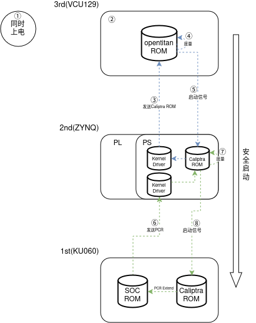
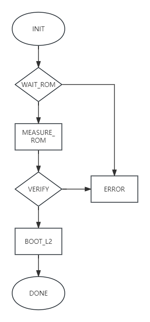
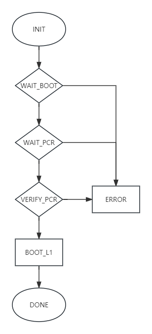
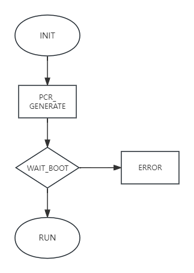
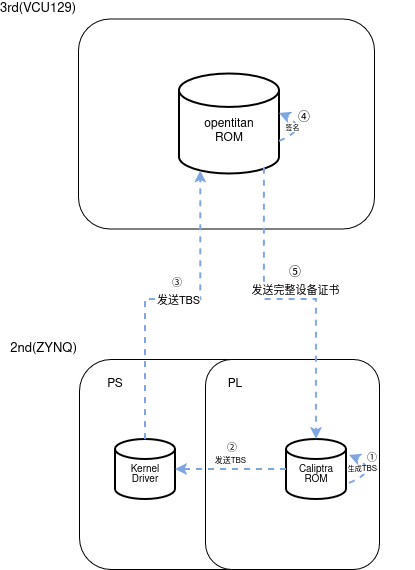
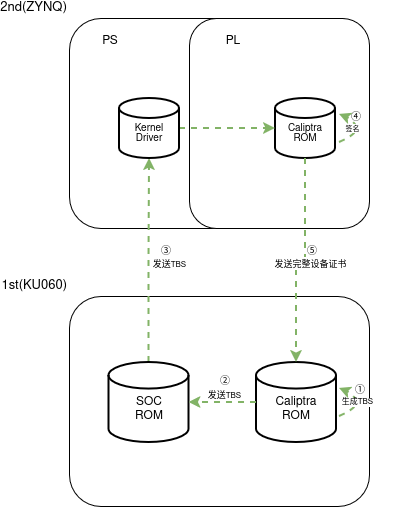
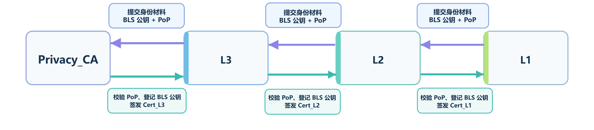
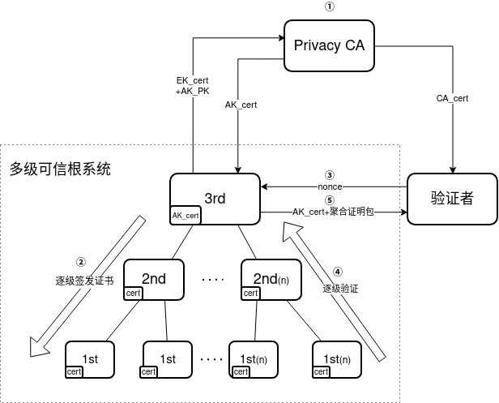
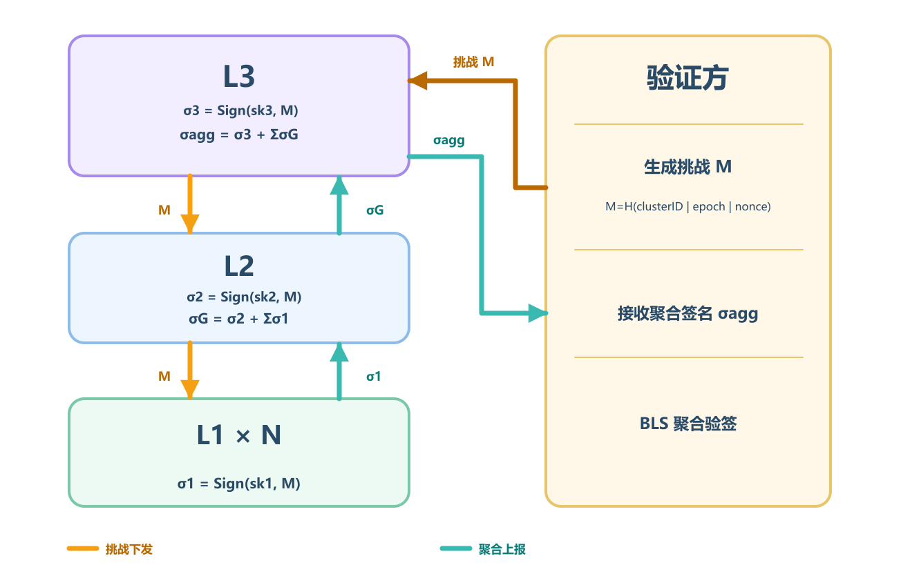

# 系统架构

本系统构建三级可信根（VCU129 + OpenTitan，顶层信任锚）→ 二级可信根（Zynq + Caliptra，中间传递层）→ 一级可信根（KU060 + Caliptra，末端业务层）的多级信任锚体系，自上而下实现信任传递、逐级度量、证书签发与聚合远程证明，为多芯片异构平台提供完整的可信计算支撑。

设计覆盖三大核心安全机制：

1、安全启动：基于逐级度量的信任链建立，确保仅合规固件可获得执行权限；

2、证书链管理：自上而下逐级签发身份证书，构建完整 PKI 身份信任链；

3、远程证明：逐级校验、聚合签名，由顶层根统一对外提供可信状态验证能力。

# 安全启动

## 核心设计原则

安全启动遵循同时上电、逐级度量、单向授权、故障隔离的核心原则：

1、三级硬件同步上电，仅顶层三级可信根具备自主启动权，下级启动必须获得上级度量授权；

2、信任自上而下单向传递，仅上级有权度量下级固件 / 状态，下级不可自度量、自认证，杜绝信任闭环；

3、下级固件异常不影响上级可信状态，实现分级故障隔离，避免单点风险击穿全链路信任。

## 完整启动流程

全流程共 8 个核心步骤，严格按信任层级依次校验授权：

1、同步上电：三级、二级、一级硬件同时上电复位，各级 ROM 完成硬件自检、安全引擎初始化与初始状态配置；

2、顶层根就绪：三级可信根（OpenTitan）完成 OTP 基准值加载、 安全引擎初始化，进入 ROM 等待状态，作为最终信任锚就绪；

3、二级 ROM 镜像上报：二级可信根将自身 Caliptra ROM 固件镜像，通过串口发送至三级可信根；

4、三级度量二级 ROM：三级可信根对接收的 Caliptra ROM 镜像执行 SHA-256 哈希计算，与 OTP 中预置的基准哈希值逐字节比对；

5、二级启动授权：度量一致则三级可信根向二级发送启动授权信号，拉起二级 Caliptra 正式运行；度量不一致则直接终止全系统启动；

6、一级 PCR 值上报：一级可信根完成本地固件自度量，生成初始 PCR 值，通过串口发送至二级可信根；

7、二级度量一级状态：二级可信根校验一级 PCR 值的合法性，与预置基准 PCR 值逐字节比对；

8、一级启动授权：校验一致则二级可信根向一级发送启动授权信号，拉起一级业务固件运行；校验不一致则禁止一级启动，保留二级及以上可信状态。

## 各状态机管控

### 三级可信根状态机

覆盖启动全生命周期，共 7 个核心状态：

1、INIT：完成时钟、OTP、加密引擎初始化，加载基准哈希值；初始化成功跳转WAIT_ROM，失败跳转ERROR；

2、WAIT_ROM：开启通信接口，启动超时计时器，等待二级上报 ROM 镜像；接收完整数据跳转MEASURE_ROM，超时跳转ERROR；

3、MEASURE_ROM：逐块计算 ROM 镜像的 SHA-256 哈希摘要；计算完成跳转VERIFY；

4、VERIFY：将计算哈希与 OTP 基准值逐字节比对；一致跳转BOOT_L2，不一致跳转ERROR；

5、BOOT_L2：拉高启动授权信号，通知二级可信根启动；信号发送完成跳转DONE；

6、ERROR：记录错误码，锁死全链路启动路径，仅硬件复位可退出；

7、DONE：进入正常运行态，承接证书签发、远程证明等后续服务。

### 二级可信根状态机

承上启下，同时对接上级授权与下级度量：

1、INIT：完成 PS 端系统与 PL 端 Caliptra 硬件初始化；成功跳转WAIT_BOOT，失败跳转ERROR；

2、WAIT_BOOT：等待三级可信根的启动授权信号；收到授权跳转WAIT_PCR，超时跳转ERROR；

3、WAIT_PCR：等待一级可信根上报 PCR 度量值；接收完整数据跳转VERIFY_PCR，超时跳转ERROR；

4、VERIFY_PCR：校验 PCR 值格式合法性，与基准值逐字节比对；一致跳转BOOT_L1，不一致跳转ERROR；

5、BOOT_L1：向一级可信根发送启动授权信号；完成后跳转DONE；

6、ERROR：按错误等级执行对应策略，致命错误锁死启动，严重错误保留运行态以支持一级固件升级；

7、DONE：进入正常运行态，承接 vTPM 服务、一级证书签发等功能。

### 一级可信根状态机

聚焦本地度量与授权等待：

1、INIT：完成 SOC 与 Caliptra 硬件初始化；成功跳转PCR_GENERATE，失败跳转ERROR；

2、PCR_GENERATE：分段度量 FMC 固件与 SOC 业务固件，按标准公式扩展 PCR 寄存器；完成后跳转WAIT_BOOT；

3、WAIT_BOOT：向二级上报 PCR 值，等待启动授权；收到授权跳转RUN，超时 / 校验失败跳转ERROR；

4、ERROR：终止业务固件运行，上报错误状态，等待固件升级与重试；

5、RUN：执行业务固件，提供本地可信服务。

## 度量规则与基准锚定

### 算法选型

**表 1 算法选型**

| **度量场景** | **算法选型** | **输出长度** | **选型依据** |
| --- | --- | --- | --- |
| 三级度量二级 ROM | SHA-256 | 256 bit | 适配 OpenTitan 硬件加速能力，满足根级静态固件度量安全基线，兼顾启动性能与 OTP 存储约束。 |
| 一级本地 PCR 扩展 | SHA-512 | 512 bit | 针对多阶段链式扩展的 PCR 场景提供更高抗碰撞冗余，适配一级 SOC 算力条件，强化末端业务度量安全强度。 |

选型说明：本系统采用分层哈希算法策略，顶层信任锚侧优先保障硬件适配性与启动效率，末端业务侧强化度量安全冗余。两级算法选型均符合 NIST 密码标准要求，信任链强度由顶层 OTP 固化基准值锚定，末端算法升级不影响根信任的安全性，同时兼顾了异构硬件平台的资源特性与业务场景的差异化安全需求。

一级可信根 PCR 寄存器遵循标准扩展公式，保障度量事件顺序与内容不可篡改：

PCR[n]new = SHA-512(PCR[n]old ∥ 新度量值)

### 度量对象

1、二级度量对象：完整caliptraROM.bin镜像，排除可变预留字段，度量范围固定；

2、一级度量对象：FMC 固件 + SOC 业务固件，按启动阶段分段度量，分别扩展至对应 PCR 索引。

### 基准值锚定

1、二级 ROM 基准哈希：预置在三级可信根 OTP 一次性可编程存储区，出厂烧录后写保护，不可修改、不可擦除；

2、一级基准 PCR 值：预置在二级可信根安全存储区，由三级可信根签发授权，不可被下级篡改。

### 判定标准

所有度量校验均执行逐字节完全比对，任意比特不一致即判定失败，无容错、无降级入口，保障信任链刚性。

## 异常处理

1、三级度量二级 ROM 不通过：始终按致命级处理，不提供软件降级入口，防止攻击者通过篡改二级根固件突破信任链；

2、二级度量一级 PCR 不通过：默认进入严重级，仅允许一级固件升级，不影响二级及以上的可信状态，实现故障隔离。

# 证书链

## 证书链整体架构

系统构建外部根 CA → 三级可信根 AK 证书 → 二级可信根设备证书 → 一级可信根设备证书的自上而下四级证书信任链，所有证书遵循 X.509 v3 标准，下级证书由上级可信根私钥签发，信任关系最终收敛至外部根 CA。

各层级证书定位：

1、根 CA 证书：可信第三方持有，全体系唯一信任锚，用于签发三级可信根 AK 证书；

2、三级 AK 证书：三级可信根运行期身份凭证，由根 CA 签发，嵌入 ML-DSA-87 后量子公钥扩展字段，用于远程证明签名身份认证；

3、二级设备证书：二级可信根身份凭证，由三级可信根签发，用于跨层级身份认证与一级证书签发；

4、一级设备证书：一级可信根身份凭证，由二级可信根签发，用于本地身份认证与聚合证明身份链校验。

### BLS聚合签名属性扩展

在现有 X.509/ECDSA 证书链基础上，系统增加 BLS 聚合签名公钥绑定属性。原有证书签发算法、颁发者关系和证书链信任关系保持不变，BLS 公钥作为 X.509 v3 非关键扩展写入三级 AK 证书、二级设备证书和一级设备证书，用于建立设备身份与 BLS 聚合签名密钥之间的可信绑定。

BLS 扩展采用私有 OID 1.3.6.1.4.1.55555.1.1，扩展内容包括协议版本、算法套件标识、16 字节密钥标识、48 字节 BLS 公钥和 96 字节所有权证明 PoP。算法套件采用 BLS12381G2_XMD:SHA-256_SSWU_RO_POP_。其中，PoP 用于证明设备确实持有对应 BLS 私钥，防止攻击者通过伪造公钥实施 rogue-key 攻击。

父级可信根在签发下级证书前，首先验证 BLS 注册信息的长度、协议版本、算法套件、公钥编码和 PoP。验证通过后，将 BLS 扩展写入下级证书 TBS，并使用原有 ECDSA 私钥对完整 TBS 签名。因此，BLS 公钥受到原有 X.509/ECDSA 证书链的身份认证和完整性保护，BLS 聚合机制不会替代原有证书信任链。

## 逐级证书签发下发流程

### 二级可信根证书签发（三级→二级）

全流程在安全通道内完成，私钥全程不脱离各自安全域：

1、TBS 生成：二级可信根 Caliptra 安全域内生成密钥对，按 X.509 标准组装证书 TBS 结构，填充设备唯一标识、公钥、密钥用途等核心字段；

2、请求转发：TBS 通过 Mailbox 发送至 Zynq PS 端内核驱动，再由驱动通过串口转发至三级可信根；

3、合法性校验：三级可信根校验请求来源合法性、TBS 格式合规性，确认设备在授权列表内；

4、上级签发：校验通过后，三级可信根使用自身私钥对 TBS 执行签名，生成完整二级设备证书；

5、证书回传：证书沿原通信链路加密回传至二级可信根；

6、本地验签存储：二级可信根使用三级公钥验证证书签名合法性，验签通过后将证书存储至本地安全 Flash 分区，完成证书部署。

### 一级可信根证书签发（二级→一级）

流程与上一级对齐，信任逐级传递：

1、TBS 生成：一级可信根 Caliptra 安全域内生成密钥对，组装证书 TBS 结构；

2、请求转发：TBS 通过 Mailbox 发送至 SOC 端，再由 SOC 通过串口转发至二级可信根；

3、合法性校验：二级可信根校验请求来源与 TBS 格式合规性；

4、上级签发：校验通过后，二级可信根使用自身私钥对 TBS 签名，生成完整一级设备证书；

5、证书回传：证书沿链路回传至一级可信根；

6、本地验签存储：一级可信根使用二级公钥验证证书签名，通过后存储至本地安全存储区。

### BLS公钥注册与证书绑定流程

各级可信根在证书申请阶段生成 BLS 密钥对和 PoP，并将其编码为 162 字节 BLS注册信息。注册信息由 1 字节协议版本、1 字节算法套件、16 字节密钥标识、48 字节 BLS 公钥和 96 字节 PoP 组成。

一级可信根将 BLS 注册信息与一级证书 TBS 一同提交给二级可信根；二级可信根完成 PoP 验证后，将 BLS 公钥绑定扩展写入一级证书并执行原有 ECDSA 签发。二级可信根采用相同方式，将自身 BLS 注册信息与二级证书 TBS 提交给三级可信根，由三级可信根完成验证、扩展写入和证书签发。

下级可信根收到证书后，除执行原有 ECDSA 证书验签外，还需要解析 BLS 扩展，并检查证书中的密钥标识、公钥和 PoP 是否与本地注册信息一致。任意字段不一致时，证书不得保存，也不得加入集群 BLS 公钥名单。

## 证书逐级验证规则

证书验证遵循「自下而上、逐级追溯、链上全验」的规则，任意一级证书不合法则整条信任链失效：

1、单证书校验项：验证证书签名合法性、有效期、密钥用途、扩展字段合规性，确认未被篡改、未过期、未被吊销；

2、层级追溯校验：下级证书必须由上级证书公钥验签通过，逐级向上追溯，最终锚定至根 CA 证书；

3、身份绑定校验：证书公钥需与对应层级固件度量值、设备唯一标识强绑定，防止证书冒用。

## 基于证书绑定的 BLS 聚合证明验证规则

BLS 聚合验证建立在原有 X.509 证书链验证结果之上。设备首次注册、证书更新或成员名单变化时，仍需执行完整的 ECDSA 证书链验证和 BLS 扩展校验；注册成功后，验证方可以缓存经过认证的成员 BLS 公钥名单及其聚合公钥。

在运行期进行远程证明时，各级设备使用与证书中 BLS 公钥对应的私钥，对同一个挑战摘要进行签名。二级可信根负责聚合其管理的一级可信根签名，并加入二级自身签名；三级可信根负责聚合所有二级子树结果，并加入三级自身签名，最终形成一个固定 96 字节的 BLS 聚合签名。

成员加入、退出、证书更新或密钥撤销后，必须同步更新成员公钥名单、成员名单摘要和聚合公钥。验证方不得使用过期成员名单验证新的聚合证明。

## 证书存储与生命周期管控

1、分级存储安全约束

三级根私钥、根 CA 公钥：存储于 OpenTitan OTP 存储区，只读不可导出，物理级防护；

二级证书与私钥：存储于 Zynq 安全 Flash 分区，仅 Caliptra 安全域可访问私钥，用户态只读；

一级证书与私钥：存储于 KU060 安全存储分区，私钥永不出 Caliptra 安全边界。

2、生命周期管理

有效期分级配置：顶层根证书有效期最长，末端一级设备证书有效期最短，降低证书泄露风险；

证书更新：必须由上级可信根重新签发，禁止本地自行修改证书内容；

## 密钥全生命周期管理

本系统密钥体系遵循 DICE 设备身份组合引擎规范，基于硬件派生实现密钥与设备身份强绑定，全程闭环管控，杜绝明文密钥出安全域。

**表 2 密钥存储约束**

| **密钥类型** | **存储位置** | **访问权限** | **导出性** |
| --- | --- | --- | --- |
| UDS/CDI 根种子 | Caliptra 硬件 OTP/fuse 区 | 仅硬件加密引擎可访问 | 不可导出 |
| 设备身份私钥 | Caliptra KV 密钥存储区 | 仅安全域内密码引擎可调用 | 不可导出 |
| 会话密钥 | 安全域内部 RAM | 仅当前通信链路使用 | 断电即销毁 |
| 公钥证书 | 外部安全 Flash 分区 | 全系统可读，仅安全域可写入 | 可公开导出 |

# 远程证明

## 证明架构与信任锚

多级远程证明采用逐级校验、聚合签名、统一对外的架构，外部验证者仅需对接顶层三级可信根，即可完成全系统可信状态校验。

1、参与角色：验证者（host）、Privacy CA（根 CA 持有方）、三级可信根、二级可信根、一级可信根；

2、信任锚起点：验证者预置可信第三方根 CA 证书，以此为基准验证完整证书链，确认三级可信根身份合法性；

3、核心逻辑：三级校验二级身份与度量状态、二级校验一级身份与度量状态，所有证明数据逐级向上聚合，最终由三级可信根使用 ML-DSA 后量子私钥统一签名，对外输出唯一证明报文。

## 挑战 - 响应全流程

1、信任锚建立三级可信根 AK 证书由外部 CA 签发。验证方安全持有该外部 CA 的根证书，用于验证 AK 证书链，获取三级的可信公钥。

2、证书链生成三级可信根签发二级证书，二级签发一级证书。

3、验证方发起挑战验证方生成随机数 Nonce，发送到三级可信根，请求远程证明。

4、逐级验证并生成签名报告三级可信根验证二级（度量值、证书签名），通过后交给二级，二级验证一级，通过后控制权交给一级。生成 Quote 包，内容包含：AK证书、PCR值、Nonce、证书链验证状态，随后三级可信根用 AK 私钥对整个 Quote 包签名（ML-DSA）。

5、验证方验证用三级公钥验证 Quote 包的签名，确认 Nonce 匹配，无篡改。比对 Quote 包中的 PCR 值是否一致。所有检查通过，则判定设备可信。

### BLS 聚合远程证明流程

1、验证方生成32字节随机Nonce，并将证明模式、证书链数量等请求参数发送给三级可信根。

2、三级可信根根据协议版本、算法套件、集群标识、Epoch、Nonce、度量摘要和成员名单摘要构造统一挑战消息，并使用SHA-256计算挑战摘要。所有参与设备必须对完全相同的挑战摘要进行签名。

3、一级可信根使用自身BLS私钥生成96字节签名，并将签名返回二级可信根。每个二级可信根收集其管理的一级签名，加入自身签名后生成二级子树聚合签名。

4、三级可信根收集所有二级子树聚合签名，加入三级自身签名，生成覆盖整个集群的最终BLS聚合签名。

5、三级可信根将AK证书、PCR值、Nonce、证明模式、证书链数量、成员数量、挑战摘要、证书链验证状态和BLS聚合签名封装进Quote，并使用ML-DSA私钥对Quote核心数据执行全局签名。

6、验证方依次验证AK证书、PCR值、Nonce、ML-DSA签名、成员名单摘要和BLS聚合签名。全部验证通过后，判定本次集群远程证明有效。

## 验证端可信校验规则

验证者按严格顺序执行校验，任意一步不通过直接判定设备不可信，终止后续校验：

1、证书链校验：从根 CA 证书出发，逐级验证三级 AK 证书、二级设备证书、一级设备证书的签名合法性、有效期与吊销状态，确认整条证书链可信；

2、全局签名校验：从三级 AK 证书的自定义扩展字段中提取 ML-DSA-87 公钥，验证 Quote 包全局签名的有效性，确认报文未被篡改、来源可信；

3、Nonce 防重放校验：核对报文中的 Nonce 与本次挑战随机数完全一致，防止历史证明报文被重放攻击；

4、PCR 度量校验：将报文中的聚合 PCR 值与基准可信值库比对，确认各级固件版本、运行状态符合安全基线，未被篡改。所有校验项全部通过，判定设备全链路可信，可建立后续安全通信；任意一项不通过，判定设备不可信，拒绝接入并触发安全告警;

5、ML-DSA 全局签名的原始消息为：PCR 值 || Nonce || 公共认证信息 || 聚合证明数据。其中，BLS 模式的聚合证明数据为 96 字节 BLS 聚合签名，ECDSA 模式为分级验证结果与计时信息。

# 软件接口

## 层级间通信接口

### 三级 ⟷  二级串口通信接口

**表 3 三级 ⟷  二级串口通信接口**

| **指令名称** | **指令方向** | **功能说明** |
| --- | --- | --- |
| trigger_msg | 二级→三级 | 二级向三级发送 Caliptra ROM 完整镜像，请求启动度量 |
| start_2nd_msg | 三级→二级 | 三级度量通过后，向二级发送启动使能信号 |
| recv_csr_msg | 二级→三级 | 二级提交证书 TBS，三级签发二级设备证书 |
| send_cxt_msg | 三级→二级 | 三级返回签发完成的完整 X.509 证书 |
| send_verify_msg | 三级→二级 | 二级证书验证成功 |
| error_msg | 三级→二级 | 度量失败、校验失败等异常通知 |

### 二级 ⟷  一级串口通信接口

**表 4 二级 ⟷  一级串口通信接口**

| **指令名称** | **指令方向** | **功能说明** |
| --- | --- | --- |
| trigger_msg | 二级→一级 | 一级向二级上报本地 PCR 度量结果，用于启动校验 |
| start_1st_msg | 二级→一级 | 二级校验通过后，向一级发送业务固件启动使能 |
| wait_ready_msg | 二级→一级 | 等待一级完成启动，二级返回签发完成的一级设备证书 |
| error_msg | 二级→一级 | 交互失败 |

### 内部 Mailbox 接口

各级 Caliptra 安全域与主处理器之间的片内通信接口，基于硬件 Mailbox 机制实现，是固件与系统层的唯一交互通道。

1、访问保护：通过 LOCK 寄存器实现互斥访问，PAUSER 字段标识请求者身份，防止非法访问与并发竞态；

2、消息格式：固定帧头 + 命令码 + 数据长度 + 载荷 + 校验和；

3、通用功能：随机数读取、PCR 操作、证书请求转发、状态回读、错误码

## 二级可信根内核驱动接口

运行于 Zynq PS 端 Linux 内核态，基于ioctl系统调用向用户空间提供标准化的 Caliptra 硬件访问接口，所有接口均做权限管控，仅 root 用户可调用。

**表 5 二级可信根内核驱动接口**

| **接口类别** | **命令码** | **功能说明** |
| --- | --- | --- |
| 随机数 | CALIP_TRNG_IOCTL_GEN | 读取生成的真随机数，支持指定输出长度 |
| 非对称加密算法 | CALIP_ECC_SIGH_IOCTL_GEN | 对指定数据进行签名，返回签名值 |
|  | CALIP_ECC_VERIFY_IOCTL_GEN | 对指定数据及签名进行验签，验证合法性 |
| 证书管理 | CALIP_GENERATE_2ND_CXT_IOCTL_GEN | 生成二级可信根证书 TBS |
|  | CALIP_SAVE_2ND_CTX_IOCTL_GEN | 保存二级可信根证书 |
|  | CALIP_GET_2ND_CTX_IOCTL_GEN | 获取二级可信根证书 |
|  | CALIP_SIGN_1ST_CTX_IOCTL_GEN | 对一级可信根TBS证书进行签名 |
|  | CALIP_VERIFY_1ST_CTX_IOCTL_GEN | 对一级可信根证书进行验签 |

设计约束：所有 ioctl 接口仅做命令转发与参数校验，不执行任何密码学运算；敏感运算全程在 Caliptra 硬件安全域内完成，驱动层不接触私钥、明文密钥等敏感数据。

## 对外服务接口

面向主机侧工具与验证方的顶层服务接口，由三级可信根通过串口对外提供。

### 远程证明接口

1、功能：接收验证方 Nonce 挑战，触发全链路逐级校验与聚合签名，返回完整 Quote 证明包

2、输入：32 字节二进制随机数 Nonce

3、输出：结构化聚合 Quote 包，包含证书链、PCR 值、ML-DSA 签名等。

### 证书签发接口

1、功能：接收下级证书请求，校验合法性后签发对应层级设备证书

2、输入：X.509 格式 TBS 证书请求

3、输出：完整签发后的 DER 格式证书

## 接口安全规则

1、最小权限原则：每个接口仅开放完成功能所需的最小操作能力，禁止越权访问敏感资源；

2、参数强校验：所有输入参数均做长度、格式、范围校验，非法参数直接拒绝，防止注入与溢出攻击；

3、并发互斥：硬件资源访问全局加锁，同一时间仅允许一个请求执行，避免竞态导致的安全漏洞；

4、无敏感数据出域：所有接口禁止返回私钥、密钥明文等敏感数据，密码学运算全程在安全域内闭环。

# 数据结构

## 各级证书结构

### 三级可信根证书

**表 6  EK 证书**

| **字段** | **真实值** |
| --- | --- |
| 版本 | X.509 v3 (0x2) |
| 序列号 | 305419896 (0x12345678) |
| 签名算法 | ecdsa-with-SHA256 |
| 颁发者 | CN = 3rd Root CA |
| 有效期起始 | 2026-01-01 00:00:00 GMT |
| 有效期结束 | 2028-01-01 00:00:00 GMT |
| 主题 | CN = EK Cert |
| 公钥算法 | id-ecPublicKey (prime256v1 / P-256) |
| 公钥长度 | 256 bit |
| X509v3 扩展 | 1、 X509v3 Key Usage (critical)。 2、 X509v3 Basic Constraints (critical): CA:TRUE, pathlen:3。 |

**表 7  AK 证书**

| **字段** | **真实值** |
| --- | --- |
| 版本 | X.509 v3 (0x2) |
| 序列号 | 2 (0x2) |
| 签名算法 | ecdsa-with-SHA384 |
| 颁发者 | CN = TPM-CA-Root |
| 有效期起始 | 2026-01-01 00:00:00 GMT |
| 有效期结束 | 2027-01-01 00:00:00 GMT |
| 主题 | CN = AK-Test-001 |
| 公钥算法 | id-ecPublicKey (prime256v1 / P-256) |
| 公钥长度 | 256 bit |
| X509v3 扩展 | 1、X509v3 Key Usage（critical）：Digital Signature、Certificate Sign、CRL Sign。 2、X509v3 Basic Constraints（critical）：CA:TRUE，pathlen:2。 3、X509v3 Extended Key Usage（non-critical）：TLS Web Server Authentication，OID为1.3.6.1.5.5.7.3.1。 4、ML-DSA公钥扩展（non-critical）：OID为1.3.6.1.4.1.311.21.99。保存5184个ASCII HEX字符，解码后为2592字节的ML-DSA-87公钥，用于验证Quote签名。 5、BLS静态绑定信息（non-critical）：OID为1.3.6.1.4.1.55555.1.1，包含协议版本、算法套件标识、密钥标识、三级可信根BLS公钥及私钥持有证明PoP。 |

### 二级可信根证书

**表 8 二级可信根证书**

| **字段** | **真实值** |
| --- | --- |
| 版本 | X.509 v3 (0x2) |
| 序列号 | 305419896 (0x12345678) |
| 签名算法 | ecdsa-with-SHA384 |
| 颁发者 | CN = AK-Test-001 |
| 有效期起始 | 2026-01-01 00:00:00 GMT |
| 有效期结束 | 2028-01-01 00:00:00 GMT |
| 主题 | CN = L2_Trust_Root |
| 公钥算法 | id-ecPublicKey (prime384v1 / P-384) |
| 公钥长度 | 384 bit |
| X509v3 扩展 | 1、X509v3 Key Usage（critical）：Digital Signature、Certificate Sign。 2、X509v3 Basic Constraints（critical）：CA:TRUE，pathlen:1。 3、BLS静态绑定信息（non-critical）：OID为1.3.6.1.4.1.55555.1.1，包含协议版本、算法套件标识、密钥标识、二级可信根BLS公钥及私钥持有证明PoP。 |

### 一级可信根证书

**表 9 一级可信根证书**

| **字段** | **真实值** |
| --- | --- |
| 版本 | X.509 v3 (0x2) |
| 序列号 | 305419896 (0x12345678) |
| 签名算法 | ecdsa-with-SHA384 |
| 颁发者 | CN = L2_Trust_Root |
| 有效期起始 | 2026-01-01 00:00:00 GMT |
| 有效期结束 | 2028-01-01 00:00:00 GMT |
| 主题 | CN = Caliptra 1.0 IDevID |
| 公钥算法 | id-ecPublicKey (prime384v1 / P-384) |
| 公钥长度 | 384 bit |
| X509v3 扩展 | 1、X509v3 Key Usage（critical）：Digital Signature。 2、X509v3 Basic Constraints（critical）：CA:TRUE，pathlen:0。 3、BLS静态绑定信息（non-critical）：OID为1.3.6.1.4.1.55555.1.1，包含协议版本、算法套件标识、密钥标识、一级可信根BLS公钥及私钥持有证明PoP。 |

## Quote 报文结构

远程证明Quote包为自定义轻量化包格式，符合TCG可信计算规范。

**表 10 自定义轻量化 Quote 包格式**

| **字段** | **长度（字节）** | **说明** |
| --- | --- | --- |
| 帧头 | 7 | 固定为 ASCII 字符串 #QUOTE# |
| AK 证书长度 | 4 | 大端格式 16 进制表示的 AK 证书 HEX 字符串长度 |
| AK 证书 | 变长 | 包含 ML-DSA 公钥的 X.509 证书（DER编码）HEX 字符串 |
| PCR 值 | 64 | 32 字节二进制 PCR 值转 64 字节 HEX 字符串 |
| Nonce | 64 | 32 字节二进制 Nonce 转 64 字节 HEX 字符串 |
| 公共认证信息 | 84 | 模式、链数、成员数、认证结果及成员集合摘要，42 字节转 9254 字节 HEX字符串 |
| BLS聚合签名 | 192 | 验证集群BLS聚合证明，96 字节转 192 字节 HEX字符串 |
| ML-DSA 签名 | 9254 | 4627 字节二进制 ML-DSA 签名转 9254 字节 HEX字符串 |
| 帧尾 | 5 | 固定为 ASCII 字符串 #END# |

## BLS 静态绑定信息字段说明

**表 11 BLS 静态绑定信息字段说明**

| **信息** | **标识** | **说明** |
| --- | --- | --- |
| 协议版本 | protocolVersion | 集群 BLS 聚合证明协议版本 |
| BLS 算法套件标识 | ciphersuiteID | BLS 所使用的算法参数 |
| BLS 公钥 | blsPublicKey | 该证书主体对应的 BLS 公钥 |
| 密钥标识 | keyID | BLS 公钥的唯一标识，用于换钥和查找 |
| 持有证明 | PoP | Proof of Possession，私钥持有证明 |

## BLS 公钥名单字段说明

**表 12 BLS 公钥名单字段说明**

| **信息** | **标识** | **说明** |
| --- | --- | --- |
| 集群标识 | clusterID | 标识该名单属于哪个集群 |
| 状态版本 | epoch | BLS 公钥名单的版本号 |
| 节点标识 | nodeID | 集群内可信根的唯一编号 |
| 密钥标识 | keyID | BLS 公钥的唯一标识，用于换钥和查找 |
| BLS 公钥 | blsPublicKey | 参与聚合签名验证的公钥 |
| 成员状态 | status | 仅写 active 或 revoked |
| 名单签名 | listSignature | 上级节点设备使用加密算法对整份 List 签名 |

## 通信接口帧结构

### 串口通信

**表 13 串口通信帧结构**

| **字段** | **长度（字节）** | **说明** |
| --- | --- | --- |
| command | 变长 | 真实代码中直接把命令拼成字符串发送，如 cmd\r\n |
| CR/LF | 4 | 发送时追加 \r\n 作为行结束 |
| data block | 32 | 按 32 字节一块发送数据 |
| ACK | 1 | 接收端返回 0x06 表示确认 |
| payload | 变长 | 传输的实际数据内容 |

### Mailbox通信

**表 14  Mailbox通信帧结构**

| **字段** | **长度（字节）** | **说明** |
| --- | --- | --- |
| command | 4 | Mailbox 命令号，表示当前操作类型 |
| dlen | 4 | 数据长度，表示后续数据块大小 |
| tx_buffer | 4/8 | 发送缓冲区地址 |
| tx_bytes | 4/8 | 发送缓冲区长度 |
| rx_buffer | 4/8 | 接收缓冲区地址 |
| rx_bytes | 4/8 | 接收缓冲区长度 |
| data | 变长 | 通过 DATAIN / DATAOUT 寄存器传输 |
| checksum | 4 | 校验字段，以求和取反方式进行校验 |

**表 15  Mailbox硬件寄存器字段**

| **字段** | **长度（字节）** | **说明** |
| --- | --- | --- |
| MBOX_CMD | 32 | 写入命令 |
| MBOX_DLEN | 32 | 写入/读取数据长度 |
| MBOX_DATAIN | 32 | 写入发送数据 |
| MBOX_DATAOUT | 32 | 读取返回数据 |
| MBOX_EXECUTE | 1 | 触发执行 |
| MBOX_STATUS | 4 | 表示Mailbox状态 |

# 设计原则与约束

## 安全设计原则

1、单向信任：信任关系严格自上而下传递，仅上级有权度量下级、签发下级证书，杜绝反向信任与信任闭环；

2、安全边界：私钥、核心密码运算封闭在硬件安全域内，敏感数据永不出安全边界；

3、故障隔离原则：下级故障不影响上级可信状态，单点风险不向上传导；

4、不可绕过原则：所有安全校验为刚性校验，失败即终止流程，无软件降级、跳过入口。

## 硬件资源约束

1、三级可信根：OpenTitan UART FIFO 深度 32 字节，OTP 与 RAM 容量有限，大数据传输采用分块机制，算法需做内存裁剪。

2、二级可信根：PL 端逻辑资源、BRAM 固定，Caliptra 固件扩展不得超出资源上限；PS 端驱动禁止用户态直接访问硬件寄存器。

3、一级可信根：可信功能与业务共享 SOC 资源，不得过度占用业务算力与存储。

## 合规性

1、密码算法符合 NIST FIPS 180-4（SHA 系列）、FIPS 186-4（ECDSA）、FIPS 204（ML-DSA）标准；

2、证书格式遵循 X.509 v3 与 ASN.1 DER 编码规范；

3、PCR 扩展与远程证明逻辑对齐 TCG TPM 2.0 核心规范；

