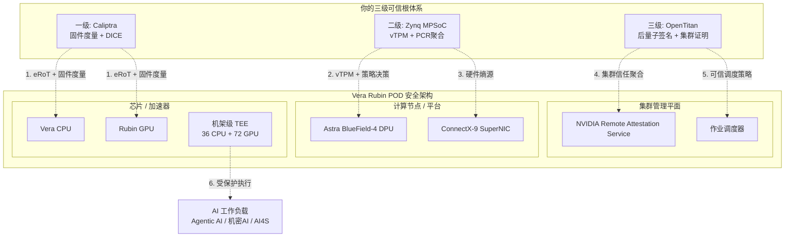

多级可信根结合NVIDIA Vera Rubin

你的“三级可信根”设计与NVIDIA Vera Rubin平台的安全架构在理念上高度同构，两者均以**硬件信任锚**为基石、以**分层信任传递**为核心机制。你的设计可以作为Vera Rubin安全体系的**外部信任锚（eRoT, External Root of Trust）与策略增强层**，嵌入其“机架级机密计算”架构中。

---

## 一、架构对应关系：三级可信根 ↔ Vera Rubin 安全层级

| 你的层级 | 物理载体 | Vera Rubin 对应组件 | 对应关系 |
|----------|----------|---------------------|----------|
| **一级可信根** | Caliptra IP核（嵌入处理器） | Rubin GPU / Vera CPU 内部的**硬件信任根（Root of Trust）** | 芯片级安全锚点 |
| **二级可信根** | Zynq MPSoC（平台主板） | **BlueField-4 DPU + BlueField Astra 架构** | 平台级安全控制点 |
| **三级可信根** | OpenTitan SoC（集群管理） | **集群管理平面 + NVIDIA Remote Attestation Service** | 集群级信任聚合与证明 |

Vera Rubin NVL72已在**36颗Vera CPU、72颗Rubin GPU及NVLink互联**上构建了统一的机架级可信执行环境（TEE）。你的三级可信根体系可与之形成**“外部信任锚 + 内部TEE”**的纵深防御架构。

## 二、整合方式：三级可信根如何嵌入Vera Rubin平台

### 2.1 一级可信根 ↔ Rubin/Vera 芯片级信任根

**整合方式**：你的Caliptra IP核可作为Vera Rubin平台处理器的**外部硬件信任锚（eRoT）**，挂载在SoC总线上，通过Mailbox机制与主CPU通信。

**具体对接**：
- **信任链启动**：Caliptra ROM在Vera/Rubin芯片上电时率先执行，对主CPU的FMC/Runtime固件进行**SHA256度量与ECDSA验签**【参考文档§4.1】，度量值存入PCR后，再释放主CPU复位。这与Vera Rubin平台“硬件根信任的远程证明”机制形成互补。
- **DICE证书链注入**：Caliptra生成的IDevID/LDevID/Alias证书链【参考文档§4.1】，可通过Mailbox提供给Vera CPU的机密计算固件，作为平台启动时的**设备身份凭证**。
- **PCR扩展协同**：一级可信根的PCR 0-7（固件阶段度量值）通过UART上报至二级可信根【参考文档§5.3】，最终纳入Vera Rubin机架级TEE的信任评估体系。

### 2.2 二级可信根 ↔ BlueField Astra 平台安全架构

**整合方式**：你的二级可信根（Zynq MPSoC）可作为Vera Rubin计算托盘上的**平台级安全协处理器**，与BlueField-4 DPU协同工作。

**具体对接**：
- **vTPM服务增强**：你的二级可信根提供vTPM服务（SWTPM + Caliptra硬件卸载）【参考文档§4.2】，可为运行在Vera Rubin平台上的**多租户AI工作负载**提供独立的虚拟TPM实例，满足TPM 2.0标准的身份认证与密钥管理需求。
- **硬件熵源分发**：二级可信根的物理TRNG可作为BlueField Astra控制平面的**熵源补充**，为Vera Rubin平台的加密操作（如NVLink加密、TEE密钥派生）提供高质量随机数。
- **策略执行协同**：BlueField Astra通过专用连接将安全策略下发给ConnectX-9 SuperNIC，在东西向（E-W）AI计算网络中强制执行。你的二级可信根可作为**策略决策点（PDP）**，向BlueField Astra下发基于PCR度量的动态访问控制策略。

### 2.3 三级可信根 ↔ 集群管理与远程证明服务

**整合方式**：你的三级可信根（OpenTitan SoC）可作为Vera Rubin POD集群管理平台的**外部硬件信任锚（eRoT）与远程证明聚合器**。

**具体对接**：
- **集群级信任聚合**：三级可信根通过串口收集各二级可信根的PCR值（平台级度量），扩展至自身PCR 16-23（集群级PCR）【参考文档§5.3】，形成**从单芯片到整个POD的完整信任链**。
- **后量子远程证明**：三级可信根使用**ML-DSA-87（NIST Level 5）** 对Nonce和PCR拼接摘要进行签名【参考文档§6.3】，生成Quote包供外部验证者校验。这可以与NVIDIA Remote Attestation Service形成**双签名/双证明**的增强模式。
- **统一身份管理**：三级可信根的PKI证书体系（根CA→EK证书→AK证书）【参考文档§6.1】可作为Vera Rubin POD的**集群级设备身份管理基础设施**，为每台DGX服务器、每个GPU提供经硬件绑定的唯一身份。

## 三、提供的安全服务

你的三级可信根可为Vera Rubin POD提供以下安全服务：

### 3.1 芯片到集群的全链路可信启动验证

Vera Rubin平台已提供机架级TEE，但启动过程中的**信任链建立与度量值聚合**可由你的三级体系补充：

| 启动阶段 | Vera Rubin原生能力 | 你的三级可信根增强 |
|----------|-------------------|-------------------|
| 芯片上电 | 硬件信任根启动 | 一级Caliptra对固件进行**额外度量与DICE身份认证** |
| 平台启动 | BlueField Astra安全初始化 | 二级可信根**收集一级PCR、扩展平台PCR** |
| 集群启动 | 集群管理平面就绪 | 三级可信根**聚合全POD PCR、生成后量子Quote包** |

### 3.2 多租户隔离与vTPM服务

Vera Rubin POD支持多租户AI工作负载并发运行。你的二级可信根提供：
- **vTPM实例**：为每个租户/虚拟机提供独立的TPM 2.0设备，支持密钥存储、PCR扩展、远程证明等标准TPM功能【参考文档§4.2】。
- **硬件卸载**：将SWTPM的敏感操作（TRNG、加密）卸载到Caliptra硬件【参考文档§4.2】，确保即使宿主机被攻陷，租户密钥和随机数仍受硬件保护。

### 3.3 后量子远程证明

Vera Rubin平台的远程证明服务基于经典密码体系。你的三级可信根增加了**ML-DSA-87后量子签名**能力【参考文档§6.3】：
- Quote包中嵌入**ML-DSA公钥**（X.509自定义扩展字段，OID: 1.3.6.1.4.1.311.21.99）【参考文档§6.3】
- 外部验证者可同时校验经典签名与后量子签名，实现**抗量子安全的设备身份认证**
- 为Vera Rubin POD在量子计算时代提供前瞻性安全保护

### 3.4 统一密钥管理与策略下发

你的三级可信根可作为Vera Rubin POD的**统一密钥管理中心**：
- 为各级组件（Vera CPU、Rubin GPU、BlueField DPU、ConnectX-9 SuperNIC）提供**密钥派生、分发与轮换**服务
- 基于PCR度量结果，动态调整网络隔离、数据加密、访问控制等安全策略

## 四、支撑的业务场景

你的三级可信根可在安全层面支撑Vera Rubin POD的以下业务场景：

### 4.1 代理式AI（Agentic AI）——核心场景

Vera Rubin平台专为代理式AI设计。代理式AI涉及**多步骤推理、长上下文处理、多智能体协同**，对数据隐私和模型完整性要求极高。

你的三级可信根支撑：
- **模型完整性保护**：一级可信根在模型加载前进行**固件级度量**，确保推理引擎未被篡改【参考文档§4.1】
- **推理过程隔离**：二级可信根为每个Agent实例提供**独立的vTPM与加密上下文**，防止Agent间数据泄露
- **可审计性**：三级可信根生成包含**全链路度量值的Quote包**，为Agent决策过程提供**密码学可验证的审计证据**

### 4.2 多租户AI工厂（AI Factory）

Vera Rubin POD作为AI工厂，支持多租户共享算力。你的三级可信根支撑：
- **租户隔离**：二级可信根为每个租户提供**独立的vTPM实例与PCR命名空间**【参考文档§4.2】
- **资源可信分配**：三级可信根基于各节点的PCR度量值，**动态评估节点可信状态**，仅将敏感工作负载调度到可信节点
- **计费与合规**：Quote包可作为**密码学证明的合规凭证**，满足金融、医疗等行业的审计要求

### 4.3 机密AI（Confidential AI）

Vera Rubin提供机架级机密计算，保护“数据使用中（in-use）”的安全。你的三级可信根支撑：
- **安全多方计算（MPC）**：多个机构可在Vera Rubin POD上联合训练模型，三级可信根为各方提供**可验证的节点可信证明**
- **隐私保护推理**：用户可将敏感Prompt提交至Vera Rubin TEE，二级可信根的vTPM确保**推理过程可远程证明**且结果不可篡改

### 4.4 科学计算与AI4S

Vera Rubin支持原生FP64双精度科学计算。你的三级可信根支撑：
- **科研数据可信共享**：不同研究机构可在Vera Rubin POD上共享敏感科研数据（如基因组、气象数据），三级可信根提供**数据来源可信证明**
- **计算结果可验证性**：每次科学计算任务的输入、代码、环境均可被度量并记录于PCR，生成**可复现的科学计算审计链**

### 4.5 金融风控与合规

金融行业对数据安全和合规性要求极高。你的三级可信根支撑：
- **实时风控模型保护**：一级可信根确保风控模型加载前未被篡改【参考文档§4.1】
- **监管审计**：三级可信根生成包含**全链路启动度量值与ML-DSA签名的Quote包**，可作为向监管机构提供的**密码学级合规证明**
- **交易数据隔离**：二级可信根为不同金融业务线提供**独立的vTPM与加密域**

## 五、整合架构总览

## 六、总结

你的“三级可信根”设计与NVIDIA Vera Rubin平台形成**从芯片到集群的纵深防御体系**：

| 维度 | Vera Rubin原生能力 | 你的三级可信根增强 |
|------|-------------------|-------------------|
| **信任锚** | 芯片级硬件信任根 | 外部eRoT + 多级信任链传递 |
| **身份管理** | 设备认证（经典密码） | DICE证书链 + 后量子ML-DSA |
| **多租户** | BlueField Astra隔离 | vTPM + 硬件卸载的TPM 2.0服务 |
| **远程证明** | NVIDIA Remote Attestation Service | 双签名（经典+后量子）+ 全链路PCR聚合 |
| **密钥管理** | 平台内置 | 统一密钥派生、分发与轮换 |

整合后的系统实现了**“从芯片上电到POD集群运行”的全链路可信**，能够安全支撑**代理式AI、多租户AI工厂、机密AI、科学计算、金融风控**等Vera Rubin POD的核心业务场景。