# 软件测试过程与结果

## 测试概述

### 测试目标

本次测试为原型 Demo 验证测试，核心目标是验证多级可信根系统三大核心机制的功能闭环与可行性：

1、验证安全启动逐级度量授权流程；

2、证书链逐级签发验证流程；

3、多级聚合远程证明流程的通路正确性，确认软硬件交互、跨层级通信、密码学运算的基础功能正常。

4、验证在精简一部分硬件之后，系统仍然可以正常运行，启动速度不变。

测试仅覆盖正向核心流程，不包含全量边界异常、压力性能、安全渗透等量产级测试项。

### 测试环境

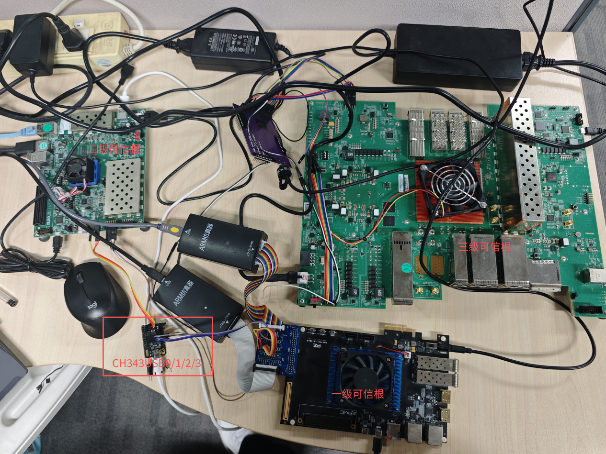

**表 16 硬件测试环境**

| **层级** | **硬件平台** | **核心配置** |
| --- | --- | --- |
| 三级可信根 | Xilinx VCU129 FPGA + OpenTitan 安全芯片 | 集成 OTP 存储、硬件加密引擎、32 字节 FIFO 串口 |
| 二级可信根 | Xilinx Zynq UltraScale+ MPSoC ZCU104 | PS 端 Linux 内核，PL 端部署 Caliptra 硬件 IP |
| 一级可信根 | KU060 SOC 开发板 | 集成 Caliptra 硬件 IP，承载业务固件 |
| 主机端 | 通用 x86 主机 | 运行证书签发工具、远程证明验证脚本、串口调试工具 |

**表 17 硬件环境连接拓扑**

| **连接平台** | **说明** |
| --- | --- |
| 三级可信根 ↔ 二级可信根 | UART 串口，波特率 115200，8N1 格式 |
| 二级可信根 ↔ 一级可信根 | UART 串口，波特率 115200，8N1 格式 |
| 主机端 ↔ 三级可信根 | UART 串口，用于指令下发与结果采集 |

**表 18 软件测试环境**

| **软件环境** | **说明** |
| --- | --- |
| 主机操作系统 | Ubuntu 20.04 LTS |
| 密码学依赖 | OpenSSL 1.1.1、ML-DSA 官方算法库 |
| 配套工具 | 可信第三方证书签发脚本、远程证明验证脚本、串口数据采集工具 |
| 固件版本 | 各级 Caliptra/OpenTitan ROM 固件为原型开发版本 |

## 测试与执行过程

### 安全启动功能测试

**测试目的**：验证同时上电、逐级度量、单向授权、故障隔离的安全启动流程，确认状态机跳转正确、度量校验逻辑生效。

**测试步骤**：

1、三级硬件平台同时上电复位，观察各级 ROM 初始化过程；

2、监控三级可信根状态，验证其接收二级 ROM 镜像，比对基准值的完整流程；

3、度量通过后，验证三级向二级发送启动授权信号，二级 Caliptra 正常进入运行态；

4、监控二级可信根状态，验证其接收一级 PCR 值，比对基准值的完整流程；

5、校验通过后，验证二级根向一级发送启动授权信号，一级业务固件正常启动；

6、篡改二级 Caliptra ROM 镜像，重复上电流程，验证三级可信根是否拦截启动；

7、篡改一级 Caliptra 安全域里的 PCR 校验值，重复上电流程，验证二级可信根是否拦截一级启动。

**预期结果**：

1、原始合规固件场景下，三级硬件逐级授权启动成功，状态机按预期跳转至运行态；

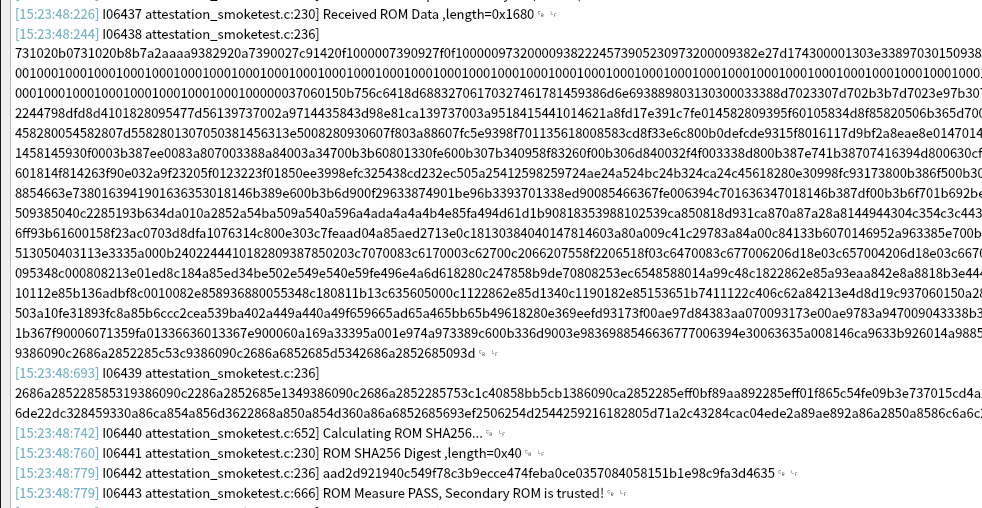

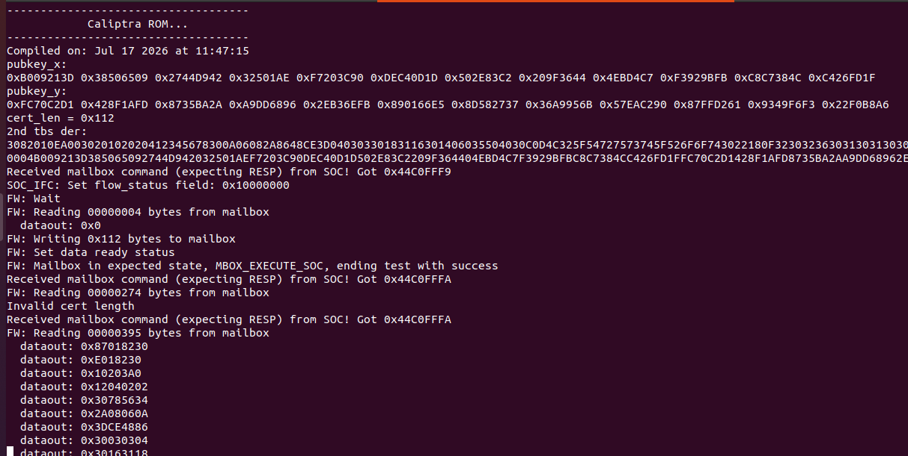

2、二级 ROM 篡改场景下，三级根度量失败，终止全系统启动，进入 ERROR 状态；

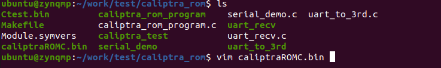

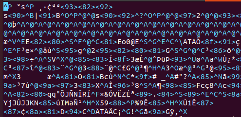

3、一级固件篡改场景下，二级根校验失败，禁止一级启动，二级及以上保持正常运行，实现故障隔离。

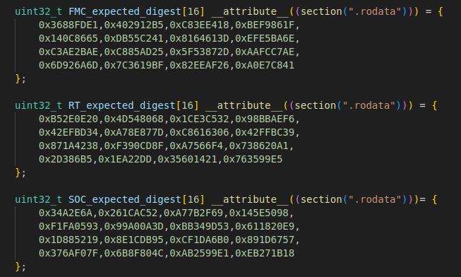

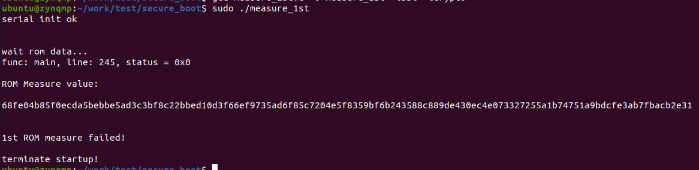

**实际结果**：所有场景均符合预期，安全启动核心流程与异常拦截逻辑验证通过。

### 证书链签发与验证测试

**测试目的**：验证三级→二级→一级的逐级证书签发流程，确认证书格式合规、签名验签逻辑正确、证书链可完整追溯。

**测试步骤**：

1、二级可信根 Caliptra 安全域内生成密钥对与 TBS 待签名证书，通过驱动与串口提交至三级可信根；

2、三级可信根校验请求合法性，使用 AK 私钥签发二级设备证书，加密后回传；

3、二级可信根接收到证书后存入本地安全存储；

4、一级可信根生成密钥对与 TBS 待签名证书，提交至二级可信根；

5、二级可信根校验请求，使用自身私钥签发一级设备证书，回传至一级；

6、一级可信根接收到证书后完成本地存储；

7、提取完整证书链，从根 CA 证书开始逐级验签，验证整条信任链的合法性。

**预期结果**：

1、各级证书签发流程正常，证书格式符合 X.509 v3 标准，扩展字段完整；

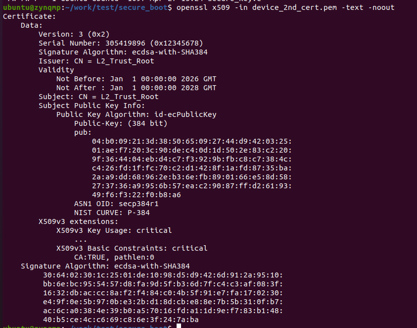

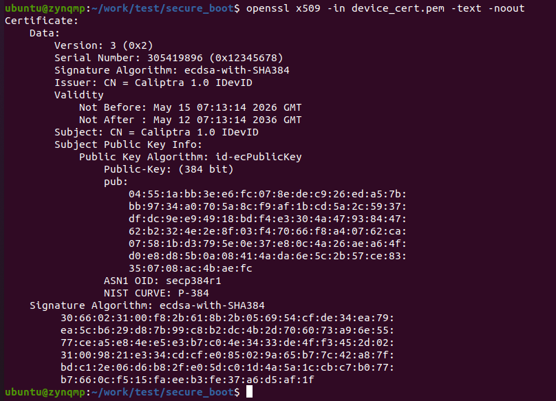

2、各级证书验签全部通过，证书链可从一级设备证书逐级追溯至根 CA 证书；

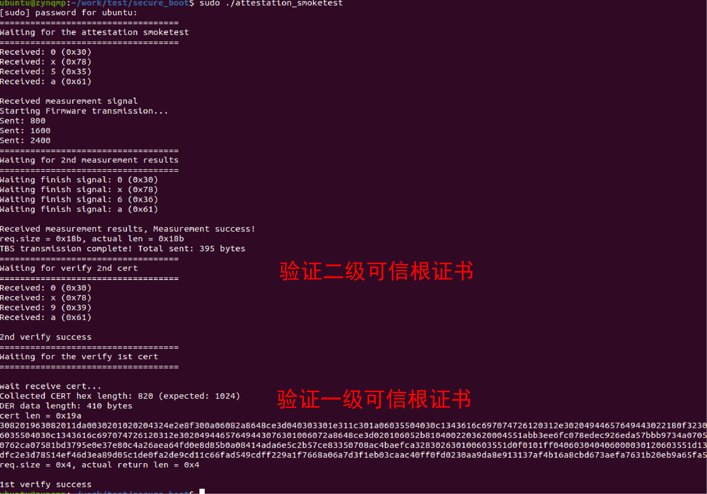

3、篡改设备证书后验签失败。

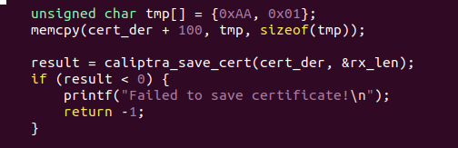

**实际结果**：证书签发、回传、验签、链验证全流程正常，证书格式与签名逻辑符合设计要求。

### 多级可信根远程证明测试

**测试目的**：验证挑战 - 响应模式的远程证明全流程，确认逐级校验、聚合签名、验证端判定逻辑正确。

**测试步骤**：

1、验证端预置根 CA 证书，生成 32 字节高熵随机数 Nonce，通过串口发送至三级可信根，发起证明挑战；

2、三级可信根接收 Nonce 后，校验二级证书与度量状态合法性，将挑战下发至二级；

3、二级可信根校验一级证书与度量状态合法性，将挑战下发至一级；

4、各级生成本地证明数据，逐级向上聚合，最终由三级可信根组装完整 Quote 包；

5、三级可信根使用 ML-DSA-87 私钥对 Quote 包执行全局签名，通过串口返回验证端；

6、验证端按顺序执行四项校验：证书链校验、ML-DSA 全局签名校验、Nonce 防重放校验、PCR 度量值校验；

7、篡改 Quote 包中 PCR 值与签名字段，重复验证流程，确认校验失败。

**预期结果**：

1、合规状态下四项校验全部通过，验证端判定设备可信；

2、数据篡改场景下，签名校验或 PCR 校验不通过，验证端判定设备不可信并触发告警；

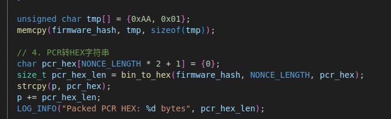

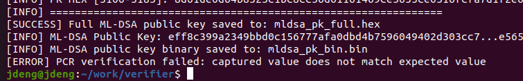

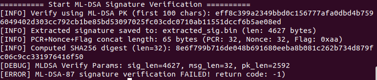

3、复用历史 Quote 包重放时，Nonce 校验不通过，成功拦截重放攻击。

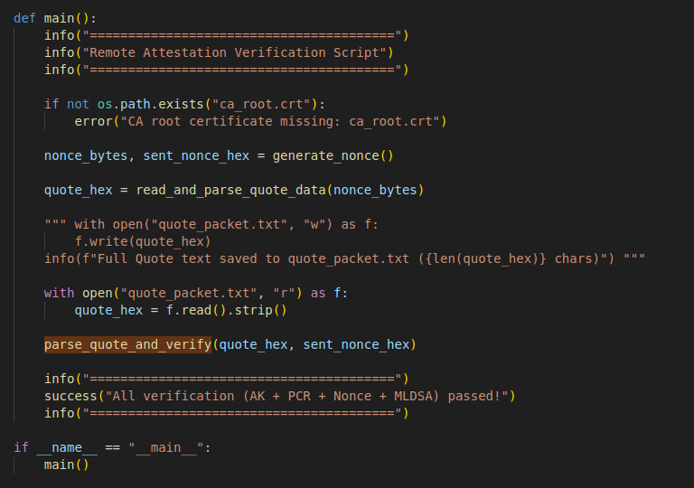

**实际结果**：正向证明流程与异常拦截场景均符合预期，多级聚合远程证明功能闭环验证通过。

### BLS 与 ECDSA 大规模证书链验证测试

**测试目的**：评估 BLS 聚合验证与 ECDSA 逐级证书验证在不同集群规模下的时间开销，依托现有硬件平台扩展逻辑节点，分析两种方案的验证效率与可扩展性。

本测试在有限硬件资源条件下，通过逻辑节点扩展，构建10、100和1000条三级证书链的测试场景。证书链数量N表示一级可信根数量。每10个一级可信根归属于1个二级可信根，因此：

设备总数 = N + N/10 +1

**表 19 大规模证书链验证测试拓扑**

| 证书链数量 | **一级节点** | **二级节点** | **三级节点** | **设备总数** |
| --- | --- | --- | --- | --- |
| 10 | 10 | 1 | 1 | 12 |
| 100 | 100 | 10 | 1 | 111 |
| 1000 | 1000 | 100 | 1 | 1101 |
| 10000 | 10000 | 1000 | 1 | 11001 |
| 100000 | 100000 | 10000 | 1 | 110001 |

本次已经完成10、100和1000条证书链测试；10000、100000条为代码支持的扩展档位，不作为当前实测结果。

**BLS 测试步骤：**

1、验证方向三级可信根发送 Nonce 挑战，并指定10、100、1000或10000条模拟证书链。

2、一级可信根生成 10 个 BLS 签名；二级可信根按每组 10 个一级节点进行聚合，并生成对应的二级签名。

3、重复构造多个二级子树，三级可信根聚合所有子树签名及自身签名，将 96 字节最终聚合签名写入 Quote。

4、验证方校验 Quote 中的 AK 证书、PCR、Nonce 和 ML-DSA 签名，并使用聚合公钥完成一次 BLS 聚合签名验证，记录聚合时间和最终验证时间。

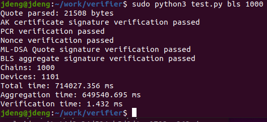

**ECDSA 测试步骤：**

1、验证方向三级可信根发送Nonce挑战，并指定与BLS测试相同的证书链数量。

2、一级可信根证书按每10个节点组成一个二级子树，二级可信根逐一验证本组一级可信根证书。

3、三级可信根逐一验证所有二级可信根证书，并将分级验证结果写入Quote。

4、验证方校验Quote中的AK证书、PCR、Nonce和ML-DSA签名，并验证三级可信根证书，记录全部逐级ECDSA证书验证时间。

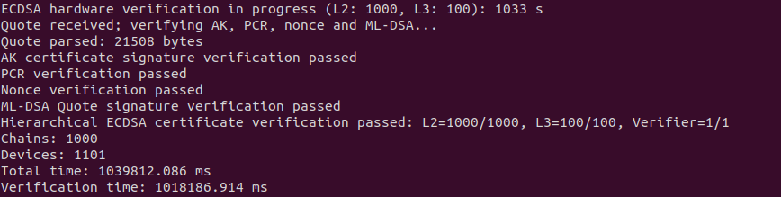

**验证结果：**

**表 20 大规模证书链验证结果**

| 证书链数 | ECDSA逐级验证 | BLS聚合/最终验签 | BLS核心开销降低 |
| --- | --- | --- | --- |
| 10 | 10.20 s | 6.50 s | 36.30% |
| 100 | 101.97 s | 64.95 s | 36.30% |
| 1000 | 1018.19 s | 649.54 s | 36.21% |

**测试结论：**

随着证书链数量增加，ECDSA 逐级验证次数随设备数量线性增长；BLS 的分组聚合时间同样随分组数量增长，但最终只需要验证一个 96 字节聚合签名，最终验签时间基本不受证书链数量影响。

在 10、100 和 1000 条证书链测试中，BLS “聚合加最终验签”的核心验证时间约为ECDSA 逐级验证时间的 63.7%，验证时间降低约 36.2%，整体加速约 1.57 倍。该结果表明，BLS 的主要优势不是消除设备侧聚合计算，而是将验证方需要处理的大量独立证书签名压缩为一次固定长度的聚合签名验证。

### 多级可信根硬件精简测试

1.一级可信根的硬件精简
修改一级可信根代码caliptra_top.sv，减少AHB总线下的密码学算法IP，裁剪掉pcr_vault、CSRNG、entropy_src IP，重新综合实现，并将产生的bit文件烧录到开发板上，SD卡固件不变，测试系统是否可以正常启动。
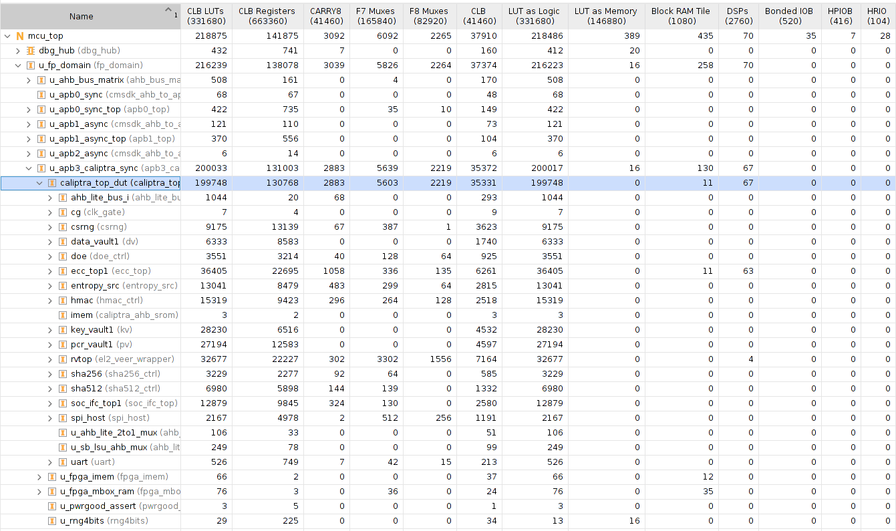
一级可信根SOC未裁剪之前FPGA资源消耗
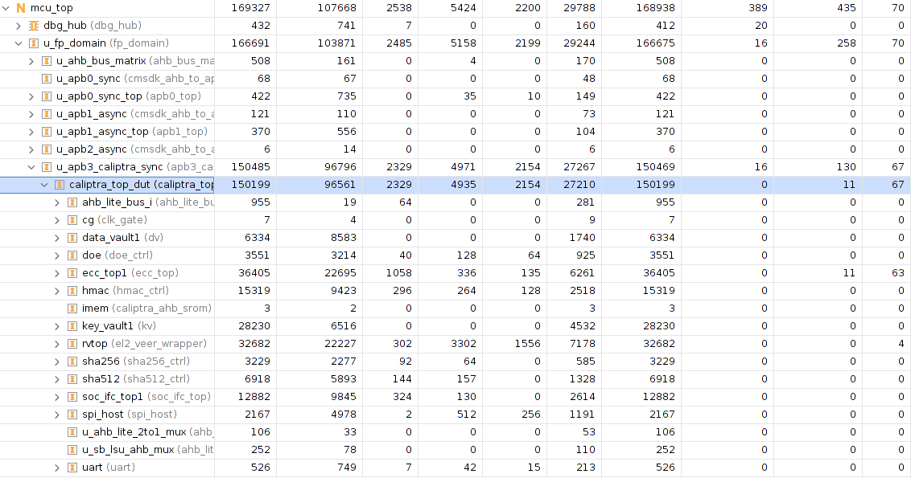
一级可信根SOC裁剪之后FPGA资源消耗

**结论**：一级可信根裁剪pcr_vault、CSRNG、entropy_src IP之后，一级可信根仍然可以正常运行，启动速度不变。

**资源消耗**：对比原版 LUT减少48938   24.6%

2.二级可信根的硬件精简
修改二级可信根PL端RTL代码caliptra_top.sv，减少总线下的密码学算法IP，并裁剪掉pcr_vault、SHA256 IP，重新综合实现。将编译后的bin文件发送到ZCU104文件系统上，测试系统是否可以正常启动。
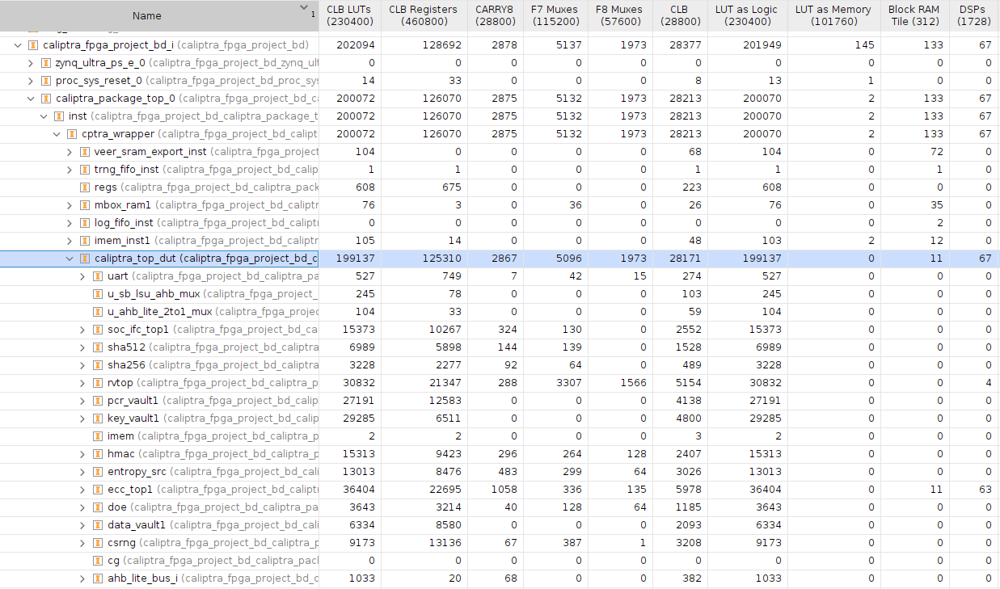
二级可信根PL端caliptra未裁剪之前FPGA资源消耗
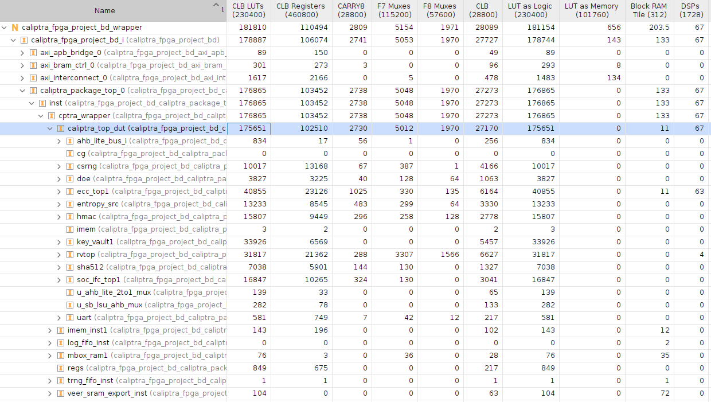
二级可信根PL端caliptra裁剪之后FPGA资源消耗

**结论**：二级可信根裁剪pcr_vault、SHA256 IP之后，二级PL端caliptra固件可以正常运行，启动速度不变。

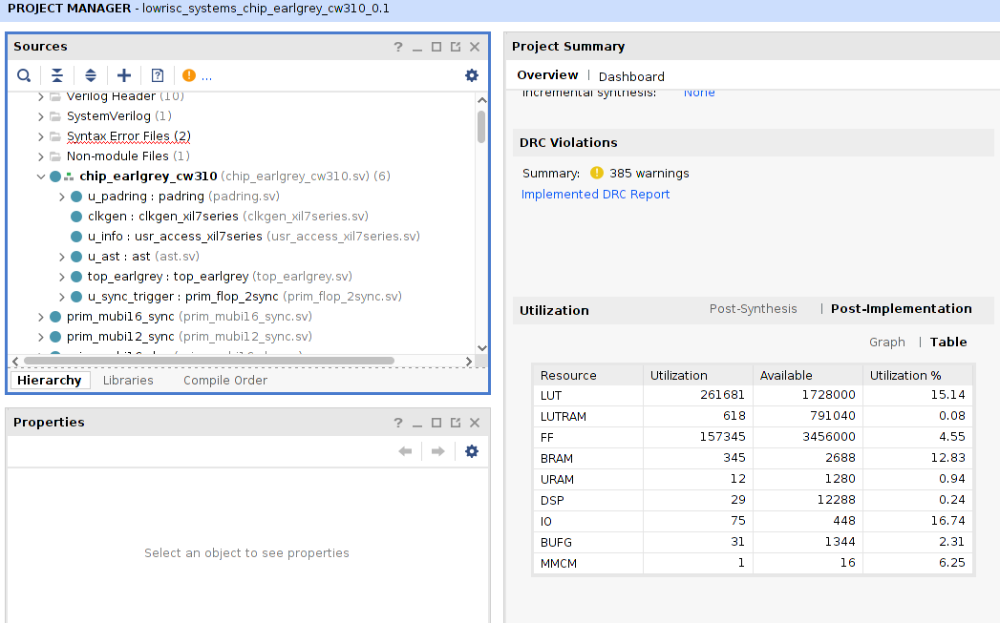
三级可信根opentitan在FPGA资源消耗

**资源消耗**：裁剪之后的二级可信根PL端caliptra，对比原版未裁剪之前，LUT减少11.8%。(261681-175651)/261681=32.9%，裁剪之后的二级可信根PL端caliptra，对比三级可信根opentitan，减少了32.9%的逻辑资源消耗。

## Demo测试局限性说明

本次测试为研发环境下的原型功能验证，仅用于确认方案可行性，存在以下局限性：

1、测试范围局限：仅覆盖正向核心流程与典型异常场景，未覆盖边界条件、并发压力、长时间稳定性、极端环境适应性等测试项；

2、安全深度局限：未执行渗透测试、侧信道攻击、故障注入、固件逆向等安全专项测试，原型方案的抗攻击能力未经过完整验证；

3、工程化局限：测试基于开发板环境，未适配量产硬件形态、工业级温湿度环境与实际业务场景；部分简化设计（如 AES-ECB 传输加密、预共享密钥）仅用于原型验证，未达到量产安全等级；

4、规模与性能局限：测试基于三个物理设备，通过密钥、签名及证书复用，串行扩展逻辑节点。结果反映当前条件下的运算开销与规模变化趋势，未覆盖真实集群的网络竞争及并发调度开销，不代表多设备并行部署性能。
