# 计算集群可信根冷热迁移与密钥分发：威胁模型、现有方案与通用治理框架

> 面向通用计算集群（云/边缘/TEE 集群）的可信根冷迁移、热迁移与密钥分发技术研究
>
> 涉及主题：可信根固件更新（冷迁移）· 运行态/虚拟可信根迁移（冷+热）· 密钥分发传输与受控迁移
>
> 文中理论部分面向**大多数计算集群的可信根冷热迁移实现**；本项目《面向异构TEE集群的多级可信根系统》（Trust_Shield）原型仅作为理论落地的**参考实现与例证**，用于支撑而非限定理论本身。

---

## 目录

- [一、引言](#一引言)
- [二、计算集群可信根冷热迁移：威胁模型与现有方案分析](#二计算集群可信根冷热迁移威胁模型与现有方案分析)
- [三、场景一：可信根固件更新——固件的冷迁移与无损热更新](#三场景一可信根固件更新固件的冷迁移与无损热更新)
- [四、场景二：运行态迁移——虚拟机与虚拟可信根（vTPM）的冷/热迁移](#四场景二运行态迁移虚拟机与虚拟可信根vtpm的冷热迁移)
- [五、场景三：密钥的分发传输、受控迁移](#五场景三密钥的分发传输受控迁移)
- [六、统一治理参考架构与实施路线](#六统一治理参考架构与实施路线)
- [七、结论](#七结论)
- [参考文献](#参考文献)

---

## 一、引言

### 1.1 背景与动机

可信计算集群（云平台、边缘集群、TEE 集群）以可信根（硬件 TPM/TCM、DICE/Caliptra 类 RoT、vTPM、厂商安全处理器等）为信任锚，构建"安全启动 → 度量 → 远程证明 → 密钥服务"的信任闭环。然而这一闭环传统上建立在**静态假设**之上：固件不变、设备不动、密钥不出安全域。现实运维中，以下需求会系统性地打破静态假设：

| 现实需求 | 打破的静态假设 | 对应迁移问题 |
|---------|--------------|-------------|
| 固件漏洞修复、功能升级 | 固件度量基准值固定 | 固件更新（代码实体的冷迁移/无损热更新） |
| 虚拟机负载调度、故障切换 | vTPM/可信根状态绑定单一物理平台 | VM/vTPM 冷、热迁移 [1][4][6] |
| 设备更换、集群扩容 | 密钥与物理芯片强绑定 | 密钥传输与重封装 [9][10][11] |
| 密钥轮换、证书到期 | 密钥一次性生成、终身使用 | 密钥分发与在线轮换 [12] |

**核心矛盾**：可信计算要求"信任链完整、度量基准稳定、私钥不出安全域"；而迁移要求"状态可导出、数据可搬运、身份可延续"。两者天然冲突，任何集群可信根迁移方案的本质，都是在这一矛盾中通过协议设计取得可证明的平衡 [1][4][25]。

### 1.2 冷迁移与热迁移的概念界定

借用虚拟化领域成熟概念并结合可信根场景重新定义（该界定贯穿全文三个场景）：

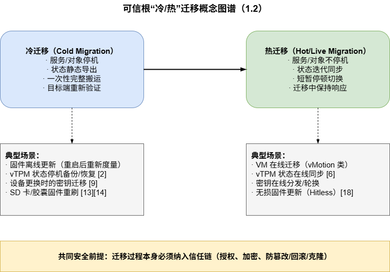

- **冷迁移**：迁移对象处于停机/静态状态，整体导出 → 搬运 → 导入 → 重新验证启动。实现简单、安全窗口可控，但服务中断。
- **热迁移**：迁移对象持续运行，状态分批迭代同步（pre-copy/post-copy），最后短暂停顿完成原子切换 [25][27]。业务连续性好，但协议复杂、安全攻击面显著增大（迁移流量可被劫持、分析 [24][26]，迁移模块自身存在可利用漏洞 [24]）。

### 1.3 迁移的三类对象与章节映射

计算集群中可信根相关的迁移问题按对象可分为三类，是普适分类，不依赖特定集群形态：

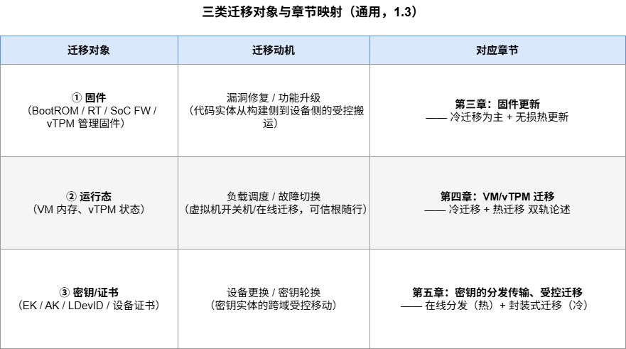

### 1.4 本文结构

第二章建立普适威胁模型并系统综述现有方案与缺陷，提出通用治理框架（创新点）；第三、四、五章分别对三类对象展开，每章内部**明确划分"冷迁移"与"热迁移"两条技术路线**，先讲普适理论/业界标准做法，再以本项目多级可信根原型为例证映射落地；第六章给出统一参考架构与分阶段路线。

---

## 二、计算集群可信根冷热迁移：威胁模型与现有方案分析

### 2.1 威胁模型：可信根冷热迁移中的攻击面与攻击者

#### 2.1.1 系统角色与信任边界

任何一个计算集群的可信根迁移场景，无论底层是 TPM、TCM 还是 DICE/Caliptra 类 RoT，都可以抽象出以下角色与信任边界：

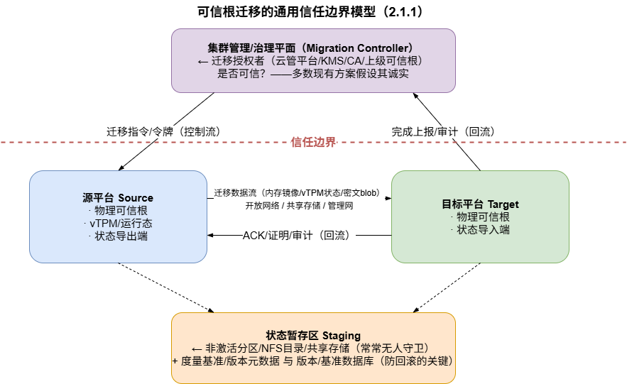

三条攻击面随之确定：
1. **控制流攻击面**：迁移授权指令、迁移令牌的伪造与重放；
2. **数据流攻击面**：迁移中转输的状态/密文/固件包（网络或共享存储）；
3. **元数据攻击面**：度量基准值、版本计数器、分区表/激活指针等"度量的度量"。

#### 2.1.2 攻击者能力分类（由弱到强）

| 攻击者 | 能力 | 现实对应 |
|--------|------|---------|
| A1 网络窃听者 | 被动观测迁移流量 | 跨数据中心 WAN 迁移中的链路监听 [24][27] |
| A2 网络主动攻击者 | 篡改/注入/重放/劫持迁移流 | 中间人、恶意交换机、BGP 劫持 [24][25] |
| A3 流量分析者 | 从流量统计特征推断迁移行为 | 迁移跟踪、DoS 定位（即使载荷已加密）[26] |
| A4 恶意/失陷主机管理员 | 控制源或目标宿主机的 hypervisor/OS | "诚实但好奇"乃至恶意的云管理员 [4][28] |
| A5 失陷管理平面 | 伪造迁移指令/令牌 | 云管平台/KMS 被攻破（最高威胁） |
| A6 软件漏洞利用者 | 攻击迁移模块本身（解析器溢出等） | 迁移服务代码审计不充分 [24][25]；近期 VMware VMX 系列漏洞证明其现实性 [28] |
| A7 物理接触者 | 掉电/拔盘/重刷存储破坏原子性 | 现场维护窗口、SD 卡/SPI 烧写 |

#### 2.1.3 威胁清单（针对可信根迁移的特有威胁）

| # | 威胁 | 攻击面 | 攻击者 | 后果 | 对策方向（详见 2.4） |
|---|------|--------|--------|------|---------------------|
| T1 | 迁移流窃听 | 数据流 | A1/A4 | TPM 状态/密钥材料泄露 | 状态加密传输（migration-key 类机制 [2][3]） |
| T2 | 迁移流篡改/注入 | 数据流 | A2 | 注入恶意固件/伪造 TPM 状态/恶意密钥 | 签名 + 认证加密（GCM）+ 迁移摘要校验 [1] |
| T3 | 回滚攻击 | 元数据 | A2/A4/A7 | 恢复含漏洞旧固件/旧密钥版本绕过补丁 | 单调版本计数器、防回滚熔丝、最低支持版本 [13][14][16][19] |
| T4 | 克隆攻击 | 数据流+源端 | A4/A7 | vTPM/密钥身份双处存活，远程证明体系失效 | 两阶段提交 + 源端销毁证明 + 全局唯一实例审计 [1][4][28] |
| T5 | 重放攻击 | 控制流/数据流 | A2 | 重放旧迁移会话/旧令牌 | Nonce + 时间戳 + 会话/目标绑定 [4][10] |
| T6 | 迁移跟踪与定向 DoS | 数据流(统计) | A3 | 迁移中暴露目标位置，切换窗口攻击 | 流量整形/伪装 [26]；缩短切换窗口 |
| T7 | 迁移模块漏洞利用 | 控制流/解析器 | A6 | 接管 hypervisor/固件（guest-to-host） | 最小化迁移模块 TCB、形式化解析器 [24][25][28] |
| T8 | 恶意目标主机 | 目标端 | A4 | 状态落地即被恶意主机解剖 | 目标平台先证明（attestation-before-landing）[28][31] |
| T9 | 度量基准篡改 | 元数据 | A4/A5 | 恶意固件配假基准，绕过度量 | 基准由上级/治理平面签名授权（见 3.4） |
| T10 | 原子性破坏（撕裂迁移） | 源端/暂存区 | A7/A2 | 迁移中断导致状态分裂或新旧并存 | 分区表/激活指针原子切换 + 尝试计数回退 [18][19] |
| T11 | 降级攻击 | 数据流+证明 | A2/A4 | 硬件卸载/安全等级在迁移后静默降级 | 能力等级如实披露进证明元数据 [2][31] |

**与普通 VM 迁移威胁的本质差异**：普通 VM 迁移保护的是**机密性与完整性**；可信根迁移还必须保护**唯一性（身份不可克隆）与基准稳定性（度量不可绕过）**——这两条是一切可信根迁移协议区别于通用安全迁移协议的红线 [1][4][12]。

### 2.2 现有方案综述：业界与学术界是怎么做的

#### 2.2.1 固件/可信根固件更新（冷迁移路线最成熟）

**（1）UEFI Capsule Update 体系（x86/服务器集群事实标准）**。UEFI 规范定义了标准化的固件更新通道：OS 侧工具（Linux 的 fwupd/LVFS、Windows Update）经 ESRT（EFI System Resource Table）发现固件资源，将签名"胶囊"（Capsule）经 `UpdateCapsule()` 或 ESP 磁盘传递交付固件，重启后由固件验证签名、检查版本依赖后写入，并在 ESRT 中记录 `LastAttemptVersion/Status` [14][15][35]。防回滚通过 FMP 载荷头的 `lowest_supported_version` 单调版本与安全启动链共同保证 [14][35]。

**（2）NIST SP 800-193 平台固件弹性框架**。提出 Protected / Recoverable / Resilient 三性质：更新必须由"更新信任根（RTU）"认证，损坏必须能被"检测与恢复信任根（RTDR）"发现并从已知良好副本恢复 [13]。Intel Boot Guard/BIOS Guard 以硬件熔丝锚定验证，SPI 写保护锁定 Flash 通道 [16][34]。

**（3）嵌入式/SoC 侧的 A/B 双分区 + PLDM-T5**。Caliptra MCU 固件更新文档给出业界标准 A/B 分区方案：Active/Inactive 双 Bank、分区表（激活指针 + 尝试计数 + 状态 + 校验和）、失败自动回退；传输编排采用 DMTF PLDM-T5（DSP0267）多阶段状态机，验证锚分别落在 Caliptra ROM 验签、Manifest 校验与 MCU 侧 Hash 比对 [17][18]。OpenTitan owner 固件采用 A/B slot + ROM 校验跳转，`PROD` 生命周期下 ROM 本体不可更新（信任锚固化）[19]。Caliptra 2.1 还支持 Hitless Update（`FW_HITLESS_UPD_RESET`，SRAM 重映射 + 定向复位），是固件"热迁移"的雏形 [18]。

**共性做法小结**：构建侧开发者签名 → 暂存区（Inactive Bank/ESP 变量）→ 设备侧验签 + 版本单调检查 → 原子切换 → 失败回退；度量基准随更新包以签名清单（Manifest）形式同步演进。

#### 2.2.2 运行态迁移：vTPM/虚拟可信根随 VM 移动

**（1）学术奠基：IBM vTPM 及其迁移设计**。Berger 等在 USENIX Security'06 首次系统化 vTPM 并支持随 VM 迁移：迁移状态用对称密钥加密、迁移摘要（migration digest）防篡改/防 DoS（状态被篡改或丢弃则拒绝恢复），并提出四种"硬件 TPM → vTPM 证书链"方案权衡安全与效率 [1]。这是后续一切 vTPM 迁移工作的基线。

**（2）安全迁移协议的强化（ETH Zurich 等）**。Danev 等指出早期方案要么依赖 Privacy CA 过重、要么违反 TPM 使用限制，提出中间密钥层（gSRK/SK）的 vTPM 密钥层级与安全迁移协议，明确三项需求：迁移发起者可认证、迁移中信任链保持、迁移过程机密 [4]。

**（3）信任扩展与证书链优化（国内系列工作）**。余发江等指出：基于证书链的信任扩展在 VM/vTPM 频繁迁移时产生大量"短命证书"，成本高且无法及时撤销、无前向安全，提出 DTE（vTPM 作为 pTPM 代理 + 认证服务器时间令牌）[5]；谭良等提出 VMEK 证书构建 pTPM→vTPM 信任扩展 [7]；王晓等基于国产 TPCM 将可信根虚拟化并设计多级 CA 下虚拟可信根动态迁移机制 [8]。这些工作共同揭示：**迁移的核心成本在"身份/证书体系"而非"状态搬运"**。

**（4）热迁移实现**。黄宇晴等将 vTPM 动态迁移与 KVM 原生 pre-copy 迭代迁移融合，VM 短暂停机窗口内完成最后一轮内存与 vTPM 状态同步 [6]。QEMU/swtpm 官方支持 emulator 后端三种迁移形态（save/restore、网络热迁移、快照），并提供 `--migration-key` 迁移状态加密；同时明确**硬件 TPM passthrough 模式禁用迁移**——硬件状态不可序列化 [2][3]。

**（5）商用平台**。VMware vSphere 将 vTPM 迁移实现为"状态迁移 + 密钥体系迁移"：启用 vTPM 强制绑定 VM Encryption，vTPM 状态文件随加密虚拟盘搬运，目标主机必须先从 KMS 获得解密授权 [20]；Azure Local 受信任启动在 VM 集群迁移/故障转移时自动传输 vTPM 状态，但同时明确警告**实时迁移网络流量默认未加密，建议叠加 IPsec** [21]；Hyper-V 二代 VM 提供迁移流量与保存状态加密选项 [22]；开源侧 libvirt/swtpm 的 vTPM 热迁移要求共享状态目录（NFS）+ 跨主机一致 UID + flavor 级 `tpm_secret_security` 配置，运维门槛高 [23]。IBM Power vTPM 亦支持 LPAR 间安全迁移 [36]。

**（6）机密虚拟机（CVM/TEE）迁移——硬件路径**。AMD SEV-SNP 与 Intel TDX 为 CVM 定义了导出/导入 ABI：迁移由 AMD 安全处理器侧 Migration Agent [30] 或 Intel 专用的可信迁移服务 TD（MigTD）[30][33] 在硬件保护下完成，全程对宿主 hypervisor 保密；实证分析表明传统依赖 hypervisor 读取 guest 状态的迁移技术对 CVM 全部失效 [31]。Google Cloud 已于 2026 年对符合条件的 SEV-SNP 机密 VM 实例开放热迁移 GA [32]。

**（7）TEE 应用态迁移（研究前沿）**。ConstMig 针对 SGX 大内存应用实现近零停机迁移（停机时间较 MigSGX 降低 77–96%）[29]；TALOS 提出"可验证状态管理"：迁移中的应用被默认视为不可信，须通过内存自省与控制流图提取验证状态连续性，且不依赖可信第三方 [28]。

#### 2.2.3 密钥迁移：封装而非暴露

TPM 2.0 以 Duplication 命令族给出"私钥迁移的标准答案"：`TPM2_Duplicate` 将私钥在源 TPM 内用 newParent 公钥重新封装为 duplication blob，明文私钥只在两端 TPM 内部出现，`TPM2_Import` 在目标端重封装；迁移目的地与条件由 Policy（可绑定特定 PCR 状态/平台）表达 [12]。宋敏、谭良等分析了裸 Duplication 接口缺少源/目标 TPM 间双向身份认证的缺陷（敌手可用自己控制的密钥充当 newParent 骗取密钥明文），提出基于 Duplication Authority 的迁移协议 [9][10]。Karlsson 等解决 TPM 1.2→2.0 跨代迁移，用 TPM2_PolicyAuthorize 重构 1.2 的 CMK/迁移秘密语义 [11]。工程侧，Clevis/TPM2 展示了"分发被策略封装的密钥而非密钥本身"的形态；vSphere/Hyper-V 的 KMS 托管体系则确立"密钥传输只发生在 KMS 与可信根之间，用户态永远只见密文"的原则 [20][22]。

### 2.3 现有方案的共性缺陷

综合 2.2，现有方案存在以下**跨平台、跨厂商的共性缺陷**，构成计算集群可信根迁移的开放问题：

| # | 缺陷 | 证据 | 影响 |
|---|------|------|------|
| D1 | **信任锚静态绑定**：度量基准硬编码于上级固件常量，固件更新即" brick 或绕过"二选一 | 原型系统 `g_2nd_rom_expected_val[32]` 硬编码现状；A/B 分区解决"放哪"未解决"信什么" [18] | 固件更新与度量体系割裂 |
| D2 | **迁移未纳入证明**：迁移事件（固件版本变化、vTPM 落户变化、密钥继承）不出现在 Quote/证明元数据中，验证方对迁移历史失明 | QEMU/vSphere/学术协议均未把迁移历史锚入 attestation [2][20][4] | 迁移成为信任链的"例外通道" |
| D3 | **证书链重建成本高**：vTPM 每次迁移需重申身份证书，短命证书泛滥、撤销不及时、无前向安全 | 余发江等实测证书成本 [5]；Danev 等的密钥层级缓解但未消除 [4] | 频繁迁移场景不可运营 |
| D4 | **唯一性/防克隆依赖假设**：多数方案假设源端诚实销毁，缺少密码学可审计的销毁证明与全局唯一实例登记 | IBM migration digest 只防传输篡改不防源端保留 [1]；TALOS 明确将防克隆列为核心挑战 [28] | 克隆攻击（T4）防线薄弱 |
| D5 | **迁移信道安全外挂化**：加密/认证被当作可选配置（IPsec"建议开启"），而非协议内生属性 | Azure Local 官方警告迁移流量默认明文 [21]；swtpm migration-key 为可选项 [3] | T1/T2/T5 防护依赖运维纪律 |
| D6 | **防回滚强度分层且常被弱化**：软计数器方案可被存储回滚攻破；强方案（熔丝）牺牲可运维性 | NIST 800-193 讨论 [13]；FMP lowest_supported_version 依赖固件厂商实现 [14] | T3 防护参差 |
| D7 | **冷/热迁移安全语义不统一**：冷迁移走"备份恢复"逻辑、热迁移走"信道加密"逻辑，两套信任模型互不复用 | QEMU 文档将 save/restore 与 live migration 分列 [2]；固件更新与 VM 迁移研究社群割裂 [13][25] | 无法建立一致的治理与审计 |
| D8 | **能力降级不可见**：硬件卸载属性（TRNG/PCR 锚定/签名加速）迁移后静默降级，证明不披露 | swtpm passthrough 限制 [2]；TEE 方案开始关注但无标准字段 [31] | 验证方基于过期假设决策（T11） |
| D9 | **管理平面单点信任**：授权者（云管/KMS/CA）被默认诚实，失陷即全盘失守（A5） | MigTD/MA 将迁移权威放进硬件但仍是单点 [30][33] | 缺乏对授权者的制约与审计联动 |

### 2.4 创新方向：面向计算集群的通用迁移治理框架

针对上述缺陷，本文提出**适用于大多数计算集群可信根冷热迁移的通用治理框架**，其四要素直接映射 D1–D9：

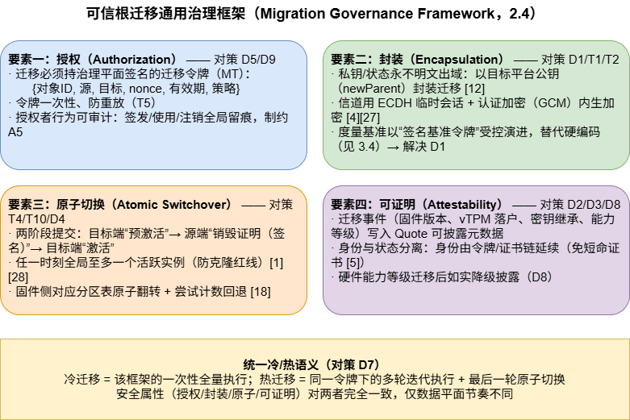

该框架是后文三个场景章节的公共理论骨架：**每个场景 = 该框架在特定迁移对象上的实例化**。

---

## 三、场景一：可信根固件更新——固件的冷迁移与无损热更新

> 固件更新本质是"新固件从可信构建环境 → 设备存储区 → 激活运行"的受控搬运，普适于一切具备可信根的集群节点（服务器 BMC/BIOS、TEE SoC 固件、RoT 子系统固件）。本章先给出通用流程与业界标准，再以本项目多级可信根原型为例证。

### 3.1 通用三段式流水线

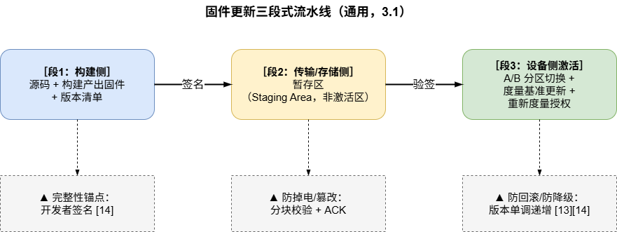

三段分别对应 NIST SP 800-193 的 Protected（更新须 RTU 认证）、Recoverable（损坏可检测恢复）、Resilient（保护+恢复兼备）三性质 [13]。

### 3.2 【冷迁移】主流实现：A/B 分区 + 签名胶囊

**通用流程**（综合 UEFI Capsule [14][15]、PLDM-T5 [17][18]、OpenTitan owner update [19]）：

1. **构建侧**：新固件 + 版本号 v(n+1) + 度量清单（Manifest 含期望摘要）→ 开发者签名。
2. **传输/暂存**：胶囊/固件包下发至非激活分区（Inactive Bank / ESP 变量 / staging 区），期间系统始终运行在 Active 分区。
3. **设备侧激活**：固件验证签名 → 版本号 ≥ 最低支持版本（防回滚 [14]）→ 度量暂存区固件并与 Manifest 摘要比对 → **原子切换**分区表激活指针 → 重启走新固件。
4. **失败回退**：Boot Attempt Count 限制重试，超限自动回退旧分区（防无限循环降级）[18]。

**分区表通用格式**（源自 Caliptra MCU，可平移到任何 MCU/SoC [18]）：

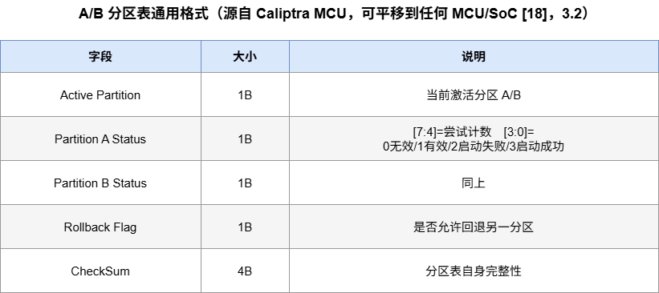

**冷迁移的安全要点**：停机窗口内对象处于静态，威胁集中在 T3（回滚）、T9（基准篡改）、T10（切换原子性）；对策是版本单调 + 签名基准 + 分区表原子翻转，均属治理框架"要素二/三"。

### 3.3 【热迁移】无损更新（Hitless Update）

对业务处理器隐藏可信根自身更新，避免整机复位：

- **Caliptra 2.1 Hitless Update**：`RESET_REASON=FW_HITLESS_UPD_RESET`，MCU SRAM 更新区重映射 + 定向复位，仅可信根子系统自复位，主机无感 [18]。
- **CPU 微码动态替换（DMR）**：运行时经 OS 接口注入厂商签名微码，无需重启，与胶囊更新（需重启）形成"常规 vs 应急"两条互补路线。
- **vTPM 管理固件热更新**：swtpm 以进程形式存在，其升级可借助管理平面滚动重启 + 状态持久化实现"准热更新"，但必须保证状态文件与新版本固件的兼容性校验，否则引入 T3/T7 风险。

**热迁移的特有威胁**：更新窗口内新旧固件并存（T10 撕裂）、SRAM 重映射竞争（T7）；治理框架要求热更新同样持有签名令牌，且切换点必须原子（要素三）。

### 3.4 度量基准的受控演进（固件迁移的信任核心，对策 D1）

固件更新后度量值必然改变：基准不更新则系统永久拒绝启动；基准可随意篡改则恶意固件可绕过度量。通用解法是**让基准本身成为被签名保护的一等公民**，三级强度：

| 方案 | 存储 | 更新方式 | 安全强度 | 适用 |
|------|------|---------|---------|------|
| A. 硬编码基准 | 固件常量 | 重编译烧写上级固件 | 最高但不可运营 | 原型/单机 |
| B. 签名基准包（基准令牌） | 上级 NV 存储 | 上级私钥签名的 {目标ID,版本,期望值,有效期} | 中，可在线更新 | **集群近期推荐** |
| C. 单调计数器+基准链 | OTP 熔丝/单调计数器 | 版本烧丝，基准值链式哈希 | 高，抗回滚 | 量产 [13][16][19] |

基准令牌格式（通用）：

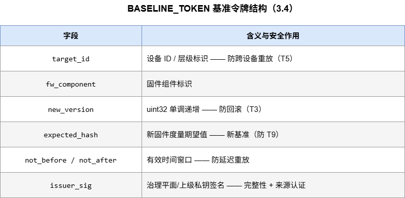

### 3.5 参考实现例证：多级可信根原型

上述理论在 Trust_Shield 原型（一级 Caliptra@KU060 / 二级 ZCU104 PS+PL / 三级 OpenTitan@VCU129，UART 32B 分块+ACK 可靠信道）上的落地映射：

- **一级固件冷迁移**：FMC/RT/SOC_FW 固件由三级经 UART 分块下发（或人工 SD 卡更换），二级写入 SD 卡新分区；一级 ROM 已具备 ECDSA 验签与 SHA512 度量能力，仅需增加分区表解析即可支持 A/B 双分区（3.2 方案平移）。
- **二级 caliptraROM.bin 的特殊地位**：它是被三级度量的对象，其更新由三级主导——三级不再比对硬编码基准 `g_2nd_rom_expected_val[32]`，而是比对"签名基准包"中的新期望值（3.4 方案 B 的直接实例化）。
- **三级自身固件**：依托 OpenTitan 原生 owner firmware A/B slot 与 `PROD` 生命周期约束（ROM 不可更新、ROM_EXT 可更新）[19]，更新包复用 Privacy CA 加密通道下发。
- **time6 维护窗口**：在现有 time1~time5 上电时序后扩展 time6，其 8 步流程（更新计划→版本校验→基准令牌签发→分块下发→staging 写入→度量比对→原子切换→逐级重授权+重签证书）即治理框架四要素在固件场景的完整执行。

---

## 四、场景二：运行态迁移——虚拟机与虚拟可信根（vTPM）的冷/热迁移

> 运行态迁移是三类对象中唯一"冷、热双轨并行"的场景：vTPM 状态既可随 VM 停机做一次性搬运（冷），也可随在线迁移迭代同步（热）。本章对两条路线分别给出通用协议与业界基线，再作例证映射。

### 4.1 通用前提：vTPM 状态的可序列化与信任扩展

一切 vTPM 迁移（冷或热）成立的前提有两个：

1. **状态可序列化**：vTPM 必须是软件态（swtpm 等），硬件 TPM passthrough 状态不可迁移 [2]。由此推论：**可迁移的是软件化的可信根状态，硬件只贡献能力（熵源、密码加速），不持有状态**——"状态可迁移、能力须重新申请"。
2. **信任可扩展**：物理可信根对 vTPM 的背书必须在迁移后延续。证书链方式 [1] 存在短命证书问题 [5]，改进方向包括中间密钥层 [4]、VMEK [7]、DTE 时间令牌 [5]、多级 CA [8]；CVM 路线则由硬件迁移权威（MigTD/MA）延续背书 [30][33]。

### 4.2 【冷迁移】通用协议：停机导出—封装搬运—验证导入

综合 IBM 迁移摘要机制 [1]、ETH 安全迁移协议 [4]、TPM2_Duplicate 封装哲学 [12] 与 vSphere 状态+密钥体系双迁移实践 [20]，冷迁移可归纳为六步通用协议：

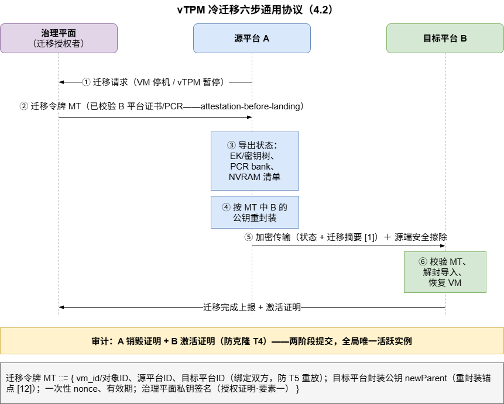

**各步骤的安全依据**：
- ② **目标平台先证明**（attestation-before-landing）：治理平面先校验 B 平台证书链与 PCR 合规性，对策恶意目标主机 T8 [28][31]；
- ③④ **封装而非暴露**：私钥树在源端安全边界内改封装到 B 的公钥下（对应 `TPM2_Duplicate`），明文私钥从不出现；同时必须修复裸 Duplicate 的双向认证缺陷（B 须证明 newParent 归属，A 须证明迁移数据来源）[9][10]；
- ⑤ **迁移摘要 + 认证加密**：防篡改/防丢态 DoS [1]，信道内生的 ECDH+GCM 会话加密对策 Azure 警告的明文迁移流量问题 [21][27]；
- ⑥+审计 **两阶段提交**：B 预激活 → A 销毁证明（签名）→ B 激活并上报，全局唯一活跃实例，是防克隆红线 [1][4][28]。

**业界冷迁移基线**：QEMU `save/restore`（`migrate "exec:..."` 整体落盘，恢复时参数须一致）[2]；vSphere 以 VM Encryption + KMS 授权实现"密钥体系先行、状态随后" [20]；Azure Local 集群故障转移时自动传输 vTPM 状态 [21]。

### 4.3 【热迁移】通用协议：迭代同步 + 原子切换

在冷迁移协议之上叠加"多轮迭代 + 短暂停顿"，通用三阶段模型（KVM 融合方案 [6]、pre-copy 经典模型 [25][27]、CVM 硬件路径 [30][31]、TEE 应用态 ConstMig [29] 共同遵循）：

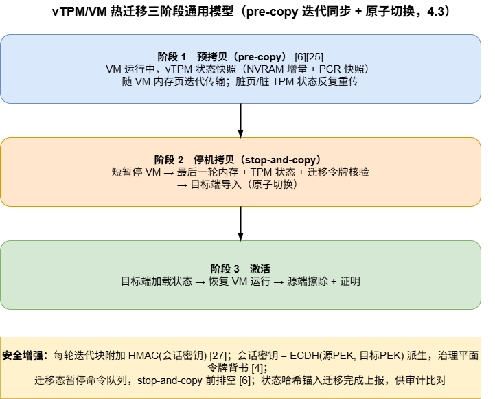

**热迁移相对冷迁移的增量威胁与对策**：

| 增量威胁 | 对策（安全增强） |
|---------|----------------|
| 多轮传输被篡改（T2 放大） | 每轮迭代块附加 HMAC(会话密钥) [27] |
| 会话密钥协商被中间人（T2） | 会话密钥 = ECDH(源PEK, 目标PEK) 派生，治理平面令牌背书 [4][27] |
| 迁移流量被统计追踪（T6） | 流量整形/伪装（stealth migration 思路）[26] |
| 切换窗口 DoS（T6/T10） | 缩短 stop-and-copy；状态哈希锚入完成上报供审计比对 |
| TPM 命令窗口一致性 | 迁移态暂停命令队列，stop-and-copy 前排空 [6] |
| 迁移模块漏洞（T7） | 最小化迁移 TCB、迁移服务不可暴露为公共网络服务 [24][25][28] |

**业界热迁移基线**：swtpm 控制通道协商状态随 VM 迁移流传输、两端目录路径一致，`--migration-key` 状态加密 [2][3]；libvirt 侧需共享状态目录 + 一致 UID + secret 安全属性 [23]；CVM 路线由 TDX MigTD / SNP Migration Agent 在硬件保护下完成，hypervisor 全程不可见 [30][31][33]，Google Cloud SEV-SNP 机密 VM 热迁移已 GA [32]；TEE 应用态近零停机迁移 ConstMig [29] 与不依赖可信第三方的可验证迁移 TALOS [28] 代表研究前沿。

### 4.4 硬件卸载属性的迁移处理（对策 D8/T11）

vTPM 迁到目标平台后，其硬件背书能力需重新建立，通用处理原则：

| 卸载属性 | 冷/热迁移后处理 |
|---------|----------------|
| TRNG 熵源 | 目标平台有硬件熵源 → 自动重挂载；无 → 降级宿主 `/dev/hwrng`，**熵源等级记入 vTPM 状态元数据并在 Quote 中披露** |
| PCR 硬件锚定 | 若曾扩展进物理 RoT PCR，需在协议 ⑥ 步做源端导出→目标端重扩展 |
| 签名/密码加速 | 无状态性，目标平台自动可用 |

**设计原则**：状态可迁移，能力（capability）不可迁移——能力只能重新申请。迁移后可信根的"硬件背书等级"由目标平台当前拓扑决定，通过证明协议如实披露，由验证方决定是否接受降级（D8 的通用解）。

### 4.5 参考实现例证：多级可信根原型

- **前置改造（状态持久化）**：原型中 swtpm 状态位于 `/tmp/mytpm1/`（非持久化，重启即身份归零）——这是 vTPM"易碎状态"的典型样本，通用改造是状态迁入受管存储并以平台封装密钥 PEK 加密：`PEK = KDF(物理 RoT 根密钥, vm-id)`，PEK 由 PL 端 Caliptra 派生不出 PL，效果为状态文件离开本平台即密文。
- **冷迁移实例**：三级可信根（集群管理者）执行 4.2 六步协议——校验目标二级平台证书/PCR → 签发 MT → 源平台 PEK 解封并按 MT 中目标 PEK 公钥重封装 → UART 分块加密传输 → 目标平台校验导入 → 源端擦除证明 + 目标激活证明归档三级审计。
- **热迁移实例**：在冷迁移协议上叠加 4.3 三阶段，迭代块 HMAC、会话密钥 ECDH 派生、stop-and-copy 状态哈希锚入迁移完成上报。
- 该实例验证了通用框架在"异构 TEE 集群"形态下的可移植性：治理平面（三级）与数据平面（UART 分块协议）均为可替换组件。

---

## 五、场景三：密钥的分发传输、受控迁移

> 密钥相关操作按对象与节奏分为两条线：**分发传输**（工作密钥/会话密钥的在线协商、加密下发与统一轮换，属"热"）与**受控迁移**（设备更换/退役时私钥实体的一次性封装搬运，属"冷"）。本章先给出普适分类与两条路线的通用协议，再给出长期形态 KDS 及其在多级可信根体系下的分级分发方案实例化，最后作原型例证映射。

### 5.1 通用密钥分类与可移动性矩阵

| 密钥类别 | 可否出域 | 允许的传输形态 | 依据 |
|---------|---------|---------------|------|
| 根密钥（UDS/PUF 种子/EK 私钥@物理TPM） | ✘ 永不 | 无 | 信任锚物理内生 [12] |
| DICE 首环私钥（IDevID） | ✘ 永不 | 无 | 签后即清 [19] |
| 派生身份私钥（LDevID/Alias） | ✘ 常规 | 随固件版本重派生 | CDI=HMAC(前级,固件hash)，固件更新天然轮换 |
| vTPM EK/AK 私钥 | ✔ 受控 | 随状态加密迁移（需唯一性承诺，见第四章） | [1][4] |
| 设备/AK 私钥 | ✔ 特批 | Duplicate 封装迁移（设备退役/更换） | [9][10][12] |
| 会话密钥（对称） | ✔ | ECDH 每会话协商派生 | 前向安全 [27] |
| 证书/公钥 | ✔ | 签名保护的明文分发 | 现有 PKI 体系 |

### 5.2 【冷迁移】封装式私钥迁移（设备更换场景）

以 TPM 2.0 Duplication 体系为标准答案 [12]，并修复其双向认证缺陷 [9][10]，通用七步协议：

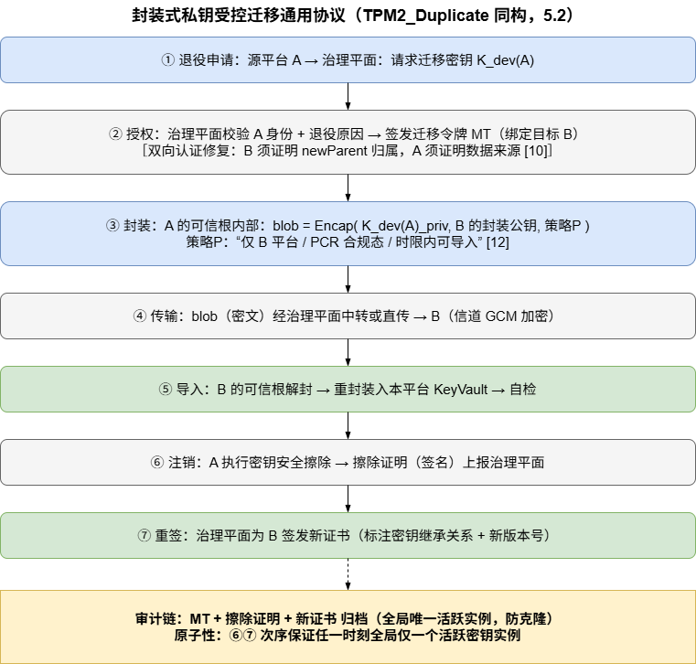

跨代迁移（如 TPM 1.2→2.0、经典→抗量子算法）可用 PolicyAuthorize 类策略重构迁移语义 [11]；抗量子演进方向为 ML-KEM（FIPS 203）混合封装。

### 5.3 【热迁移】在线密钥分发与轮换

不搬运既有私钥，而是**在线协商新生会话密钥 / 分发被策略封装的密钥**：

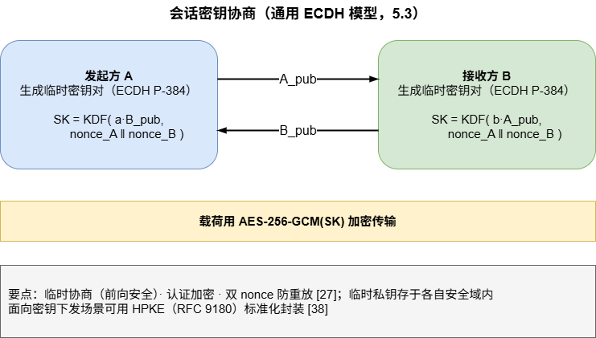

面向密钥下发场景，IETF 已将"以接收方公钥封装对称密钥+载荷"标准化为 HPKE（RFC 9180，混合公钥加密），为加密下发提供了与具体协商协议解耦的标准接口 [38]。

策略封装分发的代表形态：密钥以"目标 PCR 合规"为解封条件分发——**密钥与平台度量状态联动**（Clevis/TPM2 生态的集群化推广）。商用体系（vSphere KMS、Hyper-V HGS）确立的原则：密钥传输只发生在 KMS 与可信根之间，用户态永远只见密文 [20][22]。

### 5.4 长期形态：集群密钥分发服务（KDS）通用模型

治理平面（集群最上层可信根/CA）长期演进为统一密钥分发中心：

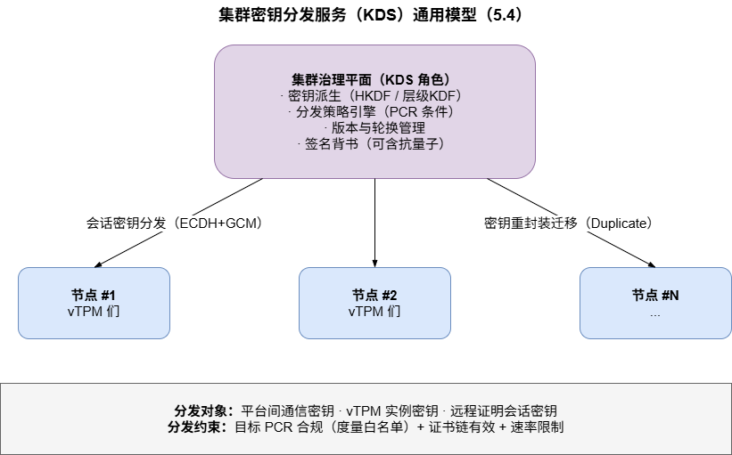

### 5.5 多级可信根密钥分发方案（KDS 的分级实例化）

KDS 通用模型在多级可信根体系中落地为"L3 全局管理—L2 分支管理—L1 节点使用"的分级分发方案：治理职能随信任层级逐级下放，形成与信任链同构的密钥分发链。

#### 5.5.1 分级分发架构

四条设计原则：

1. **三级分发架构**：采用"L3 全局管理—L2 分支管理—L1 节点使用"的层级化体系，分发拓扑与信任链拓扑同构；
2. **逐层生成**：L3 生成 L2 密钥，L2 负责 L1 密钥，L1 仅获得本节点工作密钥——任何一层只与相邻层发生密钥关系；
3. **信任锚不出域**：身份私钥、UDS 和 CDI 始终保存在本地 KeyVault 中，**不进行跨层传输**（呼应 5.1 矩阵的红线行）；
4. **最小权限**：通过分层派生限制密钥泄露范围，单层失陷仅波及该层派生半径。

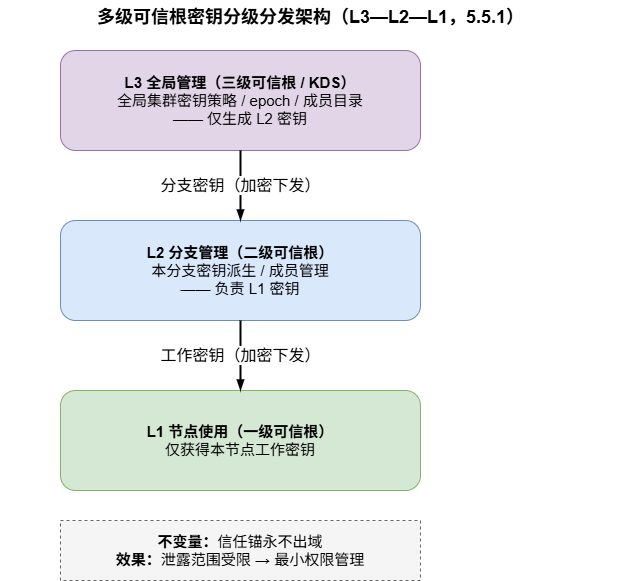

#### 5.5.2 分发协议流程

核心流程为五阶段：**节点注册 → 轮换通知 → 加密下发 → 接收确认 → 统一激活**。

| 阶段 | 发起方 | 动作 | 安全要点（对照 2.1 威胁） |
|------|--------|------|--------------------------|
| ① 节点注册 | 节点→上级 | 验证设备身份、层级关系和密钥接收公钥 | 只接受已注册公钥，防接收公钥被中间人替换（T2/T8） |
| ② 轮换通知 | L3 | 发布新 epoch、成员目录摘要、密码套件和密钥策略 | epoch 单调递增防回滚（T3）；目录摘要锁定本次分发成员集合，防未授权节点混入 |
| ③ 加密下发 | 上级→指定下级 | 上级将工作密钥加密后发送给指定下级节点 | HPKE+AES-GCM 封装，仅目标节点可解（T1/T2） |
| ④ 接收确认 | 下级→上级 | 下级解密并安全保存密钥，返回接收成功证明 | 证明含节点签名+epoch，全链可审计（框架要素四） |
| ⑤ 统一激活 | L3 | 所有节点准备完成后，L3 通知各节点同时启用新密钥 | 集群级两阶段提交：确认后统一启用，防新旧密钥状态撕裂（T10） |
| 异常处理 | — | 分发失败时清除未激活密钥，继续使用原密钥 | 保留原密钥保证运行连续性；未激活密钥清除防残留泄露（T1） |

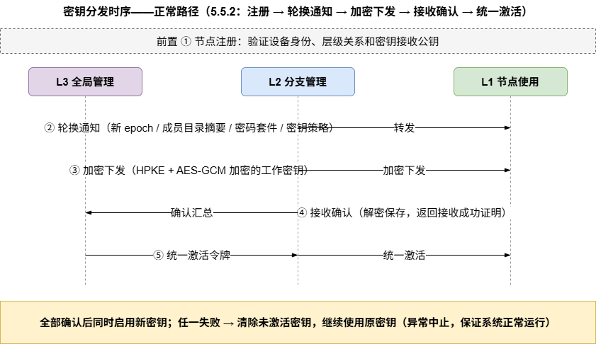

#### 5.5.3 安全机制

1. **加密传输**：使用 HPKE（RFC 9180）和 AES-GCM 保护密钥机密性与完整性 [38]，密钥材料全程以密文形态存在于分发信道；
2. **身份认证**：只有通过身份认证的可信节点，才能接收和使用密钥，未注册/未认证节点的密钥请求一律拒绝；
3. **统一激活**：新密钥统一确认后再启用，避免各级节点密钥状态不一致导致的通信错配与安全空洞；
4. **异常中止**：发现异常时立即停止分发并保留原密钥，保证系统正常运行，将分发失败的影响限制在"一次轮换未完成"而非"集群密钥体系失效"。

#### 5.5.4 与通用治理框架的映射

| 框架要素（2.4） | 本方案对应机制 |
|----------------|---------------|
| 授权 | 节点注册 + 轮换通知（epoch 令牌锁定成员与策略） |
| 封装 | HPKE+AES-GCM 加密下发；UDS/CDI/身份私钥不出本地 KeyVault |
| 原子切换 | 接收确认 + 统一激活（集群级两阶段提交） |
| 可证明 | 接收成功证明 + 异常中止事件归档，可与远程证明元数据联动（D2） |

该实例化表明：分级分发方案并未引入新的安全原语，而是将治理框架四要素沿"分层派生"拓扑做了**纵深部署**——这正是 KDS 通用模型在多级可信根形态下的自然投影。

### 5.6 参考实现例证：多级可信根原型

- **现状短板（普适样本）**：原型中 CA→三级 AK 证书下发采用 AES-256-ECB + 硬编码预共享密钥——ECB 相同明文块产生相同密文、无前向安全，仅适用于原型；二级↔三级证书明文 DER 传输依赖信道物理隔离假设，集群化后不成立。这两点是 5.3/5.5 升级路线的直接动机。
- **升级映射**：ECDH P-384 会话密钥 + AES-GCM（三级 OpenTitan OTBN 与二级 Caliptra ECC 引擎可直接复用）；集群工作密钥的分发采用 5.5 分级方案（L3 三级可信根承担全局管理角色）；设备退役场景执行 5.2 七步协议；长期由三级可信根承担 KDS 角色，并与 ML-DSA/ML-KEM 抗量子演进衔接。

### 5.7 密钥分发与传输安全性对照（通用）

| 维度 | 弱实践（常见现状） | 强实践（框架要求） |
|------|------|--------|
| 机密性 | AES-ECB / 明文信道 | AES-256-GCM 认证加密 |
| 密钥来源 | 静态预共享 | ECDH 临时协商（前向安全）/ HPKE 封装 [38] |
| 私钥迁移 | 不支持或明文导出 | Duplicate 封装 + 双向认证 + 策略 + 擦除证明 [9][10][12] |
| 分发协调 | 无（逐台配置） | epoch + 成员目录摘要 + 统一激活（见 5.5） |
| 防重放 | 无 | 双 nonce + 有效期 + 目标绑定 |
| 防克隆 | 依赖假设 | 唯一活跃实例 + 审计链 |
| 抗量子 | 传统算法 | ML-KEM 混合协商（演进） |

---

## 六、统一治理参考架构与实施路线

### 6.1 控制平面与数据平面分离

三类迁移共用一个治理架构（框架四要素的部署形态）：

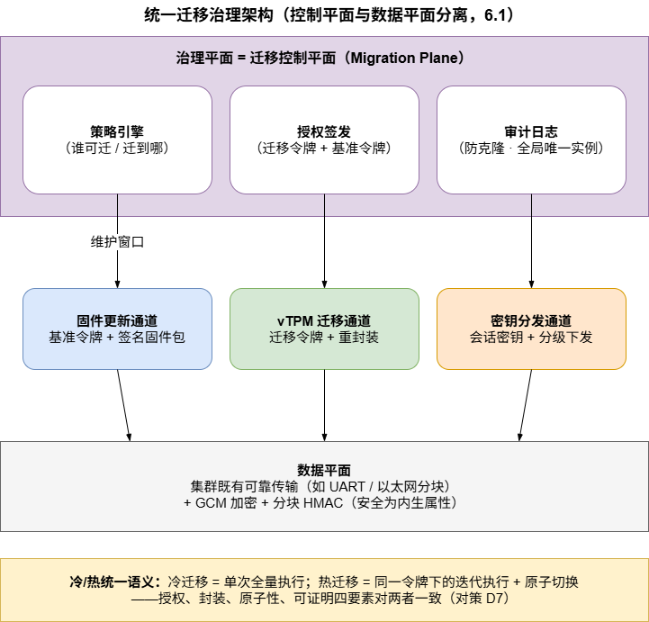

冷/热迁移在该架构下的统一语义：**冷迁移 = 单次全量执行；热迁移 = 同一令牌下的迭代执行 + 原子切换**。授权、封装、原子性、可证明四要素对两者一致，仅数据平面节奏不同——这直接消解了缺陷 D7 的"两套信任模型"问题。

### 6.2 分阶段实施路线（通用）

| 阶段 | 目标 | 关键工作 | 依托现有资产（多数集群具备） |
|------|------|---------|---------------------------|
| **近期**（工程加固） | 固件可信更新 + vTPM 持久化 | ① A/B 分区 + 分区表解析；② 签名基准包替换硬编码基准；③ vTPM 状态迁出易失存储 + 平台封装密钥加密；④ 信道 ECB/明文 → GCM | 可靠分块传输、RoT 内 ECC/SHA 引擎、证书签发链 |
| **中期**（冷迁移闭环） | vTPM/VM 冷迁移 + 私钥受控迁移 | ⑤ swtpm 类控制通道状态导出/导入打通；⑥ 迁移令牌协议（治理平面签发）；⑦ Duplicate 重封装 + 双向认证修复；⑧ 擦除证明与审计链 | emulator 控制通道 [2][3]、PKI、mailbox/ioctl 框架 |
| **远期**（热迁移+KDS） | 热迁移与集群密钥服务 | ⑨ 迭代同步 + 命令队列原子切换 [6]；⑩ KDS 策略引擎与分级分发协议（注册→轮换通知→加密下发→接收确认→统一激活，见 5.5）；⑪ ML-KEM 混合协商；⑫ 迁移与分发历史锚入 Quote 元数据（D2 闭环） | 机密计算硬件迁移支持 [30][31][32]、远程证明协议 |

### 6.3 安全性自检清单（对照 2.1 威胁清单）

| 检查项（威胁编号） | 固件更新 | vTPM迁移 | 密钥分发传输 |
|--------|:-------:|:-------:|:-------:|
| 授权（T5/A5） | 治理平面签名基准令牌 | 治理平面迁移令牌 | 治理平面/CA 背书 + 节点注册 |
| 完整性（T2） | 开发者签名+度量 | 状态 HMAC+迁移摘要 [1] | GCM 认证加密 |
| 机密性（T1） | 会话密钥加密 | PEK 封装+密文传输 [2][3] | ECDH/HPKE+GCM [38] |
| 防回滚（T3） | 版本单调递增 [13][14] | 令牌有效期 | epoch 单调递增 |
| 防克隆（T4） | — | 销毁证明+两阶段提交 | 唯一活跃实例 |
| 防重放（T5） | 令牌 nonce+窗口 | 双 nonce | 双 nonce + 目录摘要 |
| 防流量分析（T6） | — | 流量整形 [26] | — |
| 模块加固（T7） | 解析器最小化 [24][25] | 迁移服务不暴露公网 [24] | — |
| 目标可信（T8） | 目标先证明 | 目标先证明 [28][31] | 注册时验证接收公钥 |
| 降级可见（T11） | 版本披露 | 能力等级披露 | 算法等级披露 |
| 审计（D2） | 更新记录归档 | 迁移双证明归档 | 令牌链/接收证明归档 |

---

## 七、结论

1. **可信根迁移是集群信任体系从"静态闭环"走向"动态可运营"的必经之路**。现有系统已完成"建链"（启动度量授权）与"证链"（远程证明）；迁移补齐的是"续链"能力——固件可换、负载可搬、密钥可流转，而信任链不断裂。

2. **威胁模型上，可信根迁移区别于普通安全迁移的本质在于两条红线**：身份唯一性（防克隆，T4）与度量基准稳定性（防篡改/防回滚，T3/T9）；此外迁移模块自身漏洞（T7，近期 VMX 漏洞族已证实其现实性 [28]）与迁移流量分析（T6 [26]）构成容易被忽视的增量攻击面。

3. **现有方案的共性缺陷是系统性的**：信任锚静态绑定（D1）、迁移不纳入证明（D2）、证书链重建成本（D3 [5]）、防克隆依赖假设（D4）、信道安全外挂化（D5，如 Azure 明文迁移警告 [21]）、冷热语义割裂（D7）等，单点修补无法根治。

4. **本文提出的通用治理框架以四要素统摄三类迁移**：授权（签名令牌）、封装（明文密钥/状态永不出域、基准签名演进）、原子切换（两阶段提交+销毁证明）、可证明（迁移事件锚入 Quote）；并将冷迁移定义为框架的单次全量执行、热迁移定义为同一令牌下的迭代执行——冷与热共享同一安全语义，仅数据平面节奏不同。

5. **三场景的普适结论**：固件更新以"签名胶囊 + A/B 分区 + 基准令牌"落地（UEFI/NIST/PLDM-T5 业界同构 [13][14][17][18]）；vTPM 迁移以"状态可序列化 + 封装搬运 + 目标先证明 + 两阶段提交"落地（IBM/ETH/国内系列工作与商用平台共同验证 [1][4][5][6][20][21]）；密钥以"在线分级分发（热）+ Duplicate 封装迁移（冷）"落地（TPM 2.0 体系与 KMS 实践 [9][10][12][20]）——其中多级可信根密钥分发方案（L3—L2—L1 逐层生成、HPKE+GCM 加密下发、epoch 统一激活）表明：分级分发并非新安全原语，而是治理框架四要素沿分层派生拓扑的纵深部署。

6. **与远程证明的闭环是最终检验标准**：所有迁移与分发事件（固件版本变化、vTPM 落户变化、密钥继承关系、epoch 轮换历史、能力等级变化）应记入 Quote 可披露的元数据，使验证方在挑战-响应时能感知迁移历史——**迁移不是信任链的例外，而是被度量的一部分**。

---

## 参考文献

[1] Berger S, Cáceres R, Goldman K A, Perez R, Sailer L, van Doorn L. vTPM: Virtualizing the Trusted Platform Module. USENIX Security Symposium, 2006. http://usenix.org/events/sec06/tech/full_papers/berger/berger.pdf

[2] QEMU Project. QEMU TPM Device Documentation（emulator 迁移机制、状态目录规则、passthrough 限制、migration 加密）. https://www.qemu.org/docs/master/specs/tpm.html

[3] Berger S (maintainer). swtpm — TPM emulator（`--migration-key` 迁移状态加密）. https://github.com/stefanberger/swtpm

[4] Danev B, Masti R J, Karame G O, Capkun S. Enabling Secure VM-vTPM Migration in Private Clouds. ETH Zurich. https://scispace.com/pdf/enabling-secure-vm-vtpm-migration-in-private-clouds-1ac6yxcbq2.pdf

[5] 余发江, 陈列, 张焕国. 虚拟可信平台模块动态信任扩展方法. 软件学报, 2017, 28(10): 2782-2796. https://www.jos.org.cn/ch/reader/download_pdf.aspx?falg=1&file_no=5174&quarter_id=10&year_id=2017

[6] 黄宇晴, 等. 一种基于 KVM 的 vTPM 虚拟机动态迁移方案. 山东大学学报(理学版), 2017, 52(6). https://lxbwk.njournal.sdu.edu.cn/CN/article/downloadArticleFile.do?attachType=PDF&id=2862

[7] 谭良, 齐能, 胡玲碧. 虚拟平台环境中一种新的可信证书链扩展方法. 通信学报, 2018, 39(6). https://www.joconline.com.cn/

[8] 王晓, 张建标, 曾志强. 基于可信平台控制模块的可信虚拟执行环境构建方法. 北京工业大学学报, 2019, 45(6): 554-565. https://journal.bjut.edu.cn/bjgydxxb/cn/article/doi/10.11936/bjutxb2018060024

[9] 宋敏, 谭良. 基于 Duplication Authority 的 TPM2.0 密钥迁移协议. 软件学报, 2019, 30(8): 2287-2313. https://www.jos.org.cn/josen/article/html/5761

[10] TPM 2.0 密钥迁移协议研究（裸 Duplicate 接口双向认证缺陷分析）. 信息网络安全. http://xwxt.sict.ac.cn/CN/article/downloadArticleFile.do?attachType=PDF&id=4603

[11] Karlsson L, Hell M. Enabling Key Migration Between Non-Compatible TPM Versions. Lund University. https://www.linuskarlsson.se/papers/enabling_key_migration.pdf

[12] Trusted Computing Group. TCG TPM 2.0 Library Specification, Part 1: Architecture（Duplication / Import / Policy 机制）. https://trustedcomputinggroup.org/resource/tpm-library-specification/

[13] NIST. SP 800-193: Platform Firmware Resiliency Guidelines（RTU/RTDR、Protected/Recoverable/Resilient）. https://nvlpubs.nist.gov/nistpubs/SpecialPublications/NIST.SP.800-193.pdf

[14] UEFI Forum. UEFI Specification（Capsule Services、ESRT、FMP、最低支持版本防回滚）. https://uefi.org/specifications ；及 Insyde《Secure and Scalable Firmware Updates via Capsules》(UEFI DevCon 2025). https://uefi.org/sites/default/files/resources/6.%20Secure%20and%20Scalable%20Firmware_Insyde_Saleh%20and%20Loe_FINAL.pdf

[15] LVFS / fwupd — Linux Vendor Firmware Service. https://fwupd.org

[16] Intel. Boot Guard & BIOS Guard（硬件锚定固件验证与安全写入）. https://www.intel.com/content/www/us/en/developer/articles/technical/boot-guard-and-bios-guard.html

[17] DMTF. DSP0267 PLDM for Firmware Update Specification v1.3.0. https://www.dmtf.org/standards/published_documents

[18] Chips Alliance. Caliptra MCU Firmware Documentation — Firmware Update（PLDM-T5、A/B 分区表、Hitless Update）. https://chipsalliance.github.io/caliptra-mcu-sw/firmware_update.html

[19] Chips Alliance. Caliptra HW Documentation（Owner anti-rollback 与安全状态）. https://chipsalliance.github.io/Caliptra/doc/Caliptra.html ；及 lowRISC OpenTitan owner firmware update（A/B slot、lifecycle 约束）. https://docs.opentitan.org/

[20] Broadcom/VMware. vSphere 虚拟受信任平台模块 (vTPM) 与 VM Encryption/KMS 文档. https://docs.broadcom.com/

[21] Microsoft. Azure Arc 启用的 Azure 本地虚拟机的受信任启动简介（vTPM 状态传输；实时迁移流量未加密警告）. https://learn.microsoft.com/zh-cn/azure/azure-local/manage/trusted-launch-vm-overview

[22] Microsoft. Hyper-V 第 2 代虚拟机安全功能（vTPM、实时迁移与保存状态加密支持）. https://learn.microsoft.com/zh-cn/windows-server/virtualization/hyper-v/generation-2-virtual-machine-security-features

[23] Platform9. Virtual TPM — vTPM Live Migration Prerequisites（共享状态目录、UID 一致、secret 属性）. https://docs.platform9.com/private-cloud-director/virtualized-clusters/virtual-tpm

[24] Oberheide J, Cooke N, Jahanian F. Empirical Exploitation of Live Virtual Machine Migration. University of Michigan CSE-TR-539-07. http://cse.umich.edu/techreports/cse/2007/CSE-TR-539-07.pdf

[25] A Survey on Techniques of Secure Live Migration of Virtual Machine（迁移模块漏洞、VLAN/加密/完整性对策综述）. https://scispace.com/pdf/a-survey-on-techniques-of-secure-live-migration-of-virtual-180965h00s.pdf

[26] Achleitner S, La Porta T, McDaniel P, Krishnamurthy S V, Poylisher A, Serban C. Stealth Migration: Hiding Virtual Machines on the Network. IEEE INFOCOM 2017. http://www.cs.ucr.edu/~krish/stefan-infocom17.pdf

[27] Mandarawi W, Fischer A, de Meer H, Weishäupl E. QoS-Aware Secure Live Migration of Virtual Machines（威胁分类、pre/post-copy、安全-停机权衡）. University of Passau / Regensburg. https://epub.uni-regensburg.de/32375/

[28] Vasileiadis S, Giannetsos T, Schunter M, Crispo B. TALOS: Reinforcing Secure Live Migration through Verifiable State Management. arXiv:2509.05150, 2025. https://arxiv.org/abs/2509.05150

[29] Kumar S, Panda A, Sarangi S R. ConstMig: Enabling Secure Live Migration of Large Intel SGX-based Applications. arXiv:2311.06991, 2026. https://arxiv.org/abs/2311.06991

[30] Kollenda K. General Overview of AMD SEV-SNP and Intel TDX（CVM 迁移：AMD Migration Agent 与 Intel MigTD）. FAU Erlangen. https://sys.cs.fau.de/extern/lehre/ws22/akss/material/amd-sev-intel-tdx.pdf

[31] Confidential VMs Explained: An Empirical Analysis of AMD SEV-SNP and Intel TDX（传统迁移技术对 CVM 失效、导出/导入 ABI）. ACM TOPS, 2025. https://dl.acm.org/doi/10.1145/3700418

[32] Google Cloud. Confidential VM Release Notes（SEV-SNP 机密虚拟机热迁移 GA, 2026-06）. https://docs.cloud.google.cn/confidential-computing/confidential-vm/docs/release-notes

[33] Intel TDX 1.5 Live Migration with Attestation（TEE 能力对比综述）. https://scaled2c.com/blog/confidential-computing-privacy/intel-tdx-vs-amd-sev-snp-vs-arm-trustzone-tee-comparison.html

[34] Samsung Knox. NIST Requirements（SP 800-193 平台弹性实践示例）. https://docs.samsungknox.com/admin/fundamentals/whitepaper/samsung-knox-for-pc/nist-requirements/

[35] Olaoye G. The Role of Secure Boot in Protecting UEFI Capsule Updates. Preprints, 2025. https://www.preprints.org/manuscript/202502.1254

[36] IBM. Virtual Trusted Platform Module (vTPM) Implementation and Evolution in IBM Power Servers. IBM Community, 2026. https://community.ibm.com/community/user/blogs/vishala-ankhilla/2026/08/11/virtual-trusted-platform-module-vtpm-implementatio

[37] 本项目内部文档：《多级可信根系统总体设计报告》（system_top3.md）、《多级可信根系统软件设计.docx》、《多级可信根冷热迁移.md》、各级可信根软硬件仓库（First_rot*/Second_rot*/Third_rot*）

[38] Barnes R, Bhargavan K, Lipp B, Wood C. Hybrid Public Key Encryption (HPKE). IETF RFC 9180, 2022. https://www.rfc-editor.org/rfc/rfc9180
